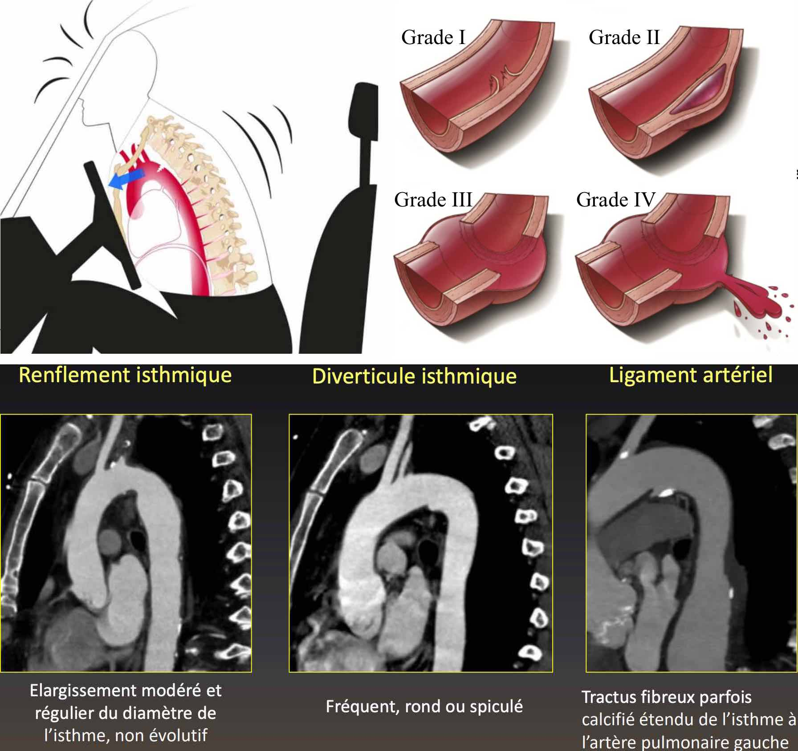
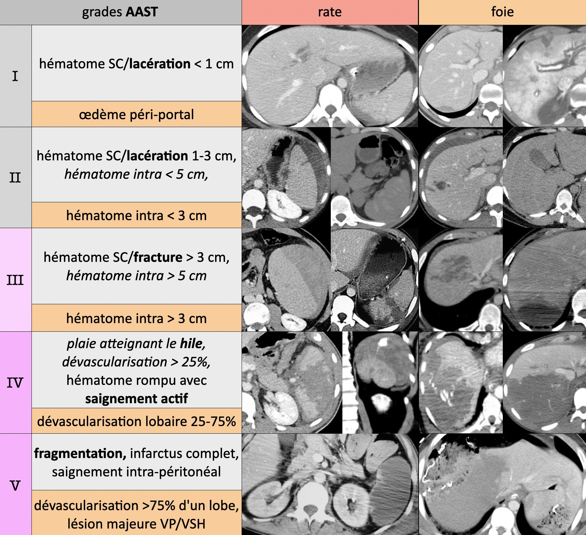

# AVP

!!! info "Protocole"
    - crâne, cou et AP IV- > TAP art > AP vx > **excrétoire si lésion rein/bassin**
    - enfant > 50 kg = TAP biphasique (80 cc > 60 cc à 60s > acquisition à 90s)
    - enfant < 50 kg = crâne et cou IV- > TAP temps mixte (50s)

```
Crâne :
Pas de lésion hémorragique intra ou péri-cérébrale récente.
Eléments médians en place. 
Pas d'hydrocéphalie.

Thorax :
Pas d'anomalie des gros vaisseaux (sous réserve de quelques artéfacts cinétiques).
Pas de pneumomédiastin, d'épanchement pleural ni péricardique.
Pas de contusion ni de lacération pulmonaire.

Abdomen et pelvis :
Pas de lésion traumatique du foie, de la rate, du pancréas, ni des reins.
Pas d'épanchement péritonéal ni de pneumopéritoine.
Pas d'infiltration de la racine du mésentère.

Cadre osseux :
Pas de lésion post-traumatique.
```
=== "thorax"
    <figure markdown="span">
        I lacération intimale < II hématome < III pseudo-anévrysme < IV rupture
        {width=620"}  
        </br>
        {width=350"}
        **contusions** pulmonaires (œdème/hémorragie) = maximales à J2-J3 ↬ SDRA  
        **lacérations** pulmonaires (rupture alvéolaire) = pneumotacèle et hématocèle
    </figure>
    !!! warning "Pc vital menacé"
        - fracture **sternum**, 3 premières côtes, volet thoracique (3 côtes avec 2 # chacune)
        - hémothorax, pneumothorax compressif, contusions étendues
        - EP (graisseuse), pneumopathie d'inhalation
=== "abdomen"
    <figure markdown="span">
        {width=670"}
        /!\ rate faux-a à J3-J7 et **grade IV/V = embolisation** sinon 50% rupture II<sup>R</sup>
        </br></br>
        {width=670"}
    </figure>
=== "rachis"
    <figure markdown="span">
        {width=700"}
        **A** = compression = 70% / **B** = distraction = 10% / **C** = rotation = 20%  
        **IRM** si lésion instable ou déficit neuro = sag T1, T2, T2 FS + ax DP
    </figure>
    !!! warning "Lésion du **complexe ligamentaire postérieur**"
        - diastasis interépineux ou articulaire postérieur
        - subluxation du corps vertébral > 2 mm
        - fracture du processus épineux