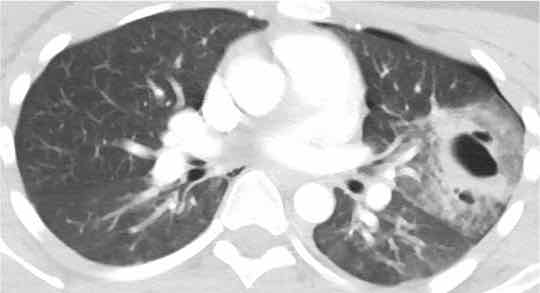
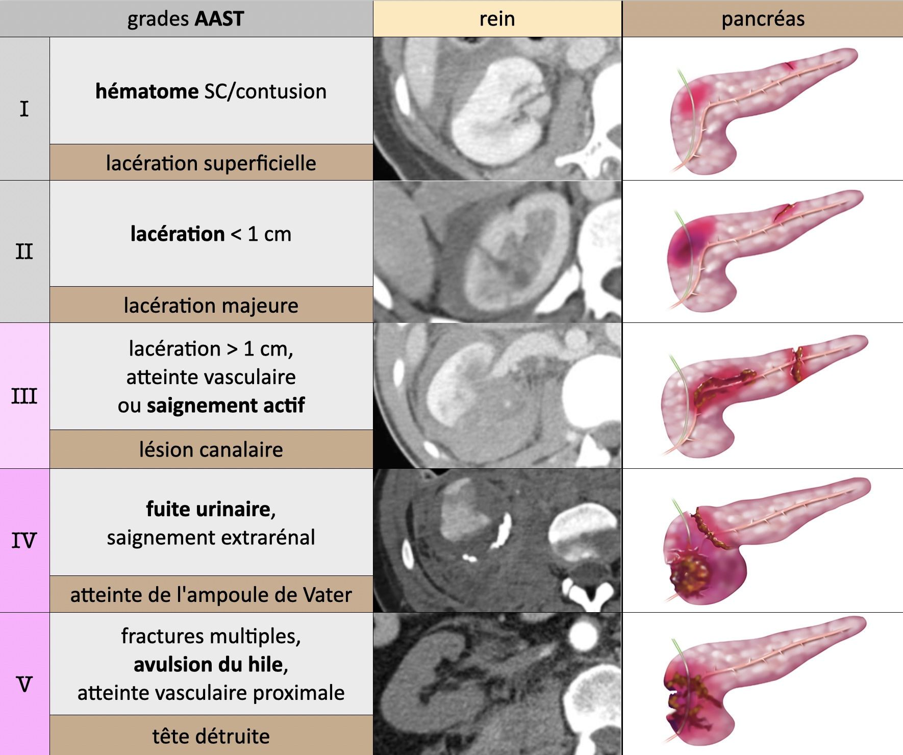

# AVP

!!! info "Protocole"
    - crâne, cou et AP IV- > TAP art > AP vx > **excrétoire si lésion rein/bassin**
    - enfant > 50 kg = TAP biphasique (80 cc > 60 cc à 60s > acquisition à 90s)
    - enfant < 50 kg = crâne et cou IV- > TAP temps mixte (50s)

=== "CTAP"
    ```
    Crâne :
    Structure médianes en place. Pas d'hydrocéphalie.
    Pas de lésion hémorragique intra ou péri-encéphalique récente.
    Pas d'hypodensité encéphalique systématisée et respect des noyaux gris centraux.
    Pas de lésion osseuse post-traumatique récente, notamment des cadres orbitaires, des rochers, des parois des sinus de la face, et de la mandibule.

    Thorax :
    Pas d'anomalie des gros vaisseaux (sous réserve de quelques artéfacts cinétiques).
    Pas de pneumomédiastin, d'épanchement pleural ni péricardique.
    Pas de contusion ni de lacération pulmonaire.

    Abdomen et pelvis :
    Pas de lésion traumatique du foie, de la rate, du pancréas, ni des reins.
    Pas d'épanchement péritonéal ni de pneumopéritoine.
    Pas d'infiltration de la racine du mésentère.

    Rachis :
    Pas d'anomalie de la transition cervico-occipital.
    Respect de la hauteur et bon alignement des corps vertébraux.
    Pas de fracture des processus transverses ni des pédicules.
    Bonne congruence des articulations postérieures.
    Pas d'épaississement des parties molles prévertébrales.

    Restant du cadre osseux :
    Pas de fracture des scapulas, des clavicules, des côtes, et du sternum.
    Respect du bassin, et des extrémités supérieurs des fémurs et des humérus.
    ```
=== "TAP"
    ```
    Thorax :
    Pas d'anomalie des gros vaisseaux (sous réserve de quelques artéfacts cinétiques).
    Pas de pneumomédiastin, d'épanchement pleural ni péricardique.
    Pas de contusion ni de lacération pulmonaire.

    Abdomen et pelvis :
    Pas de lésion traumatique du foie, de la rate, du pancréas, ni des reins.
    Pas d'épanchement péritonéal ni de pneumopéritoine.
    Pas d'infiltration de la racine du mésentère.

    Crâne et cadre osseux : cf. CR dédié
    ```
=== "neuro-os"
    ```
    Crâne :
    Pas de lésion hémorragique intra ou péri-encéphalique récente.
    Pas d'hypodensité cérébrale systématisée et respect des noyaux gris centraux.
    Structure médianes en place. Pas d'hydrocéphalie.
    Pas de lésion osseuse post-traumatique récente, notamment des cadres orbitaires, des rochers, des parois des sinus de la face, et de la mandibule.

    Rachis :
    Pas d'anomalie de la transition cervico-occipital.
    Respect de la hauteur et bon alignement des corps vertébraux.
    Pas de fracture des processus transverses ni des pédicules.
    Bonne congruence des articulations postérieures.
    Pas d'épaississement des parties molles prévertébrales.

    Restant du cadre osseux :
    Pas de fracture des scapulas, des clavicules, des côtes, et du sternum.
    Respect du bassin, et des extrémités supérieurs des fémurs et des humérus.
    ```

<figure markdown="span"> </figure>

=== "thorax"
    <figure markdown="span">
        I lacération intimale < II hématome < III pseudo-anévrysme < IV rupture
        {width=620"}  
        </br>
        {width=350"}
        **contusions** pulmonaires (œdème/hémorragie) = maximales à J2-J3 ↬ SDRA  
        **lacérations** pulmonaires (rupture alvéolaire) = pneumotacèle et hématocèle
    </figure>
    !!! warning "Pc vital menacé"
        - fracture **sternum**, 3 premières côtes, volet thoracique (3 côtes avec 2 # chacune)
        - hémothorax, pneumothorax compressif, contusions étendues
        - EP (graisseuse), pneumopathie d'inhalation
=== "abdomen"
    <figure markdown="span">
        [Causes d'ascite isolée](https://radiopaedia.org/articles/isolated-free-fluid-in-trauma){:target="_blank"} = 5% des traumas  
        </br>
        [{width=700"}](https://radiopaedia.org/articles/aast-injury-scoring-scales){:target="_blank"}
        /!\ rate faux-a à J3-J7 et **grade IV/V = embolisation** sinon 50% rupture II<sup>R</sup>  
        </br>
        [{width=700"}](https://radiopaedia.org/articles/aast-injury-scoring-scales){:target="_blank"}
    </figure>
=== "rachis"
    <figure markdown="span">
        {width=700"}
        **A** = compression = 70% / **B** = distraction = 10% / **C** = rotation = 20%  
        **IRM** si lésion instable ou déficit neuro = sag T1, T2, T2 FS + ax DP
    </figure>
    !!! warning "Lésion du **complexe ligamentaire postérieur**"
        - diastasis interépineux ou articulaire postérieur
        - subluxation du corps vertébral > 2 mm
        - fracture du processus épineux