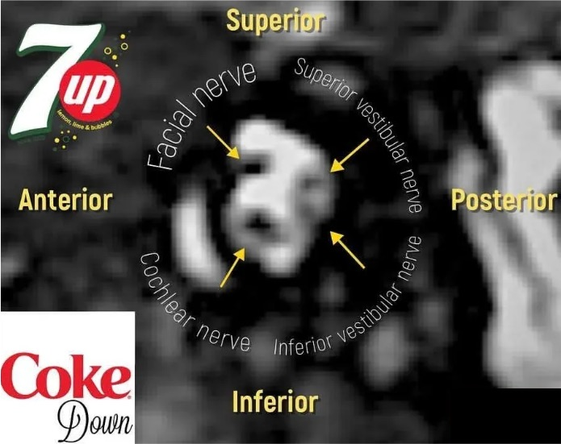
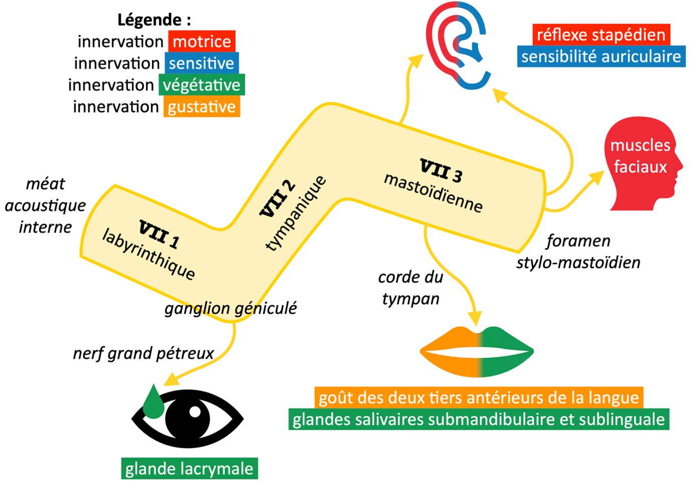

# Modèles de comptes rendus

=== "vertiges"
    ```
    Séquences axiales diffusion, FLAIR et T2* à l'étage encéphalique.
    Acquisition centrée sur les conduits auditifs internes en 3D T2 HR.
    Séquences axiales T1 SE sans puis après injection de gadolinium, et 3D T1 EG.

    Etage supra-tentoriel :
    Structures de la ligne médiane en place.
    Intégrité des espaces liquidiens intra et péri-cérébraux.
    Pas de lésion ischémique ou hémorragique récente.
    Trophicité cortico-sous-corticale en rapport avec l'âge.

    Fosse postérieure :
    Tronc cérébral, vermis et hémisphères cérébelleux sans anomalie.
    Respect des nerfs vestibulo-cochléaires, sans rehaussement pathologique.
    Signal des liquides labyrinthiques d'aspect normal, sans rehaussement pathologique.
    ```

    <figure markdown="span">
        </br>
        {width="400"}
    </figure>

=== "PF"
    ```
    Séquences axiales diffusion et FLAIR à l'étage encéphalique.
    Séquences centrées sur les CAI 3D T2 HR et axiales T1 avant et après injection.

    Etage supra-tentoriel :
    Structures de la ligne médiane en place.
    Intégrité des espaces liquidiens intra et péri-cérébraux.
    Pas de lésion ischémique ou hémorragique récente.
    Trophicité cortico-sous-corticale en rapport avec l'âge.
    Pas de prise de contraste pathologique.

    Fosse postérieure :
    Absence de rehaussement pathologique des nerfs faciaux.
    Tronc cérébral, vermis et hémisphères cérébelleux sans anomalie.
    Signal des liquides labyrinthiques d'aspect normal, sans rehaussement pathologique.
    ```

    <figure markdown="span">
        </br>
        {width="700"}
        [trajet du nerf facial](https://radiopaedia.org/cases/intratemporal-facial-nerve-annotated-ct){:target="_blank"}
    </figure>

=== "hydrops"
    ```
    Séquences axiales diffusion et FLAIR à l'étage encéphalique.
    Séquences centrées sur les conduits auditifs internes 3D T2 HR et 3D FLAIR 4 heures après injection de gadolinium.

    Etage supra-tentoriel :
    Structures de la ligne médiane en place.
    Intégrité des espaces liquidiens intra et péri-cérébraux.
    Pas de lésion ischémique ou hémorragique récente.
    Trophicité cortico-sous-corticale en rapport avec l'âge.

    Fosse postérieure :
    Tronc cérébral, vermis et hémisphères cérébelleux sans anomalie.
    Pas de syndrome de masse des nerfs vestibulo-cochléaires.
    Pas d'anomalie de signal des liquides labyrinthiques.
    Pas de dilatation des utricules, saccules et canaux endolymphatiques.
    ```
    
    <figure markdown="span">
        [thèse de Victor Chaton (page 27)](https://pepite-depot.univ-lille.fr/LIBRE/Th_Medecine/2021/2021LILUM114.pdf){:target="_blank"}
    </figure>