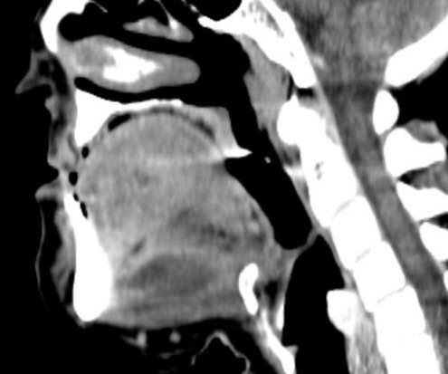

# [Abcès péri-amygdalien](https://radiopaedia.org/articles/peritonsillar-abscess){:target="_blank"}

<figure markdown="span">
    [espaces profonds](https://radiopaedia.org/cases/deep-spaces-of-the-head-and-neck-annotated-mri-1#image-20791865){:target="_blank"} de la face et du cou et [anatomie](https://radiopaedia.org/cases/ct-neck-with-annotated-scrollable-images-1){:target="_blank"}
</figure>

```
Elargissement des amygdales palatines.
Collection péri-amydgalienne 
Absence de collection dans l'espace rétropharyngé.
Respect du calibre de la filière aéro-digestive.
Perméabilité des veines jugulaires internes.
Ganglions jugulo-carotidiens supérieurs centrimétriques.
Apex pulmonaires, cadre osseux et coupes encéphaliques sans anomalie.
```

!!! warning "complications"
    - [abcès rétropharyngé](https://radiopaedia.org/articles/retropharyngeal-abscess){:target="_blank"} ↬ compression laryngée, médiastinite, abcès épidural
    - sd de [Lemierre](https://radiopaedia.org/articles/lemierre-syndrome){:target="_blank"} = thrombose veine jugulaire interne + 90% EP septiques

<figure markdown="span">
    anneau de [Waldeyer](https://radiopaedia.org/articles/waldeyers-ring-1){:target="_blank"} = tonsilles
    {width="300"}  
    </br>
    collection dans le plancher buccal = [angine de Ludwig](https://radiopaedia.org/articles/ludwig-angina){:target="_blank"}
    {width="300"} 
</figure>

