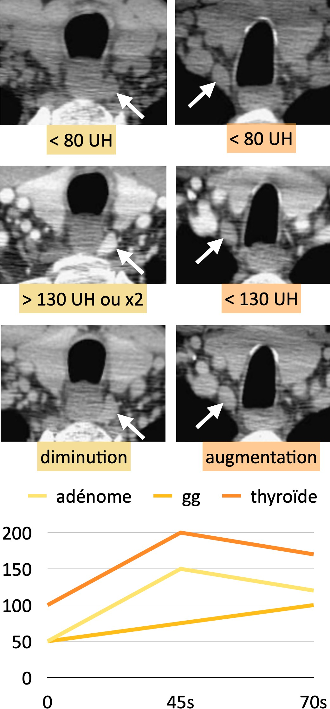

# [Adénome parathyroïdien](https://radiopaedia.org/articles/parathyroid-adenoma){:target="_blank"}

<figure markdown="span">
    {width="275"}  
    ectopique dans 5% (médiastin supérieur)  
    scintigraphie MIBI / TEP choline  
</figure>