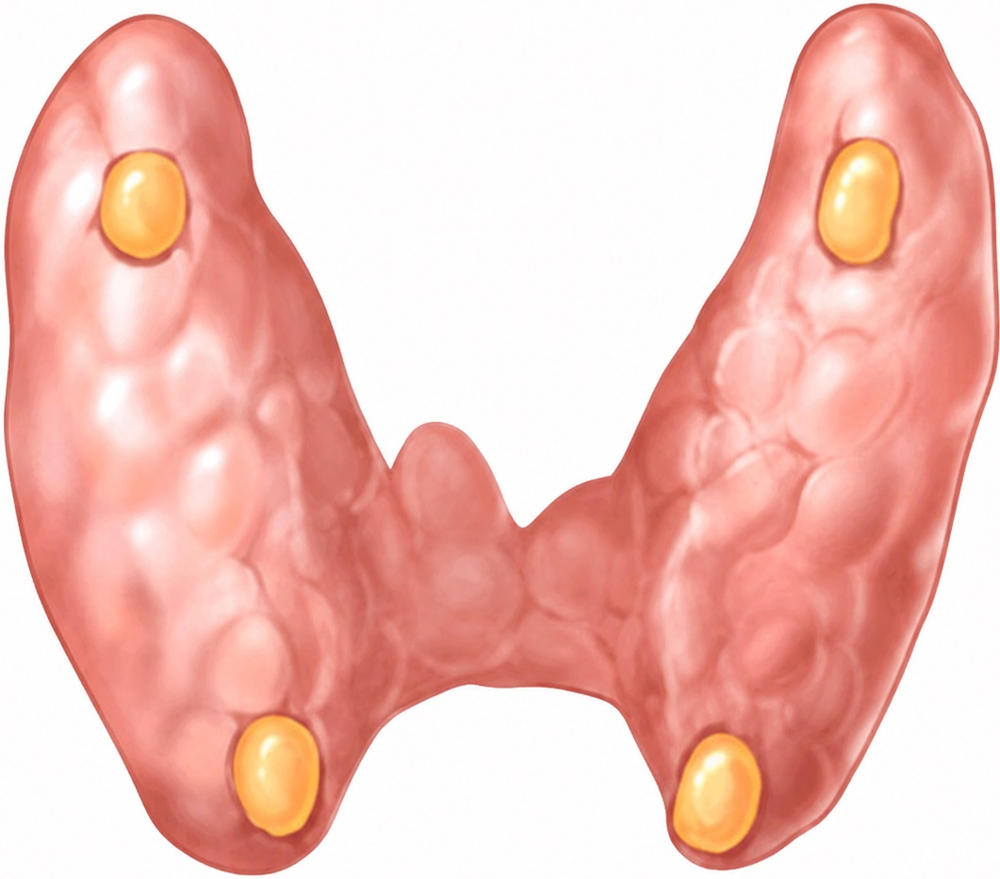

# [Adénome parathyroïdien](https://radiopaedia.org/articles/parathyroid-adenoma){:target="_blank"}

<figure markdown="span">
    nodule hypoéchogène homogène > 1 cm + vascularisation  
    80% [adénome](https://radiopaedia.org/articles/parathyroid-adenoma){:target="_blank"} parathyroïdien > 15% hyperplasie > 5% carcinome  
     
    {width="600"}

    scintigraphie MIBI < TEP choline  
     
    {width="600"}
    hyperplasie des parathyroïdes = moins hypervascularisées  
     
    {width="250"}
    parathyroïdes **inf. = 1/3 inf. ou sous-thyr**  
    ectopique dans 5% (médiastin sup.)   
</figure>