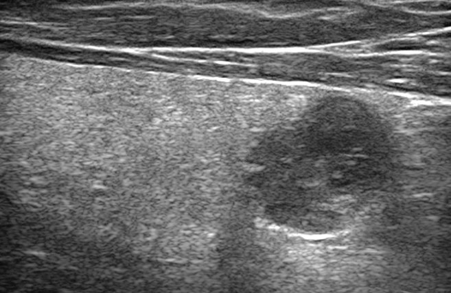
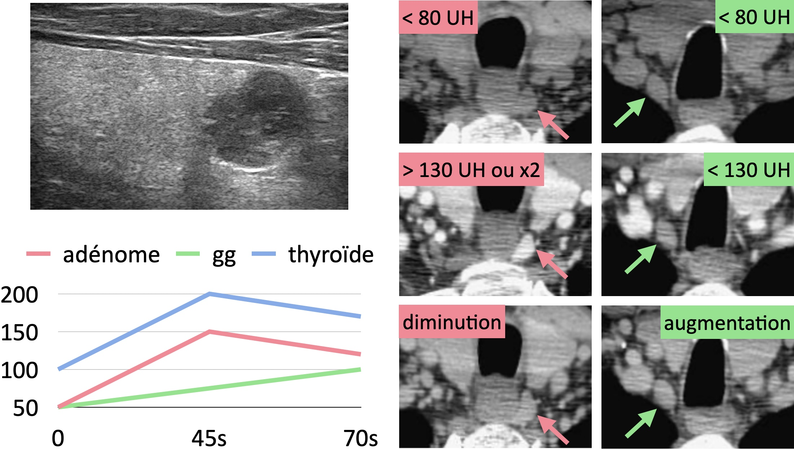
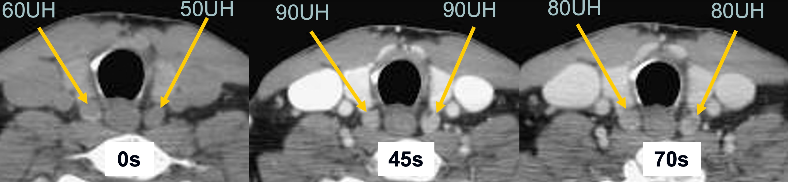

# [Adénome parathyroïdien](https://radiopaedia.org/articles/parathyroid-adenoma){:target="_blank"}

<figure markdown="span">
    {width="275"}
    ectopique dans 5% (médiastin sup.)  
    scintigraphie MIBI < TEP choline  
    {width="275"}  
    hyperplasie des parathyroïdes = moins hypervascularisé
    {width="600"}
</figure>