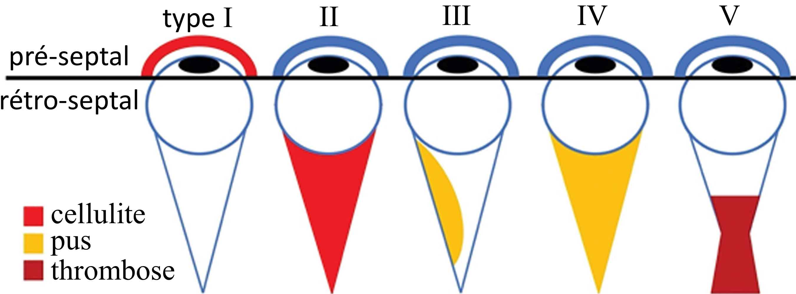

<figure markdown="span">
    [adénite cervicale](https://radiopaedia.org/articles/cervical-adenitis){:target="_blank"} = virale ++ (sauf unilatéral = bactérien) = abcédation ?
</figure>

!!! example "sinusite"
    - pneumatisation ethmoïde NNé < maxillaire 3a < frontale et sphénoïdale 5-10a
    - ethmoïdite = [Chandler](https://radiopaedia.org/articles/chandler-classification-of-orbital-infections){:target="_blank"} (III abcès sous-périosté et V thrombose sinus caverneux) 
    <figure markdown="span">
        {width="450"}
    </figure>
    - DD = [dacryocystite](https://radiopaedia.org/articles/dacryocystitis){:target="_blank"}

!!! example "[mastoïdite aiguë](https://radiopaedia.org/articles/acute-mastoiditis){:target="_blank"}"
    - M6 - 3a = complication d'une otite moyenne aiguë
    - abcès sous-périosté péri-auriculaire ± abcès épidural et TVC

!!! example "maladie des [griffes du chat](https://radiopaedia.org/articles/cat-scratch-disease){:target="_blank"}"
    - adénomégalie axillaire/cervicale S2-4 après contage ↬ abcédation/fistulisation
    - 10% granulomes hépatiques et spléniques (évolution vers la calcification)
    - sérologie peu fiable = PCR sur ponction ++

!!! danger "**adénomégalie** suspecte"
    - ferme, sans dl, persistante à S6, non inflammatoire, sus-clav
    - DD = lymphome, leucémie, métastase, histiocytose, lupus, ...

<figure markdown="span">
</figure>

!!! warning "principales [masses cervicales](https://pap-pediatrie.fr/orl/comment-raisonner-devant-une-masse-cervicale-chez-lenfant){:target="_blank"}"
    - NNé [fibromatosis colli](https://radiopaedia.org/articles/fibromatosis-colli){:target="_blank"} = hypertrophie muscle SCM
    - <M3 [hémangiome infantile](https://radiopaedia.org/articles/infantile-haemangioma){:target="_blank"} = lésion parotidienne molle avec hypervascularisation
    - <2a [lymphangiome kystique](https://radiopaedia.org/articles/cystic-hygroma-1){:target="_blank"} = masse kystique ± remaniements hémorragiques
    - <10a [kyste tractus thyréoglosse](https://radiopaedia.org/articles/thyroglossal-duct-cyst){:target="_blank"} = (para)médian = thyroïde en place ?!
    - 10-40a [kyste 2è arc branchial](https://radiopaedia.org/articles/second-branchial-cleft-cyst){:target="_blank"} = antéro-médial au SCM = surinfection récidivante
    - <20a [rhabdomyosarcome](https://radiopaedia.org/articles/rhabdomyosarcomas-head-and-neck){:target="_blank"} = masse de croissance rapide