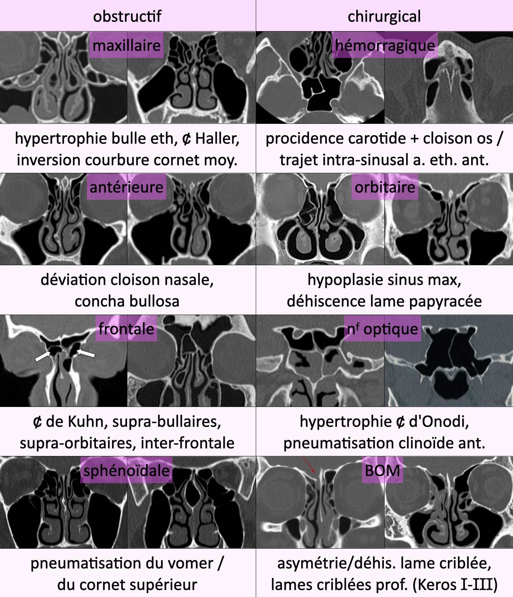
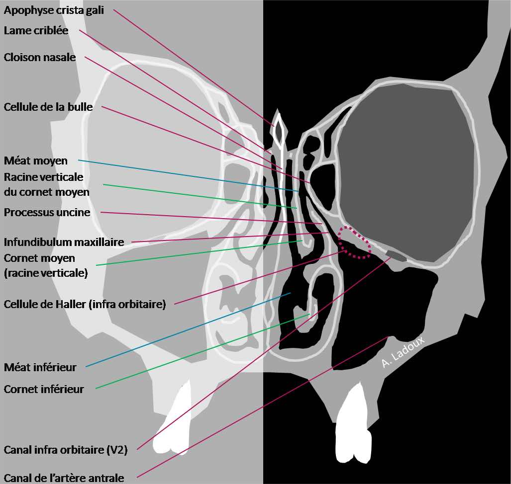
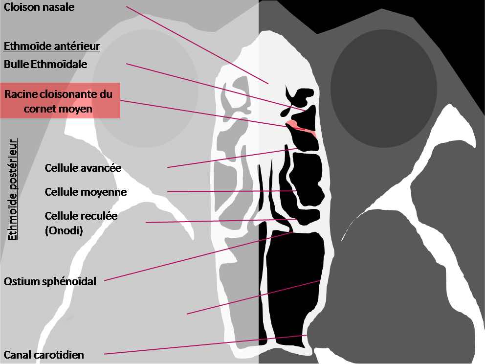
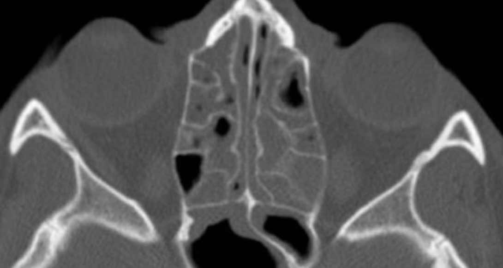

# Sinus

```
Bonne aération des cellules frontales, sphénoïdales, ethmoïdales et maxillaires.
Pas de variante anatomique à risque obstructif ou chirurgical.
Pas de parodonthopathie apicodentaire.
Pas de lésion osseuse suspecte.
Parties molles sans particularité.
```

<figure markdown="span">
    [{width="510"}](https://cerf.radiologie.fr/sites/cerf.radiologie.fr/files/files/enseignement/pdf/02MM%20Sinus.pdf){:target="_blank"}
    + latérodéviation ou pneumatisation du **processus unciforme**  
    </br>
    {width="650"}
    sinusite antérieure = maxillaire + ethmoïdale ant. + frontale
    {width="600"}  
    {width="300"}
    > M1 après épisode de sinusite aiguë...  
    **polypose naso-sinusienne** ± asthme et intolérance AINS  
    = dégénérescence œdémateuse bilatérale débutant à l'ethmoïde
</figure>

!!! tip "Pneumatisation"
    ethmoïde dès la naissance < maxillaire 3 ans < frontale et sphénoïdale 5-10 ans

!!! tip "Sinusite **maxillaire « plus »**"
    aspergillome, pyocèle, polype antro-choanal, papillome inversé