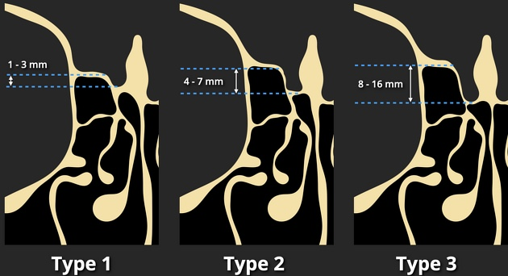

# Sinus

```
Bonne aération des cellules frontales, sphénoïdales, ethmoïdales et maxillaires.
Liberté des carrefours ostio-méatiques et des canaux naso-frontaux.
Pas de variante anatomique à risque obstructif ou chirurgical.
Lames criblées de profondeur symétrique classée Keros 2.
Pas de granulome apicodentaire dans les quadrants supérieurs.
Pas de lésion osseuse suspecte et parties molles sans particularité.
```

<figure markdown="span">
    {width="650"}
    sinusite antérieure = maxillaire + ethmoïdale ant. + frontale
    {width="600"}  
    </br>
    [{width="550"}](https://cerf.radiologie.fr/sites/cerf.radiologie.fr/files/files/enseignement/pdf/02MM%20Sinus.pdf){:target="_blank"}
    + latérodéviation ou pneumatisation du **processus unciforme**  
    </br>
    {width="500"}
    classification de [Keros](https://radiopaedia.org/articles/keros-classification-of-olfactory-fossa){:target="_blank"}  
    </br></br>
    {width="300"}
    > M1 après épisode de sinusite aiguë...  
    **polypose naso-sinusienne** ± asthme et intolérance AINS  
    = dégénérescence œdémateuse bilatérale débutant à l'ethmoïde
</figure>

!!! tip "Sinusite **maxillaire « plus »** => IRM"
    aspergillome, pyocèle, polype antro-choanal, papillome inversé