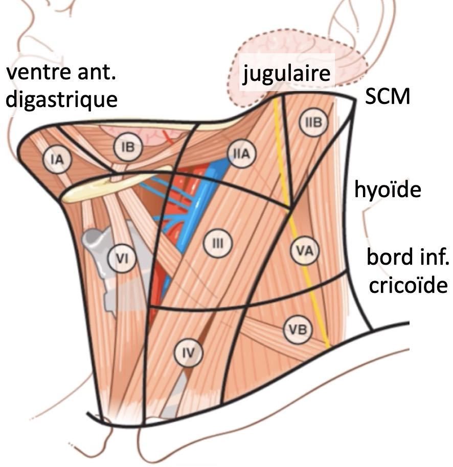
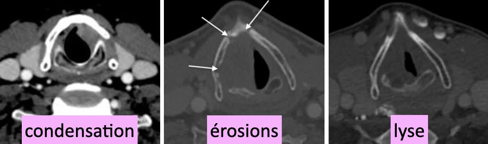
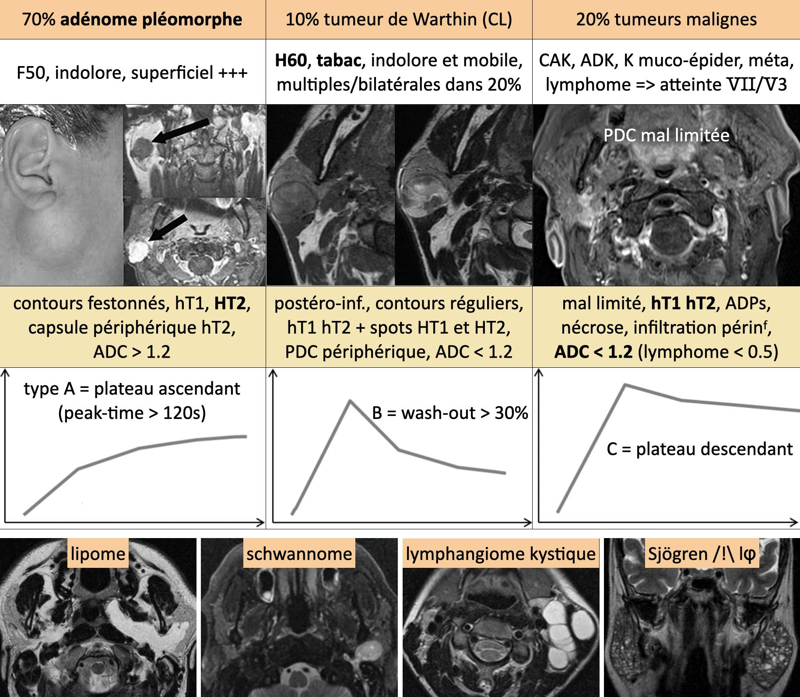
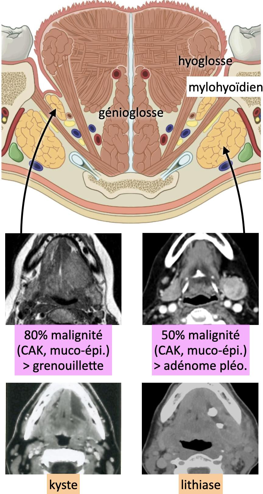

# [Anatomie](https://radiopaedia.org/cases/ct-neck-with-annotated-scrollable-images-1){:target="_blank"}

=== "VADS"

    <figure markdown="span">
        TDM cervico-faciale biphasique ± phonation/Valsalva + thorax + IRM si > os hyoïde  
        H60 OH-tabac, 95% [carcinome épidermoïde](https://radiopaedia.org/articles/head-and-neck-squamous-cell-carcinomas){:target="_blank"}, sauf [adk](https://radiopaedia.org/articles/sinonasal-adenocarcinoma){:target="_blank"} ethmoïde et [UCNT](https://radiopaedia.org/articles/nasopharyngeal-carcinoma){:target="_blank"} cavum  
        [otalgie réflexe](https://archives.uness.fr/sites/campus-unf3s-2014/orl/enseignement/otalgie/site/html/2.html){:target="_blank"} = signe précoce
    </figure>

    !!! tip "CR"
        - lésion bourgeonnante / ulcérée / infiltrante, grand axe
        - épicentre, extensions (6 directions), critères [T3/T4](https://oncologik.fr/referentiels/sforl){:target="_blank"}
        - ADP grand axe (TNM) x petit axe (RECIST)
        - 15% tumeur synchrone poumons/œsophage

    !!! warning "ADP = larynx sus-glottique, hypo/oro/nasopharynx et cavité buccale"
        - taille > 10 mm (sauf II > 12 mm et rétropharyngée > 5 mm)
        - aspect rond : rapport grand axe sur petit axe < 2
        - perte du hile graisseux, PDC hétérogène, nécrose
        - regroupement de plus de 3 ganglions
        - rupture capsulaire = spicules, infiltration graisse

    <figure markdown="span">
        [{width="350"}](https://onclepaul.fr/wp-content/uploads/2011/07/Aires-lymphatiques-cervicales-AF-2022.pdf){:target="_blank"}  
        atteintes cartilagineuses
        {width="450"}  
    </figure>

=== "PAROTIDE"

    <figure markdown="span">
        [{width="800"}](https://radiopaedia.org/articles/salivary-gland-tumours){:target="_blank"}  
        {width="320"}  
    </figure>

=== "BASE DU CRÂNE"

    <figure markdown="span">
        [Tumeurs de la bases du crâne](https://radiopaedia.org/articles/tumors-of-the-base-of-skull-differential-diagnosis){:target="_blank"}
    </figure>
