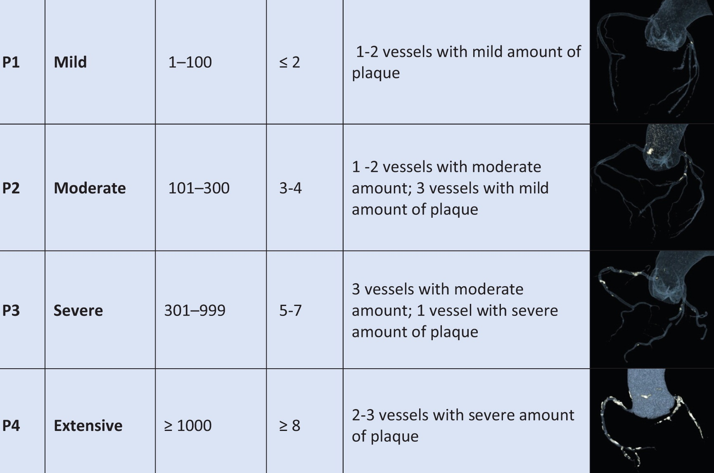
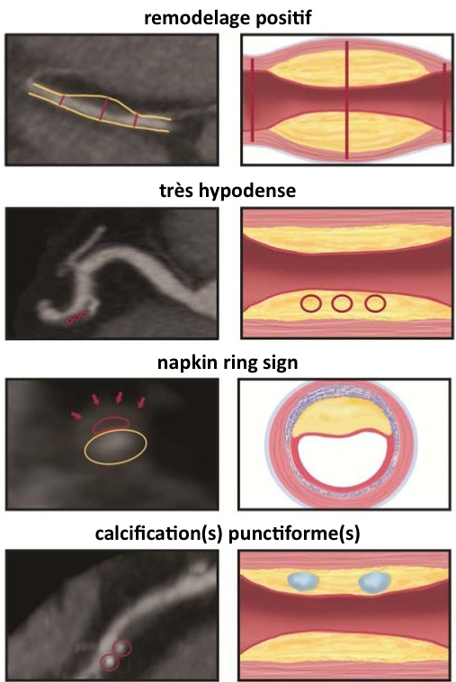

# [CAD-RADS 2.0](https://radiologyassistant.nl/cardiovascular/cad-rads/coronary-artery-disease-reporting-and-data-system){:target="_blank"}

|  score | sténose  | interprétation | investigation | 
| :----------: | :-------: | :----------: | :-------: |
| 0 | 0% | pas de sténose |  |
| 1 | 1-24% | sténose minime |  |
| 2 | 25-49% | sténose légère |  |
| 3 | 50-69% | sténose intermédiaire | test fonctionnel |
| 4A | 70-99% sur 1 ou 2 vx | sténose sévère | coro / test f° |
| 4B | TCG > 50% / 3 vx > 70% | sténose sévère | coro |
| 5 | 100% | occlusion complète | coro |
| N | non diagnostic |  | autre examen |

<figure markdown="span">
    [{width="800"}](https://pubs.rsna.org/doi/10.1148/rg.220202?url_ver=Z39.88-2003&rfr_id=ori:rid:crossref.org&rfr_dat=cr_pub%20%200pubmed){:target="_blank"}  
    **± HRP** si au moins deux facteurs :
    [{width="360"}](https://pmc.ncbi.nlm.nih.gov/articles/PMC4135448/){:target="_blank"}  
</figure>

```
Score calcique selon Agatston à , correspondant au percentile .
Absence d'anomalie de naissance ou de trajet des artères coronaires.
Dominance coronarienne droite.

Analyse de la lumière coronarienne :
- TCG : pas d'anomalie pariétale, pas de sténose ;
- IVA : pas d'anomalie pariétale, pas de sténose ;
- D1 : pas d'anomalie pariétale, pas de sténose ;
- D2 : pas d'anomalie pariétale, pas de sténose ;
- Cx : pas d'anomalie pariétale, pas de sténose ;
- marginales : pas d'anomalie pariétale, pas de sténose ;
- CD : pas d'anomalie pariétale, pas de sténose.

Coeur de taille normale, sans dilatation des cavités ni thrombus.
Absence d'épanchement ou de calcification péricardique.
Valve aortique tricuspide non calcifiée.
Aorte tubulaire mesurant  mm.

Pas d'anomalie pulmonaire ni osseuse significative.
```