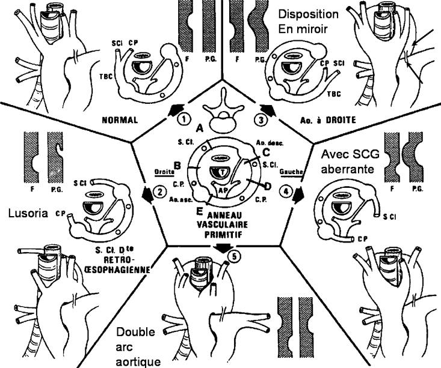
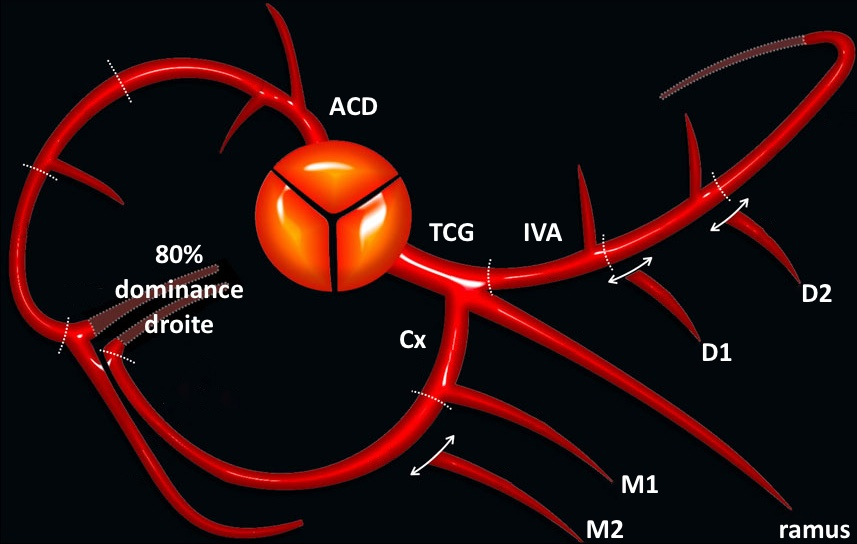

# Malformations vasculaires

=== "arc aortique"

    <figure markdown="span">
        [Variantes anatomiques de l'arc aortique](https://radiopaedia.org/articles/variant-anatomy-of-the-aortic-arch){:target="_blank"}
        {width="800"}    
    </figure>

=== "coronaires"

    <figure markdown="span">
        [{width="500"}](https://radiologyassistant.nl/cardiovascular/cad-rads/coronary-artery-disease-reporting-and-data-system){:target="_blank"}  
        [Variantes anatomiques](https://onclepaul.fr/wp-content/uploads/2011/07/cours-coeur-1.pdf){:target="_blank"} 
    </figure>