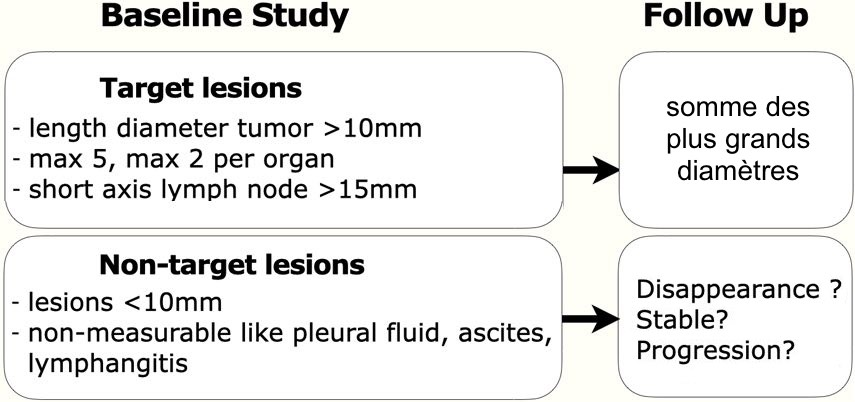

# [RECIST 1.1](https://recist.eortc.org/recist-1-1-2/){:target="_blank"}

<figure markdown="span">
    somme des **plus grands diamètres** et des **petits axes pour les gg**  
     
    [{width="480"}](https://staging.radiologyassistant.nl/more/recist-1-1/recist-1-1-1){:target="_blank"}  
    (suivi x 100 / baseline ou nadir) - 100 :  
    **Progression si + ≥ 20%** versus *nadir*  
    **Réponse partielle si - ≥ 30%** versus *baseline*  
    Réponse complète si disparition de toutes les lésions  
    Stabilité lésionnelle sinon
</figure>