# Anatomie

=== "Estomac"

    <figure markdown="span">
        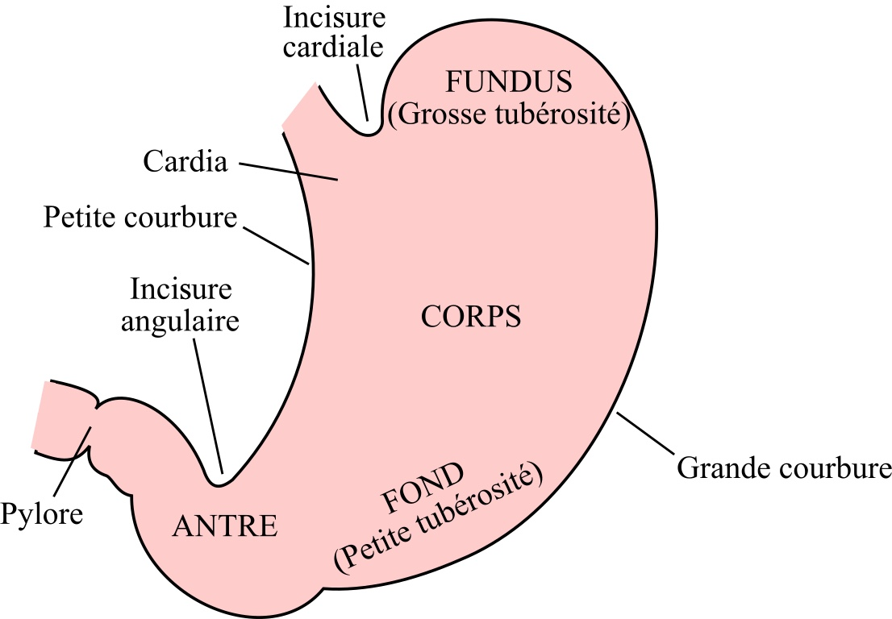{width="450"}  
        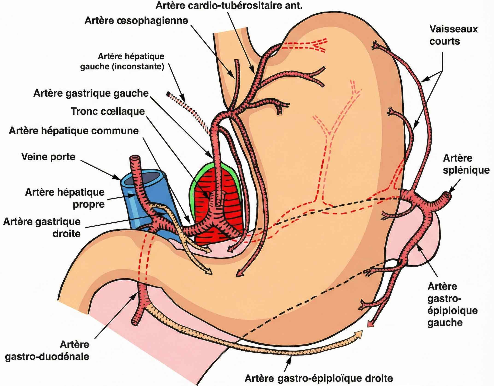{width="700"}  
        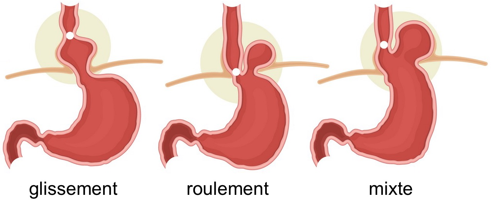{width="500"}          
    </figure>

=== "Pancréas"

    <figure markdown="span">
        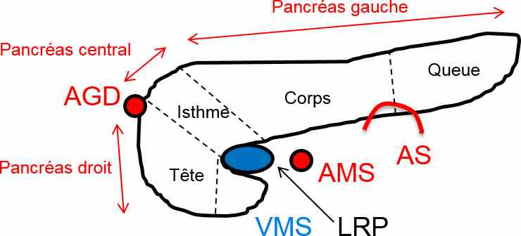{width="450"}  
        [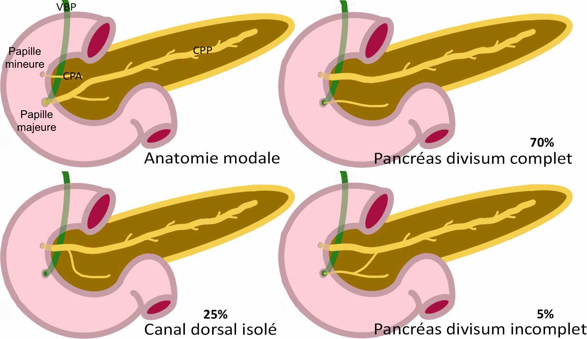{width="800"}](https://radiopaedia.org/articles/pancreas-divisum){:target="_blank"}
        **5% pancréas divisum** = CPP s'abouche dans la papille mineure = + de PA
    </figure> 

=== "Foie"

    <figure markdown="span">
        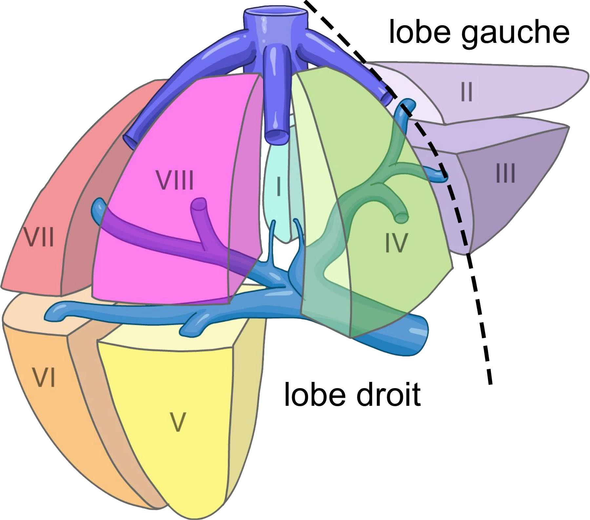{width="340"}  
        [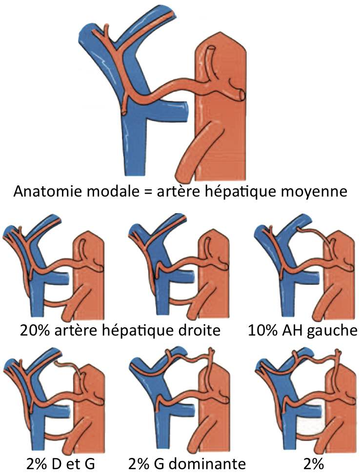{width="400"}](http://onclepaul.fr/wp-content/uploads/2011/07/incidence-chirurgicale-des-variations-vasculaires-abdominalesFILEminimizer.pdf){:target="_blank"}
    </figure>

    !!! danger "sténose du tronc cœliaque"
        - sur hypertrophie du ligament arqué médian = peut être sectionné au bloc
        - sur athérome = **CI ligature art. gastro-duodénale** (arcade de suppléance via l'AMS)

=== "Omentums"

    <figure markdown="span">
        [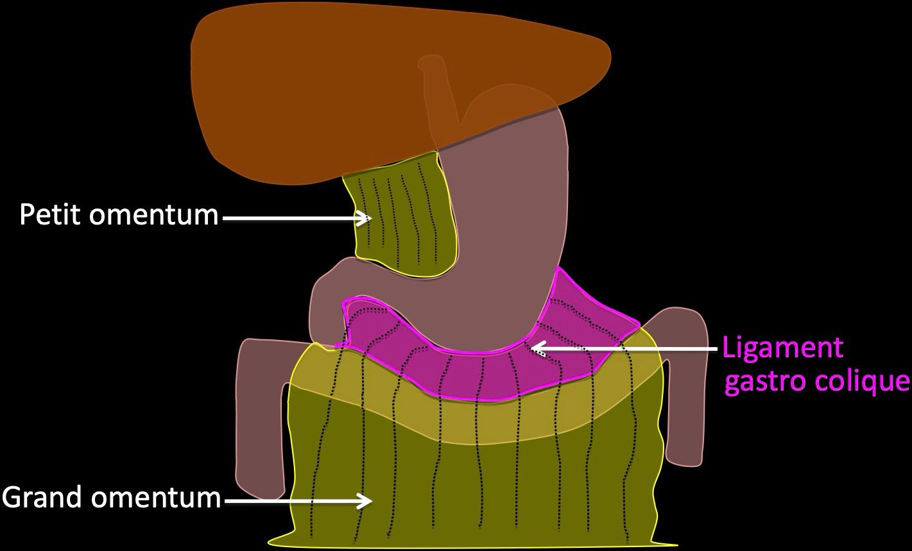{width="500"}](https://onclepaul.fr/wp-content/uploads/2011/07/Bourse-omentaleanatomie-lFILEminimizer.pdf){:target="_blank"}  
        [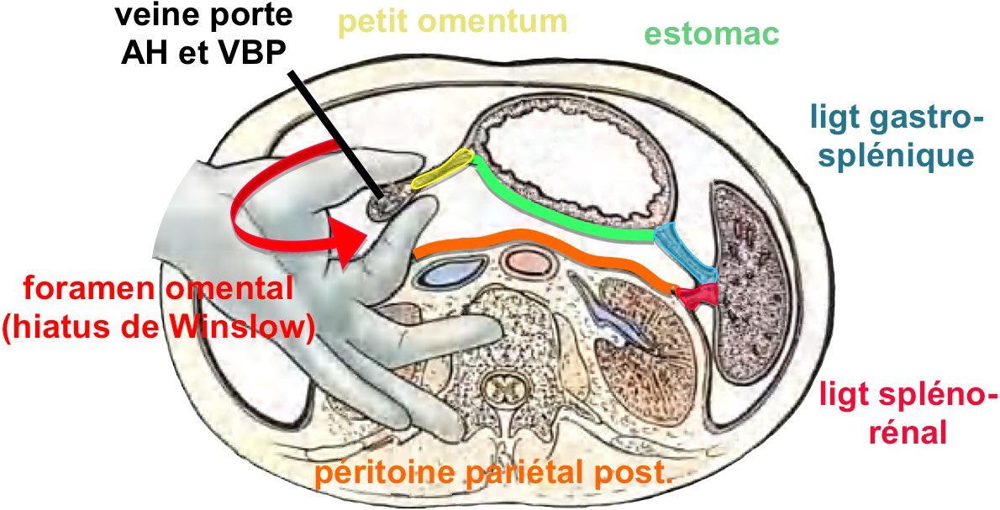{width="500"}](https://onclepaul.fr/wp-content/uploads/2011/07/Bourse-omentaleanatomie-lFILEminimizer.pdf){:target="_blank"}
        **bourse omentale** (anciennement arrière cavité des épiploons)  
         
        [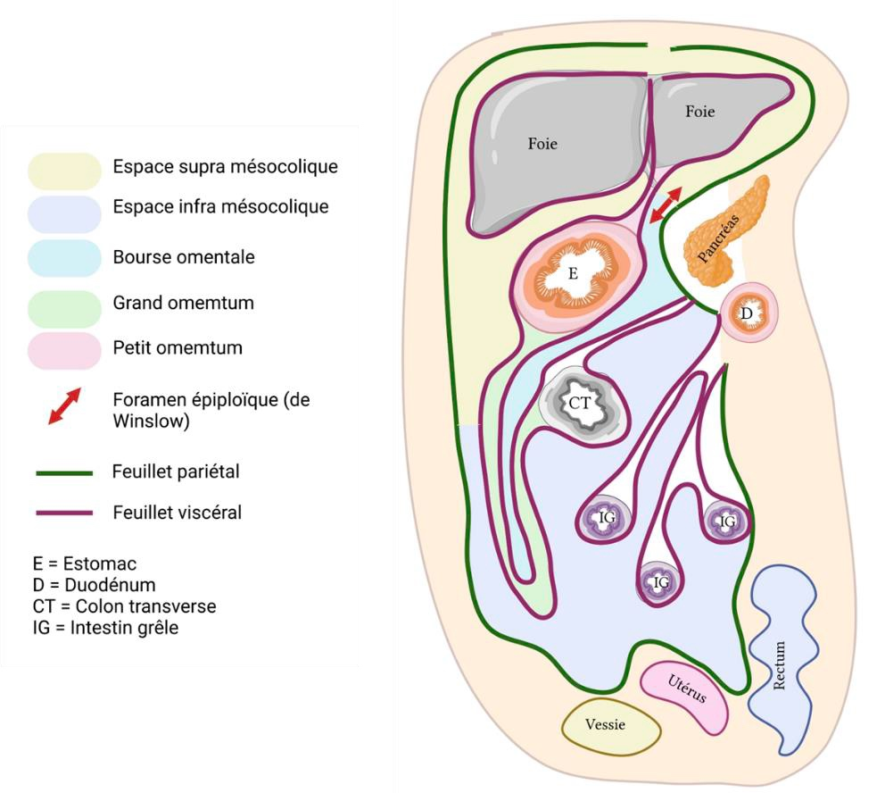{width="600"}](https://pepite-depot.univ-lille.fr/LIBRE/Th_Medecine/2023/2023ULILM193.pdf){:target="_blank"} 
    </figure>

=== "Carcinose"

    <figure markdown="span">
        [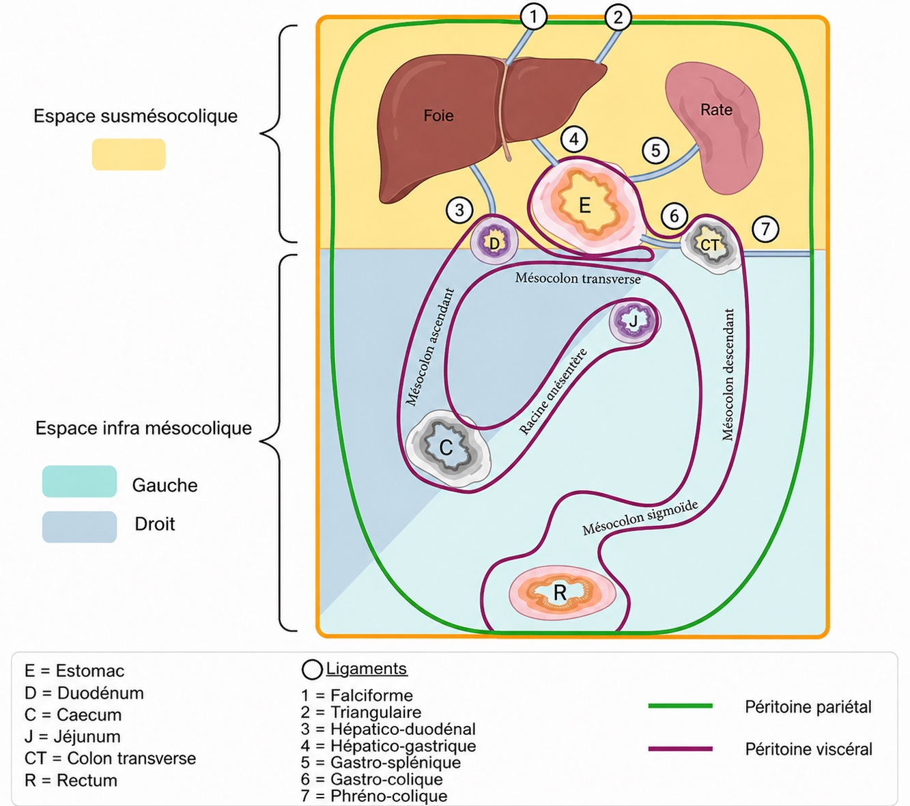{width="600"}](https://pepite-depot.univ-lille.fr/LIBRE/Th_Medecine/2023/2023ULILM193.pdf){:target="_blank"}
         
        [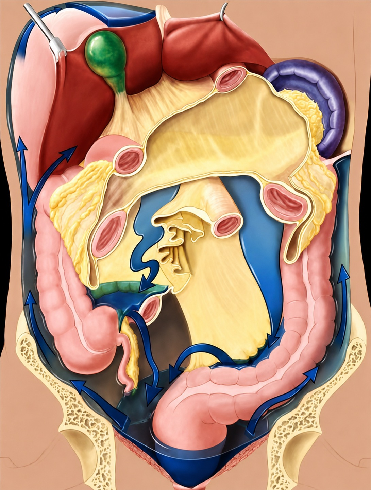{width="600"}](https://pepite-depot.univ-lille.fr/LIBRE/Th_Medecine/2023/2023ULILM193.pdf){:target="_blank"}  
         
        [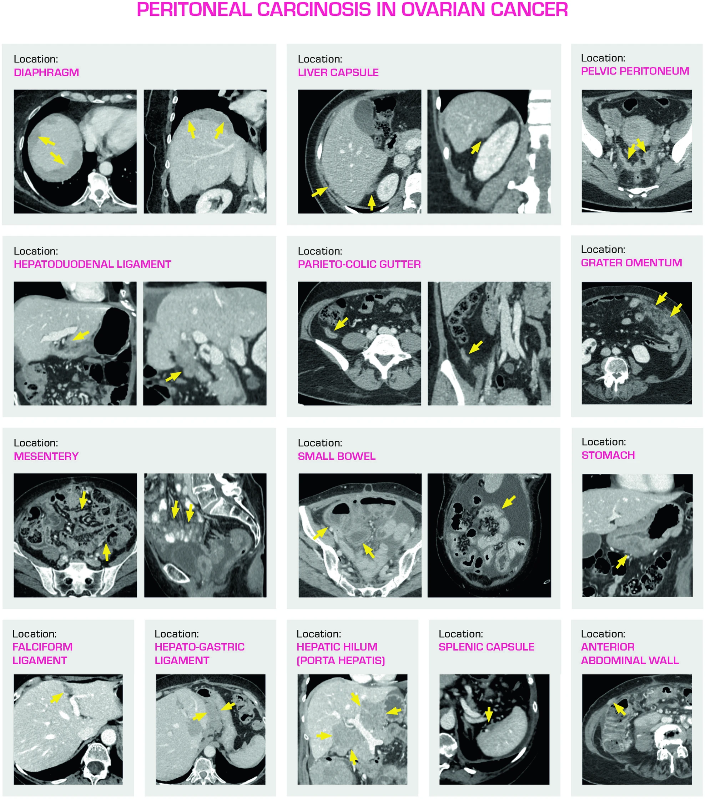{width="850"}](https://link.springer.com/article/10.1007/s00330-024-10817-1#Fig5){:target="_blank"}  
    </figure>