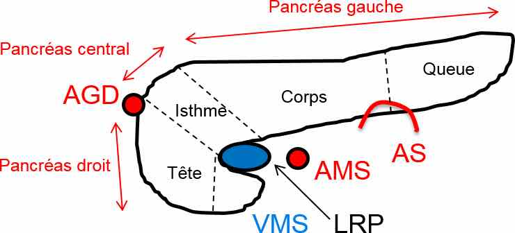
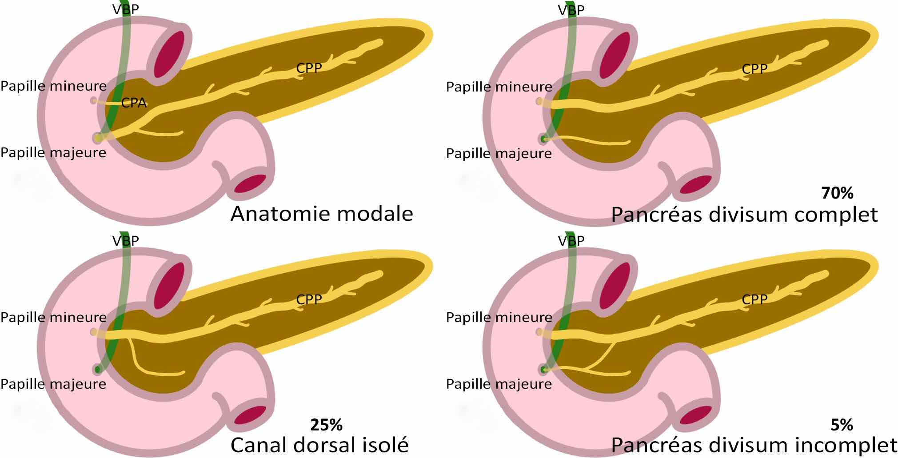

# Anatomie

=== "Estomac"

    <figure markdown="span">
        {width="450"}  
        {width="700"}  
        {width="500"}          
    </figure>

=== "Pancréas"

    <figure markdown="span">
        {width="450"}  
        [{width="800"}](https://radiopaedia.org/articles/pancreas-divisum){:target="_blank"}
        **5% pancréas divisum** = CPP s'abouche dans la papille mineure = + de PA
    </figure> 

=== "Foie"

    <figure markdown="span">
        {width="340"}  
        [{width="400"}](http://onclepaul.fr/wp-content/uploads/2011/07/incidence-chirurgicale-des-variations-vasculaires-abdominalesFILEminimizer.pdf){:target="_blank"}
    </figure>

    !!! danger "sténose du tronc cœliaque"
        - sur hypertrophie du ligament arqué médian = peut être sectionné au bloc
        - sur athérome = **CI ligature art. gastro-duodénale** (arcade de suppléance via l'AMS)

=== "Omentums"

    <figure markdown="span">
        [{width="500"}](https://onclepaul.fr/wp-content/uploads/2011/07/Bourse-omentaleanatomie-lFILEminimizer.pdf){:target="_blank"}  
        [{width="500"}](https://onclepaul.fr/wp-content/uploads/2011/07/Bourse-omentaleanatomie-lFILEminimizer.pdf){:target="_blank"}
        **bourse omentale** (anciennement arrière cavité des épiploons)
    </figure>