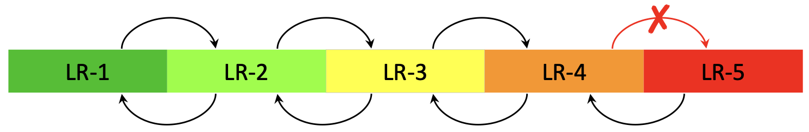
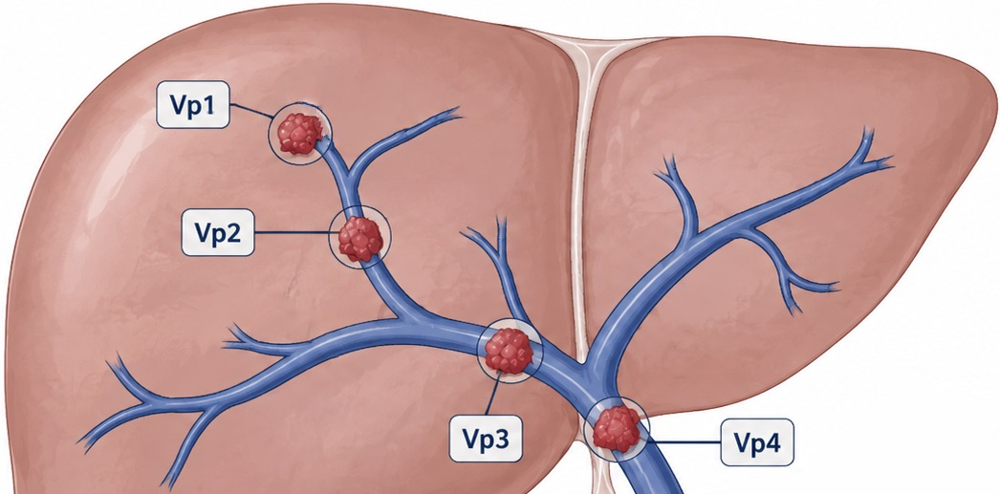
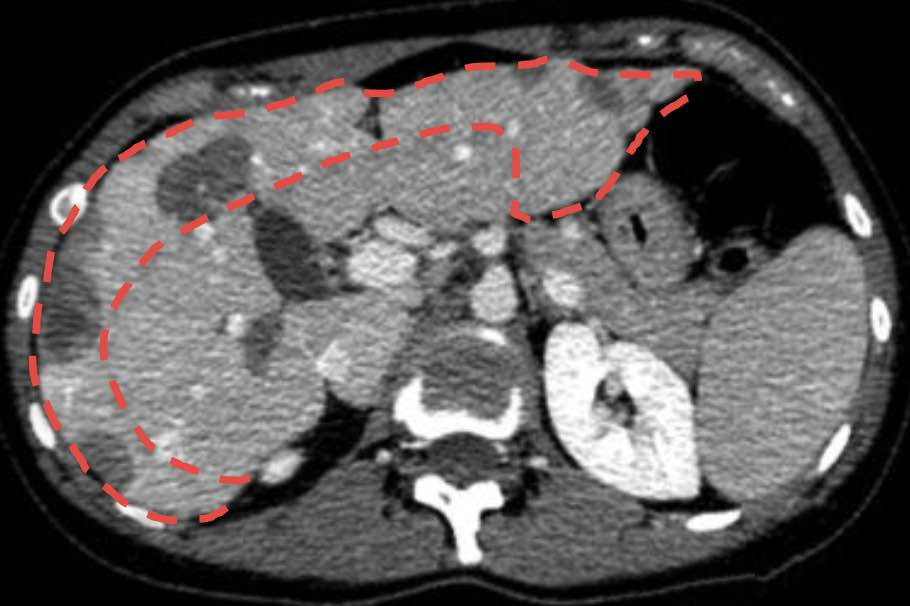
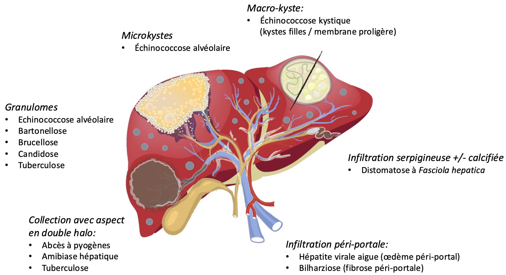
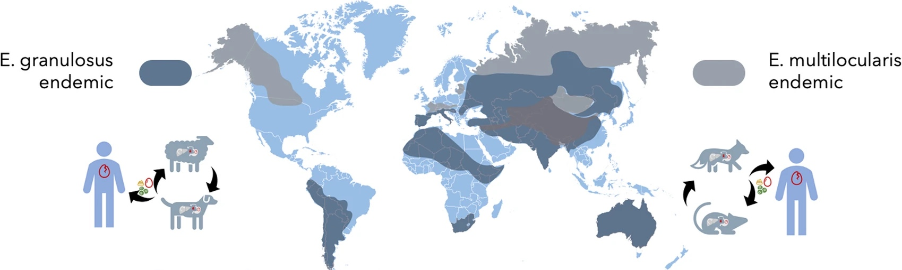
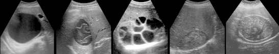
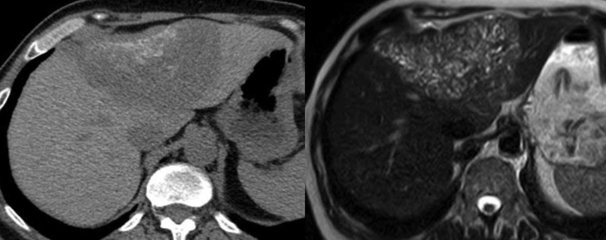
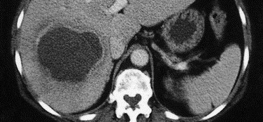
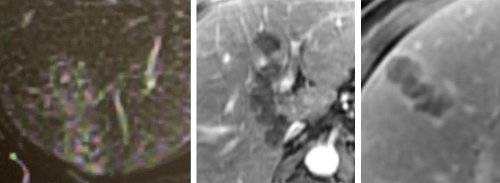

=== "CR"
    ``` title="cirrhose"
    Séquences axiale diffusion, axiale T1 Dixon, axiale et coronale T2.
    Après injection de gadolinium, séries dynamiques T1 FS et T1 Dixon.

    Foie d'hépatopathie chronique avec des contours bosselés, une hypertrophie du foie gauche et du lobe caudé, ainsi qu'une hypotrophie du segment IV.
    Absence de lésion hépatique hypervascularisée ou avec washout qui serait suspecte de carcinome hépatocellulaire.
    Signes d'hypertension portale associant une ascite de faible abondance, une splénomégalie et des voies de dérivations porto-systémiques.
    Perméabilité des vaisseaux hépatiques.
    Pas de dilatation des voies biliaires. 
    Pas d'adénomégalie sur le volume exploré.
    Vésicule biliaire, pancréas, surrénales, et reins sans particularité.
    ```
    ``` title="normale"
    Séquences axiale diffusion, axiale T1 Dixon, axiale et coronale T2.
    Après injection de gadolinium, séries dynamiques T1 FS et T1 Dixon.

    Foie de taille et de morphologie normales, sans lésion focale.
    Vésicule biliaire en réplétion, à parois fines, sans lithiase.
    Pas de dilatation des voies biliaires intra ni extra-hépatiques.
    Perméabilité des vaisseaux hépatiques afférents et efférents.
    Pas d'adénomégalie ni d'ascite sur le volume exploré.
    Rate de taille normale. Pas de voie de dérivation porto-systémique.
    Pancréas d'aspect normal, sans lésion focale, ni dilatation du Wirsung.
    Surrénales, reins, structures digestives, et bases pulmonaires sans particularité.
    ```

=== "LI-RADS"
    ``` mermaid
    graph TD
        B(ssi cirrhose / atcd CHC / VHB chronique) -->|# sauf < 18 ans / maladies vasculaires ou congénitales| C(?)
        
        C -->|bénin/probablement| LR-1(LR-1/LR-2)
        C -->|invasion veineuse| LR-TIV(LR-TIV)
        C -->|aspect en cible| LR-M(LR-M)

        style LR-1 fill:#c4e538,stroke:#333,stroke-width:2px
        style LR-TIV fill:#FFFFFF,stroke:#333,stroke-width:2px
        style LR-M fill:#D16C00,stroke:#333,stroke-width:2px
    ```

    !!! info "[Critères majeures](https://siad.radiologie.fr/wp-content/uploads/Cours-11-M-Wagner.pdf){:target="_blank"} (si doute, considérer le critère comme absent)"
        - lavage non périphérique
        - capsule rehaussée
        - ↗ > 50% en < M6

    | `Nb critères` | ∅ HRPA < 20 | ∅ HRPA ≥ 20 | HRPA < 10 | HRPA 10–19 | HRPA ≥ 20 |
    | --- | --- | --- | --- | --- | --- |
    | `0` | <span style="background-color: #fff500; color: black; padding: 2px 6px; border-radius: 4px; font-weight: bold;">LR-3</span> | <span style="background-color: #fff500; color: black; padding: 2px 6px; border-radius: 4px; font-weight: bold;">LR-3</span> | <span style="background-color: #fff500; color: black; padding: 2px 6px; border-radius: 4px; font-weight: bold;">LR-3</span> | <span style="background-color: #fff500; color: black; padding: 2px 6px; border-radius: 4px; font-weight: bold;">LR-3</span> | <span style="background-color: #ff9200; color: black; padding: 2px 6px; border-radius: 4px; font-weight: bold;">LR-4</span> |
    | `1` | <span style="background-color: #fff500; color: black; padding: 2px 6px; border-radius: 4px; font-weight: bold;">LR-3</span> | <span style="background-color: #ff9200; color: black; padding: 2px 6px; border-radius: 4px; font-weight: bold;">LR-4</span> | <span style="background-color: #ff9200; color: black; padding: 2px 6px; border-radius: 4px; font-weight: bold;">LR-4</span> | <span style="background-color: #ff9200; color: black; padding: 2px 6px; border-radius: 4px; font-weight: bold;">LR-4</span> / <span style="background-color: #ff0000; color: black; padding: 2px 6px; border-radius: 4px; font-weight: bold;">LR-5</span> * | <span style="background-color: #ff0000; color: black; padding: 2px 6px; border-radius: 4px; font-weight: bold;">LR-5</span> |
    | `≥ 2` | <span style="background-color: #ff9200; color: black; padding: 2px 6px; border-radius: 4px; font-weight: bold;">LR-4</span> | <span style="background-color: #ff9200; color: black; padding: 2px 6px; border-radius: 4px; font-weight: bold;">LR-4</span> | <span style="background-color: #ff9200; color: black; padding: 2px 6px; border-radius: 4px; font-weight: bold;">LR-4</span> | <span style="background-color: #ff0000; color: black; padding: 2px 6px; border-radius: 4px; font-weight: bold;">LR-5</span> | <span style="background-color: #ff0000; color: black; padding: 2px 6px; border-radius: 4px; font-weight: bold;">LR-5</span> |

    <figure markdown="span">
        * LR-4 si capsule rehaussée / LR-5 si lavage non périphérique ou croissance supérieure au seuil
    </figure>

    !!! info "[Critères auxiliaires](https://siad.radiologie.fr/wp-content/uploads/Cours-11-M-Wagner.pdf){:target="_blank"}"
        - **en faveur d'un CHC** si capsule non rehaussée, aspect de nodule dans un nodule, aspect en mosaïque, contenu hématique, graisse
        - **malignité** si individualisable en écho, croissance mais inférieure au seuil, restriction en diffusion, hyperintensité T2 modérée, épargne stéatosique, épargne ferrique, hypointense PHB
        - **bénignité** si stabilité > 2 ans, diminution de taille, vaisseaux non déformés, surcharge ferrique intralésionnelle, hyperT2 marqué, isointense PHB

        <figure markdown="span">
            {width="500"}
        </figure>

=== "bases"
    <figure markdown="span">
        stéatose = < 45 UH et ↘ signal en OP &nbsp;&nbsp;&nbsp;&nbsp;&nbsp;&nbsp; surcharge en fer = hypoT2 et ↗ signal OP
    </figure>

    !!! tip "[cirrhose](https://radiopaedia.org/articles/cirrhosis){:target="_blank"}"
        - HYPERtrophie seg I et lobe gauche / hypotrophie lobe droit (dont seg IV)
        - [HTP](https://radiopaedia.org/articles/portal-hypertension){:target="_blank"} = ascite, splénomégalie, voies de dérivations porto-systémiques
        - [nodule régénération](https://radiopaedia.org/articles/regenerative-liver-nodule?lang=us){:target="_blank"} = hypoT2 ± spontanément hyperdense

    !!! tip "**HRPA**"
        |  hépatocytaire (isoT1 et T2 hors FS) |  non hépatocytaire |  
        | :----------: | :-------: |
        | HNF et adénome | angiome capillaire | 
        | troubles perfusionnels | fistule artério-porte | 
        | CHC | métas | 

    !!! tip "**HyperT1**"
        |  graisse* |  sang |  mélanine/mucine |
        | :----------: | :-------: | :-------: |
        | CHC | CHC | mélanome |
        | adénome | adénome | méta ovaire | 
        | ilôt stéatosique | métas | méta colon | 

        \* plus rarement : HNF, angiomyolipome, métas (liposarcome)

    !!! tip "lésions **pédiculées**"
        <figure markdown="span">
            HNF, CHC, angiome, adénome, et TFS
        </figure>

=== "bénin"
    <figure markdown="span">
        /!\ **kyste hémorragique vs [cystadénome](https://radiopaedia.org/articles/mucinous-cystic-neoplasm-of-the-liver-and-biliary-system){:target="_blank"}** = PDC cloisons/nodule (caillot vs tissulaire) = écho de contraste
    </figure>
    
    !!! success "[hémangiome](https://radiopaedia.org/articles/hepatic-haemangioma-3){:target="_blank"}"
        - ECHO hyper, homogène, <u>renforcement post</u>, < 3 cm, Doppler-
        - TDM hypo, PDC centripète en <u>mottes discontinues</u>, sans lavage
        - IRM hypoT1, <u>hyperT2 > rate et rein</u>, DD = méta TNE et CCR mucineux
        - ± shunt artérioveineux en périphérie
        - atypique = [à remplissage rapide](https://radiopaedia.org/articles/flash-filling-hepatic-haemangioma-2){:target="_blank"} / à remplissage lent / [scléreux](https://radiopaedia.org/articles/hyalinised-hepatic-haemangioma){:target="_blank"} / [géant](https://radiopaedia.org/articles/giant-hepatic-haemangioma-1){:target="_blank"} / [pédiculé](https://radiopaedia.org/articles/pedunculated-hepatic-hemangioma){:target="_blank"}

    !!! success "[HNF](https://radiopaedia.org/articles/focal-nodular-hyperplasia){:target="_blank"} // femme jeune ([10x plus fréquent](https://www.fmcgastro.org/postu-main/archives/postu-2009-paris/tumeurs-benignes-du-foie-hyperplasie-nodulairefocale-et-adenomes-2/){:target="_blank"} que l'adénome)"
        - typique = pas d'hépatopathie chronique, semblable au foie avant injection, homogène, contours lobulés, hypervascularisé sans lavage, cicatrice centrale rehaussée au temps tardif
        - IRM cicatrice hypoT1 hyperT2, <u>captation PHB</u> (peu contributif si < 3 cm => écho de contraste)
        - graisse possible (comme dans l'adénome), en revanche pas de capsule


    !!! success "[adénome](https://radiopaedia.org/articles/hepatic-adenoma){:target="_blank"} // **COP**"
        |   |  muté HNF1α |  télangiectasique/inflammatoire | 
        | :----------: | :-------: | :-------: |
        | `terrain` | femme jeune | stéatose |
        | `écho` | hyper <u>homogène</u> Doppler- | <u>hétérogène</u>, Doppler+ |
        | `TDM` | hypo, hypervasc modéré, lavage | hypervasc persiste vx |
        | `IRM` | chute intense et homogène en OP | hyperT2 |
        | `risque` | moins de complications | hémorragie et dégénérescence |

        <figure markdown="span">
            **/!\ homme** => dégénérescence CHC
        </figure>

    !!! success "[HNR](https://radiopaedia.org/articles/nodular-regenerative-hyperplasia){:target="_blank"} // hémopathie, vascularites, chimio, transplantation hépatique"
        &nbsp;&nbsp;&nbsp; petits nodules hypervasc sans lavage + signes d'HTP
    
    !!! success "tumeurs rares"
        - [angiomyolipome](https://radiopaedia.org/articles/hepatic-angiomyolipoma-1){:target="_blank"}
        - [pseudo-tumeur inflammatoire](https://radiopaedia.org/articles/hepatic-inflammatory-pseudotumour){:target="_blank"} = nodule nécrotique solitaire > infiltration périportale

=== "malin"
    !!! danger "[CHC](https://radiopaedia.org/articles/hepatocellular-carcinoma){:target="_blank"} // OH, NASH, hépatites virales, hémochromatose"
        - HRPA et lavage > 1 cm, hyperT2 modéré ± graisse
        - capsule, composantes nécrotiques/hémorragiques, **thrombose porte**
        <figure markdown="span">
            [{width="500"}](https://www.mdpi.com/1422-0067/22/23/12880){:target="_blank"}
        </figure>
        - /!\ CHC hypovasc (y penser devant tout nodule hépatocytaire sur cirrhose)
        - [carcinome fibrolamellaire](https://radiopaedia.org/articles/fibrolamellar-hepatocellular-carcinoma?lang=us){:target="_blank"} = sur foie sain, 20-40 ans, cicatrice centrale, DD HNF

    !!! danger "[cholangiocarcinome](https://radiopaedia.org/articles/cholangiocarcinoma){:target="_blank"} // polykystose, cholangite, cirrhose"
        - TDM hypovasc ± hypervasc périph, dilatation VB, zones fibreuses ± nécrotiques
        - IRM **rétractile**, hypoT1, hyperT2 modéré/franc, DD méta adk mmucineux

    !!! danger "[métas](https://radiopaedia.org/articles/hepatic-metastases-1){:target="_blank"}"
        - ECHO halo périph hypoéchogène
        - TDM contours irréguliers, PDC périph hétérogène
        - IRM <u>restriction diffusion</u>, hypoT1, hyperT2 modéré (sauf TNE hyperT2 franc)
        - <u>Lavage PHB</u> /!\ sauf fibrose avec le Multihance (captation progressive, adk mucineux ++)

        |  hypovasculaire | HYPERvasc ± sang  | kystiques |  
        | :----------: | :-------: | :-------: | 
        | CCR, pancréas | TNE, CCC, CMT, mélanome | TNE, adk mucineux | 
        | poumon, sein | sarcome, chorioK, GIST | sarcome, mélanome, VADS | 

        <figure markdown="span">
            Ca<sup>2+</sup> = adk mucineux / HyperT1 marqué = mélanome / stéatose adjacente = insulinome
        </figure>

    !!! danger "[hémangioendothéliome épithélioïde](https://radiopaedia.org/articles/hepatic-epithelioid-hemangioendothelioma-1?lang=us){:target="_blank"} = 40a"
        - lésion vasculaire rare, malignité intermédiaire (métas poumon, os, rate)
        - nodules périphériques rétractiles hypovasc avec PDC périph
        - IRM aspect en cible, centre franc hyperT2 > périph, hyperdiff central
        <figure markdown="span">
            {width="300"}
        </figure>

=== "kystes"
    !!! info "[kyste hépatique simple](https://radiopaedia.org/articles/simple-hepatic-cyst){:target="_blank"} (polykystose si ≥ 3)"
        - hyperT2 liquidien sur séquence T2 long, franc hypoT1
        - /!\ grande taille => hémorragie, rupture, infection

    !!! info "[hamartomes biliaires](https://radiopaedia.org/articles/multiple-biliary-hamartomas-1){:target="_blank"}"
        - petits kystes disséminés ± nodule mural se rehaussant
        - associations : [Caroli](https://radiopaedia.org/articles/caroli-disease-1){:target="_blank"}, fibrose congénitale, polykystose hépatique/rénale

    !!! info "[kystes péri-biliaires](https://radiopaedia.org/articles/peribiliary-cyst-1){:target="_blank"} // cirrhose"
        dilatation microkystique des glandes péribiliaires péri-hilaire ++

    !!! info "[kyste à revêtement cilié](https://radiopaedia.org/articles/ciliated-hepatic-foregut-cyst){:target="_blank"}"
        - sous-capsulaire segment IV, < 4 cm, ± spontanément dense
        - 4% transformation en carcinome épidermoïde => exérèse ++

    !!! info "[cystadénome](https://radiopaedia.org/articles/biliary-cystadenoma){:target="_blank"} biliaire // femme d'âge moyen"
        - grand kyste multiloculaire, cloisons et parois épaisses
        - nodule mural = cystadénocarcinome

=== "infection"
    <figure markdown="span">
        [hépatite virale aiguë](https://radiopaedia.org/articles/acute-hepatitis){:target="_blank"} = hépatomégalie + œdème périportal + épaississement parois vésiculaires  
        <br>
        {width="900"}
        <br>
        {width="800"}        
    </figure>

    !!! example "parasitoses"
        - [kyste hydatique](https://radiopaedia.org/articles/hepatic-hydatid-infection?embed_domain=external.radpair.com%2527%255B0%255Dfavicon.ico&lang=us){:target="_blank"} = kyste uniloculaire (Gharbi I) / mb flottante (II) / vésicules filles (III) / pseudo-tumeur (IV) / calcifié (V)
        <figure markdown="span">
            [{width="700"}](https://radiopaedia.org/articles/who-iwgeclassification-of-cystic-echinococcosis?embed_domain=external.radpair.com%2527%255B0%255Dfavicon.ico){:target="_blank"}
        </figure>
        - [échinococcose alvéolaire](https://radiopaedia.org/articles/alveolar-echinococcosis?lang=us){:target="_blank"} = masse infiltrante avec calcifications et sans rehaussement, microkystes en IRM +++
        <figure markdown="span">
            {width="450"}
        </figure>
        - [abcès amibien](https://radiopaedia.org/articles/amoebic-hepatic-abscess){:target="_blank"} = DD abcès à pyogènes = Afrique, Asie du sud-est, Amérique latine
        <figure markdown="span">
            {width="300"}
        </figure>
        - [distomatose](https://www.radeos.org/maladie/fiche-distomatose-hepatique-a-fasciola-hepatica_1634.html){:target="_blank"} = nodules sous-capsulaires serpigineux convergeant vers le hile
        <figure markdown="span">
            {width="350"}
        </figure>