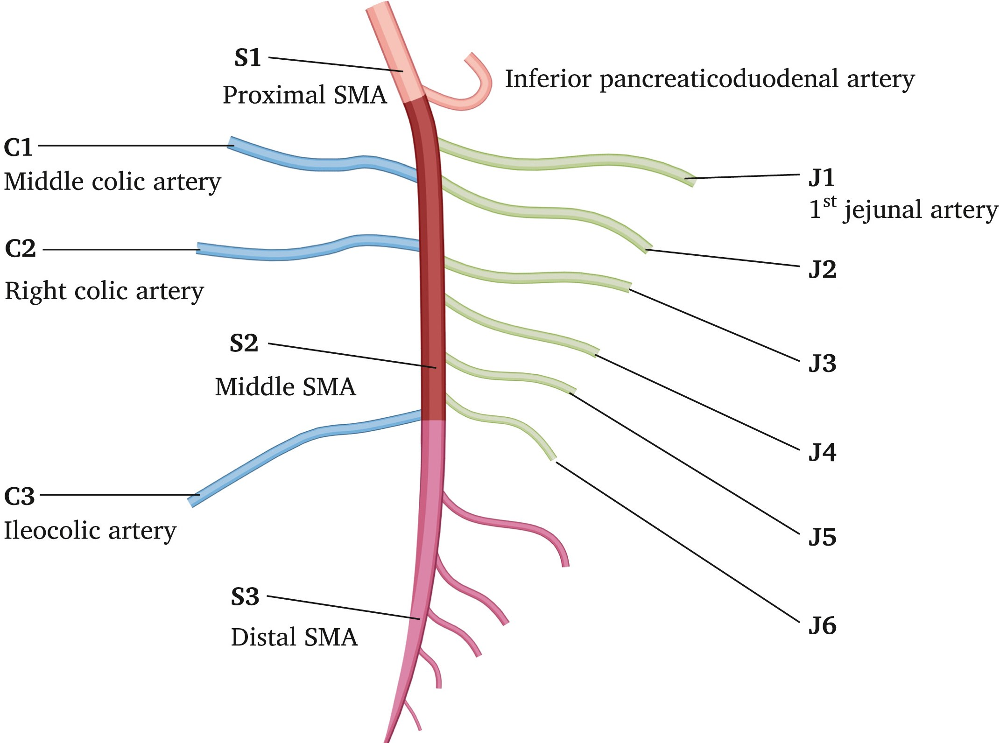
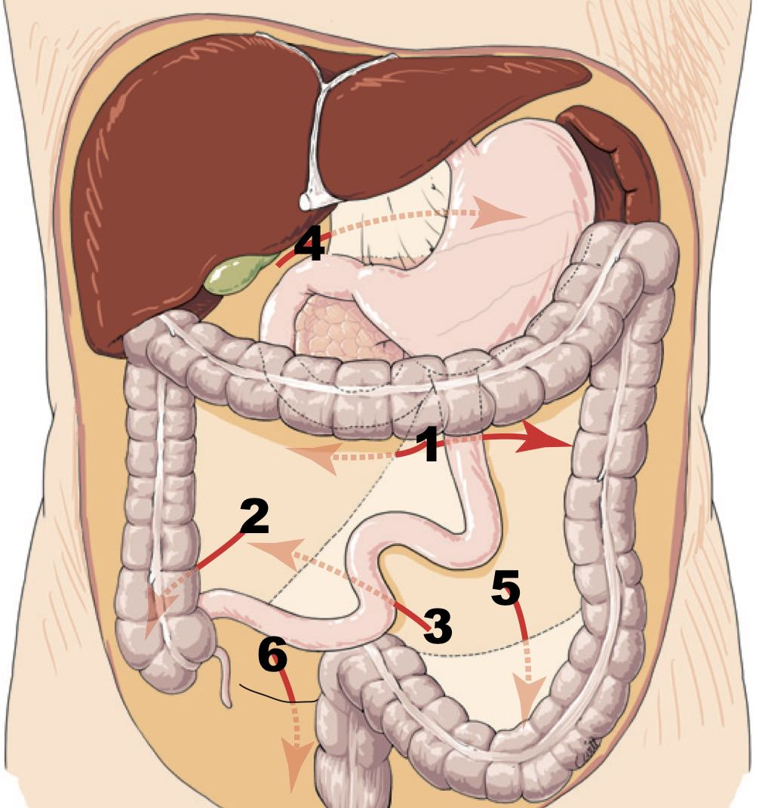
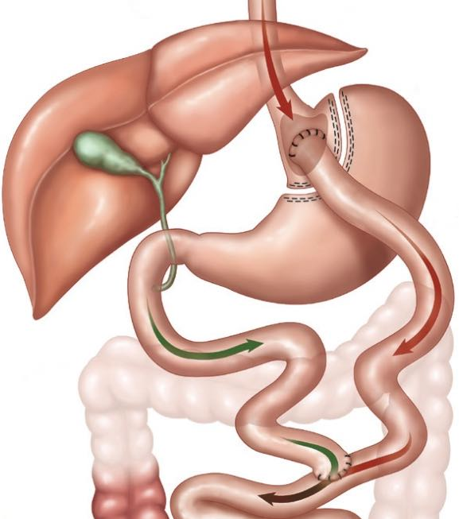
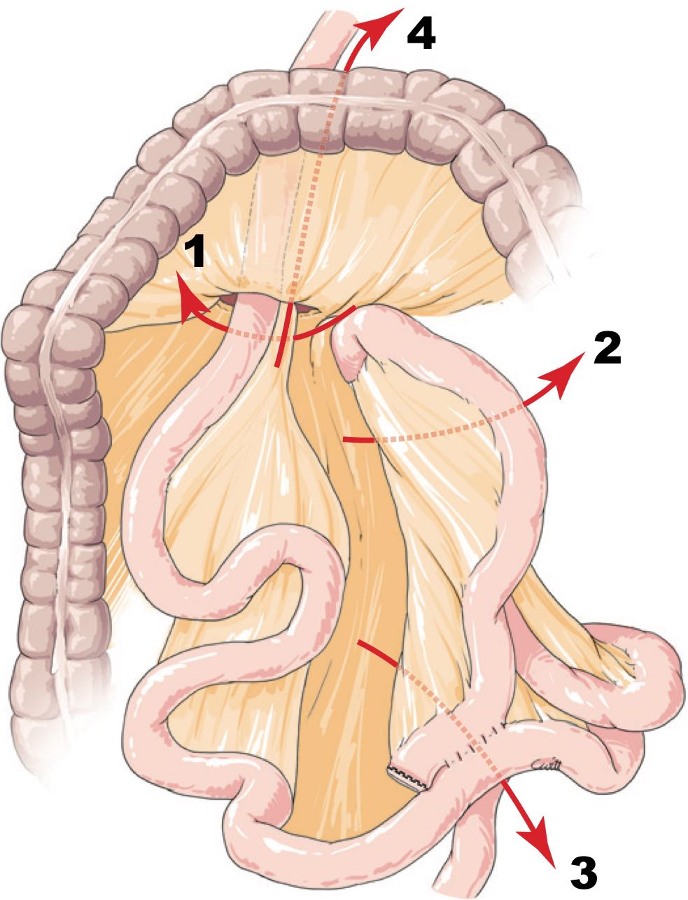

# [Intestin grêle](https://radiopaedia.org/articles/small-bowel){:target="_blank"}

=== "Ischémie mésentérique"
    <figure markdown="span">
        [dl abdo intense brutale](https://radiopaedia.org/articles/mesenteric-ischaemia){:target="_blank"} chez l'homme avec FDRCV = APx3   
        **80% occlusion artérielle** > 10% ischémie non-occlusive et 10% occlusion veineuse  
        {width="600"}
        embolie (/!\ VG et Ao) > thrombose > dissection
    </figure>

    !!! danger "[Probabilité](https://pubmed.ncbi.nlm.nih.gov/28266590/){:target="_blank"} de nécrose"
        - lactate > 2 mmol/L (seulement 50% des cas)
        - **dilatation** grélique > 25 mm (mort des plexus nerveux)
        - défaut de rehaussement et pneumatose pariétale

    !!! warning "Complications à distance"
        - 50% **sd de reperfusion** = dl, saignement, SIB = épaississement pariétal
        - entérite post-ischémique = sténose Crohn-like

=== "Hernies internes"
    <figure markdown="span">
        [Hernies internes](https://radiopaedia.org/articles/internal-hernia){:target="_blank"} = 2% des occlusion gréliques
        [{width="350"}](https://onclepaul.fr/wp-content/uploads/2011/07/hernies-internes-emc-2015.pdf){:target="_blank"}
        1 = 50% **paraduodénale**, 2 = 15% péricaecale, 3 = 10% transmésentérique,  
        4 = foramen de Winslow, 5 = intersigmoïdienne, 6 = pelvienne (ligament large)  
    </figure>
    <figure markdown="span">
        [{width="300"}](https://radiopaedia.org/articles/roux-en-y-gastric-bypass-surgery){:target="_blank"}
        Bypass gastrique par [Roux-en-Y](https://radiopaedia.org/articles/roux-en-y-gastric-bypass-surgery){:target="_blank"} (plus fréquent que [mini-bypass](https://radiopaedia.org/cases/mini-gastric-bypass-surgery-1){:target="_blank"})  
        /!\ fistule anastomose gastro-jéjunale et sténose anastomose jéjuno-jéjunale  
        + 5% hernie interne tardive (dl abdo intermittente à 2 ans) si **cœlioscopie**  
        [{width="300"}](https://onclepaul.fr/wp-content/uploads/2011/07/hernies-internes-emc-2015.pdf){:target="_blank"}
        1 = hernie de [Petersen](https://radiopaedia.org/articles/petersen-hernia-1){:target="_blank"}, entre l'anse alimentaire et le mésocôlon transverve  
        2 = hernie transmésentérique, en arrière des anses alimentaire et biliaire  
        3 = en arrière de l'anastomose jéjunojénunale (au pied de l'anse montée)  
        4 = hernie transmésocolique, ssi anse montée en rétro-colique (rare)  
    </figure>
    !!! tip "**TDM avec balisage** par PDC hydrosoluble"
        - occlusion du grêle avec disposition radiaire des anses
        - signe du tourbillon (Se 80% Sp 80%), avec pincement de la VMS ++
        - engorgement lymphatique (adénomégalie et infiltration du mésentère)
        - déplacement vers la droite de l'anastomose jéjunojéjunale
        - anses grêle autre que le duodènum derrière l'AMS