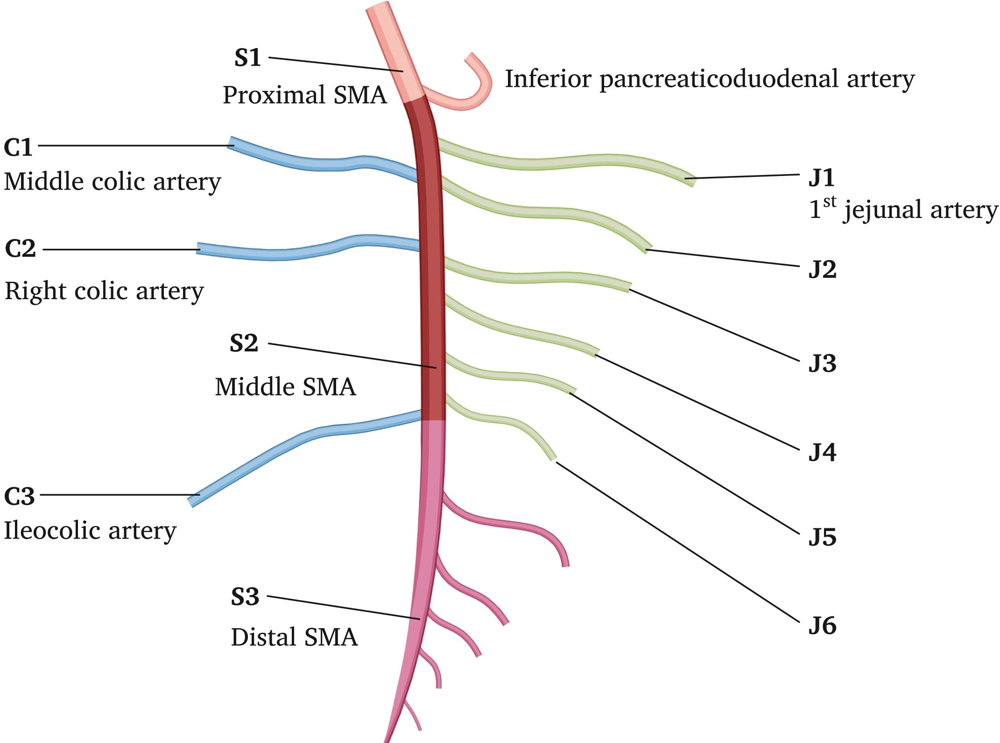
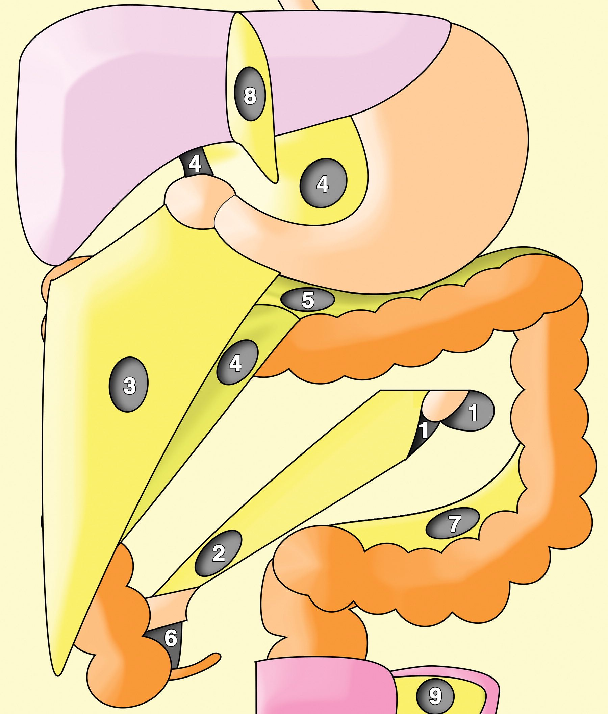
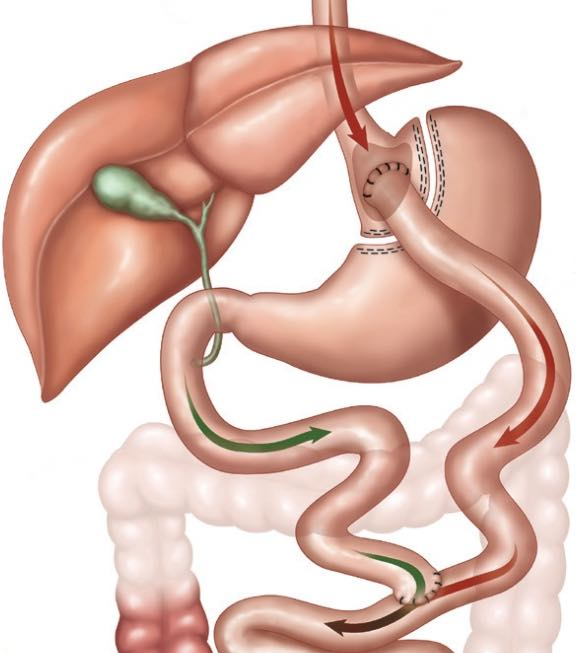
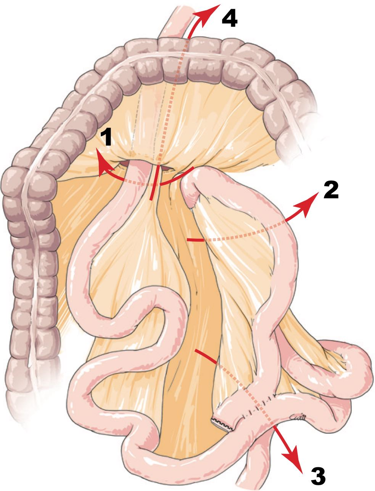

# [Intestin grêle](https://radiopaedia.org/articles/small-bowel){:target="_blank"}

=== "ischémie mésentérique"
    <figure markdown="span">
        [dl abdo intense brutale](https://radiopaedia.org/articles/mesenteric-ischaemia){:target="_blank"} chez l'homme avec FDRCV = APx3 4 cc/s et 2 ml/kg   
        **80% occlusion artérielle** (embolique / athéro-thrombotique) = 50% †  
        10% ischémie non-occlusive (vasoconstriction splanchnique) = 80% †  
        10% occlusion veineuse  (infarcissement hémorragique ?) = 10% †  
         
        {width="600"}
        embolie (/!\ VG et Ao) > thrombose > dissection
    </figure>

    !!! danger "[Probabilité](https://pubmed.ncbi.nlm.nih.gov/28266590/){:target="_blank"} de **nécrose transmurale**"
        - lactate > 2 mmol/L (seulement 50% des cas)
        - **dilatation** grélique > 25 mm (mort des plexus nerveux)

    !!! warning "Complications à distance"
        - 50% **sd de reperfusion** = dl, saignement, SIB = épaississement pariétal
        - entérite post-ischémique = sténose Crohn-like

=== "sd occlusif"

    !!! warning "Signes de **souffrance ischémique**"
        - anse fermée (distance entre les becs < 2 cm)
        - hyperdensité spontanée
        - défaut rehaussement
        - infiltration profonde méso
        - (pneumatose et aéromésentérie/portie)

    <figure markdown="span">
        [**2% de hernies internes**](https://pubs.rsna.org/doi/10.1148/rg.2016150113?url_ver=Z39.88-2003&rfr_id=ori:rid:crossref.org&rfr_dat=cr_pub%20%200pubmed){:target="_blank"} = mécanisme à **anse fermée**
        [{width="450"}](https://pubs.rsna.org/doi/10.1148/rg.2016150113?url_ver=Z39.88-2003&rfr_id=ori:rid:crossref.org&rfr_dat=cr_pub%20%200pubmed){:target="_blank"}
        1 = **paraduodénale** ([G = VMI en avant](https://radiopaedia.org/cases/left-paraduodenal-hernia-11?lang=gb){:target="_blank"} / [D = AMS en avant](https://radiopaedia.org/cases/right-paraduodenal-hernia-1){:target="_blank"} avec malrotation mésentère++)  
        2 = transmésentérique, 3 = transomentale, 4 = foramen de Winslow (petit omentum)  
        5 et 7 = mésocolon, 6 = péricaecale, 8 = ligament falciforme, 9 = ligament large  
    </figure>

=== "bypass"

    <figure markdown="span">
        [{width="300"}](https://radiopaedia.org/articles/roux-en-y-gastric-bypass-surgery){:target="_blank"}
        Bypass gastrique par [Roux-en-Y](https://radiopaedia.org/articles/roux-en-y-gastric-bypass-surgery){:target="_blank"} (plus fréquent que [mini-bypass](https://radiopaedia.org/cases/mini-gastric-bypass-surgery-1){:target="_blank"})  
        = anse alimentaire 1,5m + anse bilio-pancréatique ↬ pied de l'anse  
        /!\ fistule anastomose gastro-jéjunale et sténose anastomose jéjuno-jéjunale  
        + 5% hernie interne tardive (dl abdo intermittente à 2 ans, ++ si **cœlioscopie**)  
    </figure>

    !!! tip "Occlusion = **TDM avec ingestion** PDC hydrosoluble (30 ml Gastrographin + 100 ml eau juste avant)"
        - occlusion du grêle avec disposition radiaire des anses
        - signe du **tourbillon** (Se 80% Sp 80%), avec **pincement** de la VMS ++
        - engorgement lymphatique (adénomégalie et infiltration du mésentère)
        - déplacement vers la droite de l'anastomose jéjunojéjunale
        - anses grêle autre que le duodénum derrière l'AMS

    <figure markdown="span">
        [{width="300"}](https://onclepaul.fr/wp-content/uploads/2011/07/hernies-internes-emc-2015.pdf){:target="_blank"}
        **1 = hernie de** [**Petersen**](https://radiopaedia.org/cases/petersen-defect-internal-hernia-roux-en-y-gastric-bypass){:target="_blank"}, entre l'anse alimentaire et le mésocôlon transverve  
        **2 = hernie transmésentérique**, en arrière des anses alimentaire et biliaire  
        3 = en arrière de l'anastomose jéjunojénunale (au pied de l'anse montée)  
        4 = hernie transmésocolique, ssi anse montée en rétro-colique (rare)  
    </figure>
