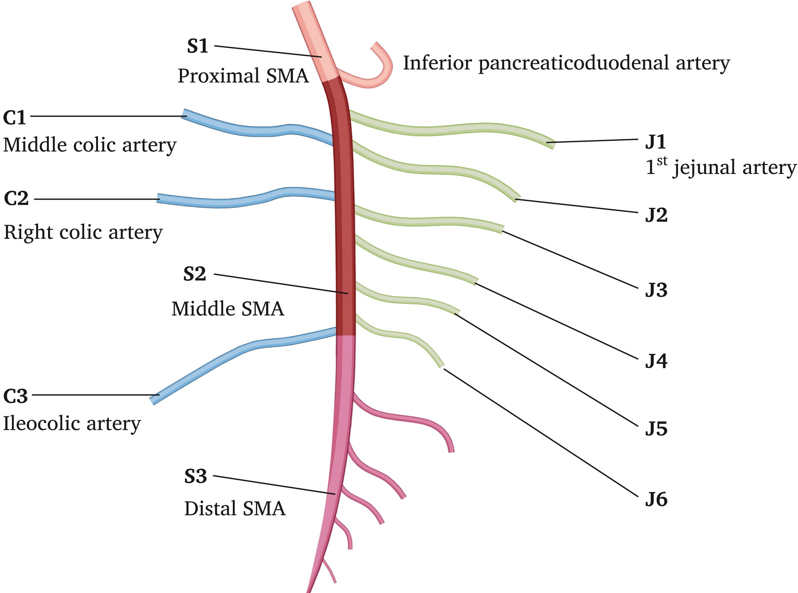
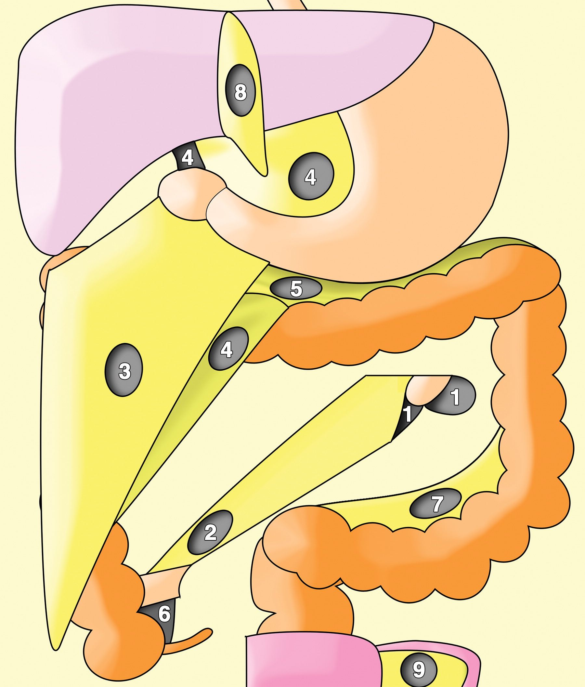
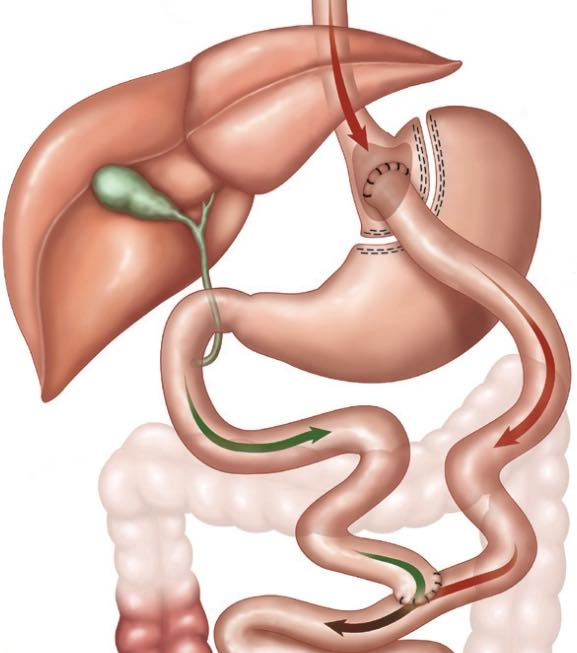
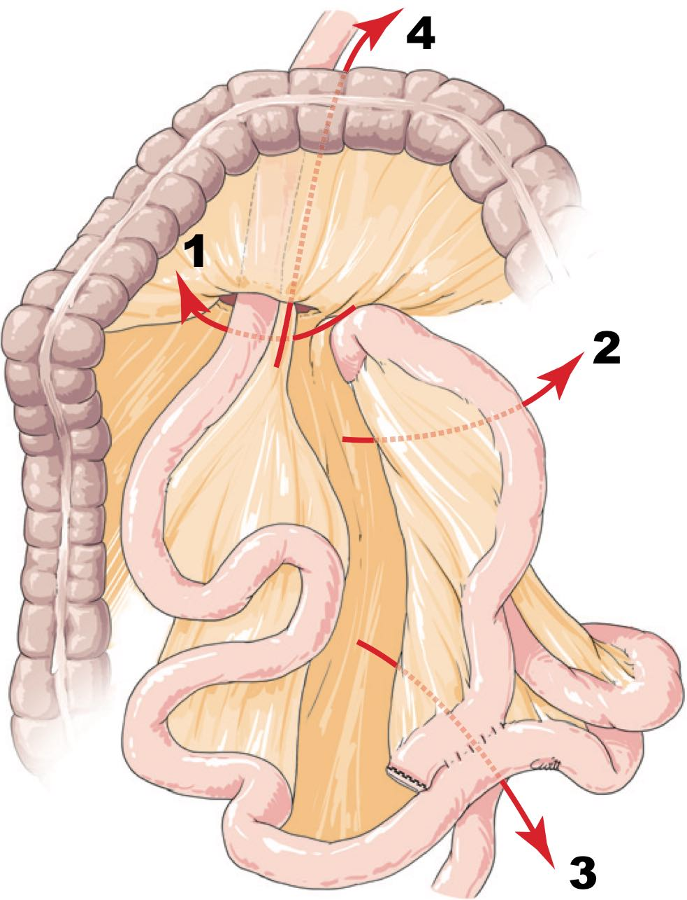
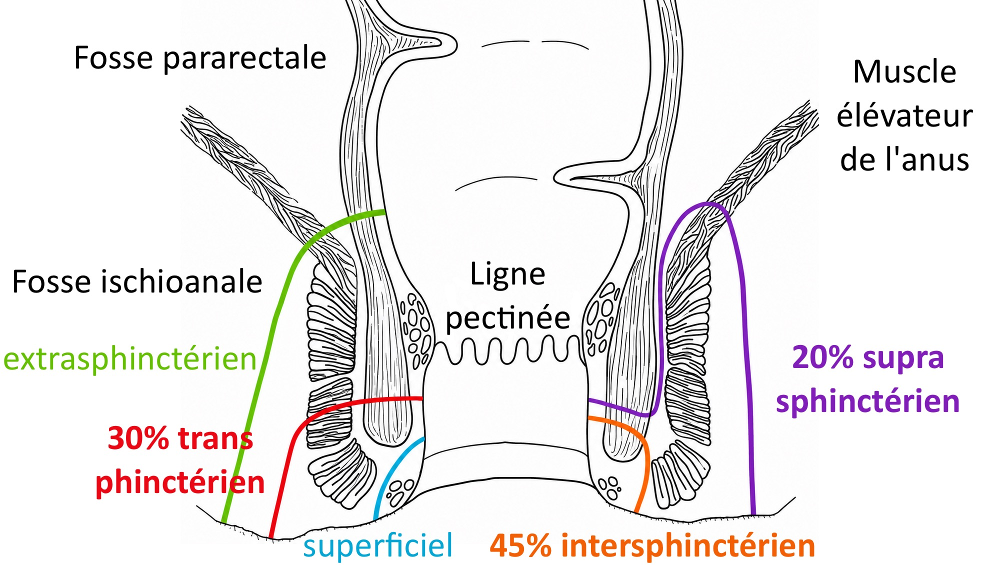
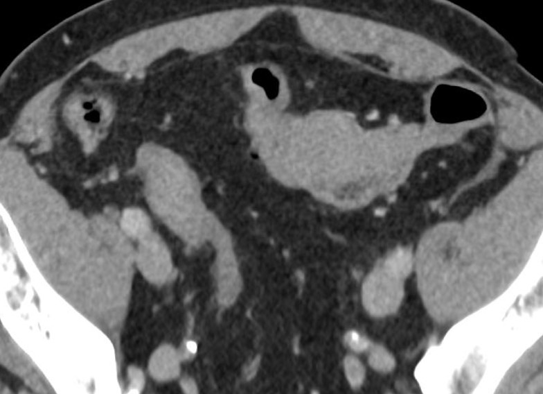
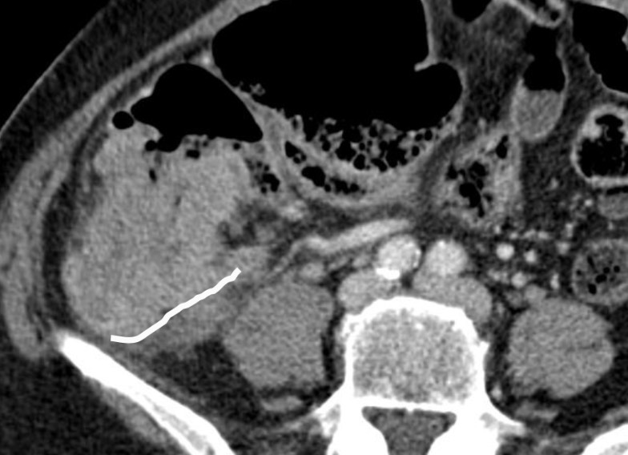
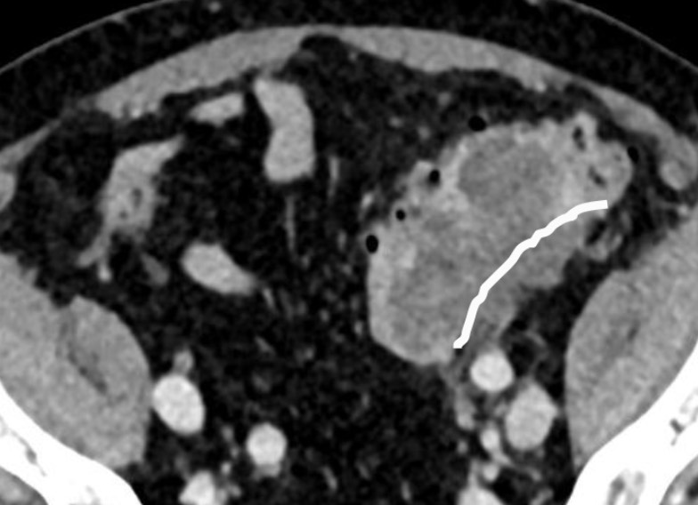
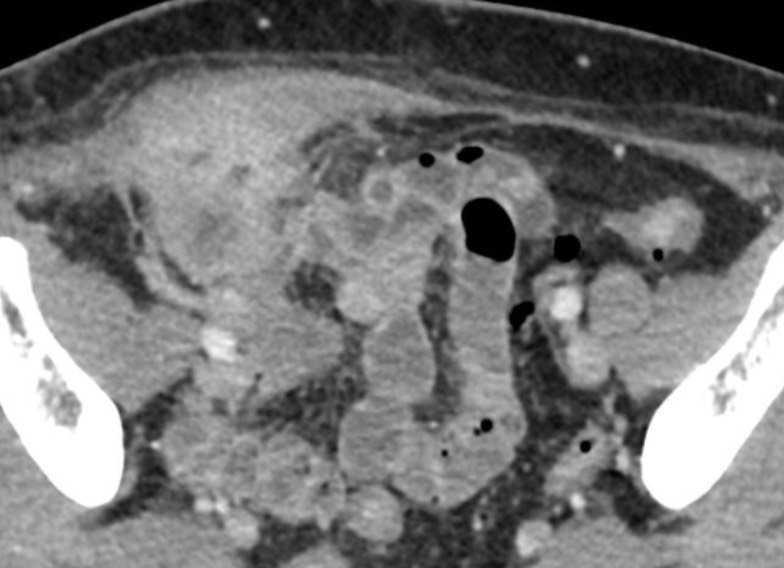

# Grêle et côlon

=== "ischémie mésentérique"
    <figure markdown="span">
        [dl abdo intense brutale](https://radiopaedia.org/articles/mesenteric-ischaemia){:target="_blank"} chez l'homme avec FDRCV = APx3 4 cc/s et 2 ml/kg   
        **80% occlusion artérielle** (embolique / athéro-thrombotique) = 50% †  
        10% ischémie non-occlusive (vasoconstriction splanchnique) = 80% †  
        10% occlusion veineuse  (infarcissement hémorragique ?) = 10% †  
        <br>
        {width="600"}
        embolie (/!\ VG et Ao) > thrombose > dissection
    </figure>

    !!! danger "[Probabilité](https://pubmed.ncbi.nlm.nih.gov/28266590/){:target="_blank"} de **nécrose transmurale**"
        - lactate > 2 mmol/L (seulement 50% des cas)
        - **dilatation** grélique > 25 mm (mort des plexus nerveux)

    !!! warning "Complications à distance"
        - 50% **sd de reperfusion** = dl, saignement, SIB = épaississement pariétal
        - entérite post-ischémique = sténose Crohn-like

=== "sd occlusif"

    !!! warning "Signes de **souffrance ischémique**"
        - anse fermée (distance entre les becs < 2 cm)
        - hyperdensité spontanée
        - défaut rehaussement
        - infiltration profonde méso
        - (pneumatose et aéromésentérie/portie)

    <figure markdown="span">
        [**2% de hernies internes**](https://pubs.rsna.org/doi/10.1148/rg.2016150113?url_ver=Z39.88-2003&rfr_id=ori:rid:crossref.org&rfr_dat=cr_pub%20%200pubmed){:target="_blank"} = mécanisme à **anse fermée**
        [{width="450"}](https://pubs.rsna.org/doi/10.1148/rg.2016150113?url_ver=Z39.88-2003&rfr_id=ori:rid:crossref.org&rfr_dat=cr_pub%20%200pubmed){:target="_blank"}
        1 = **paraduodénale** ([G = VMI en avant](https://radiopaedia.org/cases/left-paraduodenal-hernia-11?lang=gb){:target="_blank"} / [D = AMS en avant](https://radiopaedia.org/cases/right-paraduodenal-hernia-1){:target="_blank"} avec malrotation mésentère++)  
        2 = transmésentérique, 3 = transomentale, 4 = foramen de Winslow (petit omentum)  
        5 et 7 = mésocolon, 6 = péricaecale, 8 = ligament falciforme, 9 = ligament large  
    </figure>

=== "bypass"

    <figure markdown="span">
        [{width="300"}](https://radiopaedia.org/articles/roux-en-y-gastric-bypass-surgery){:target="_blank"}
        Bypass gastrique par [Roux-en-Y](https://radiopaedia.org/articles/roux-en-y-gastric-bypass-surgery){:target="_blank"} (plus fréquent que [mini-bypass](https://radiopaedia.org/cases/mini-gastric-bypass-surgery-1){:target="_blank"})  
        = anse alimentaire 1,5m + anse bilio-pancréatique ↬ pied de l'anse  
        /!\ fistule anastomose gastro-jéjunale et sténose anastomose jéjuno-jéjunale  
        + 5% hernie interne tardive (dl abdo intermittente à 2 ans, ++ si **cœlioscopie**)  
    </figure>

    !!! tip "Occlusion = **TDM avec ingestion** PDC hydrosoluble (30 ml Gastrographin + 100 ml eau juste avant)"
        - occlusion du grêle avec disposition radiaire des anses
        - signe du **tourbillon** (Se 80% Sp 80%), avec **pincement** de la VMS ++
        - engorgement lymphatique (adénomégalie et infiltration du mésentère)
        - déplacement vers la droite de l'anastomose jéjunojéjunale
        - anses grêle autre que le duodénum derrière l'AMS

    <figure markdown="span">
        [{width="300"}](https://onclepaul.fr/wp-content/uploads/2011/07/hernies-internes-emc-2015.pdf){:target="_blank"}
        **1 = hernie de** [**Petersen**](https://radiopaedia.org/cases/petersen-defect-internal-hernia-roux-en-y-gastric-bypass){:target="_blank"}, entre l'anse alimentaire et le mésocôlon transverve  
        **2 = hernie transmésentérique**, en arrière des anses alimentaire et biliaire  
        3 = en arrière de l'anastomose jéjunojénunale (au pied de l'anse montée)  
        4 = hernie transmésocolique, ssi anse montée en rétro-colique (rare)  
    </figure>

=== "Crohn"

    |  sténose  | inflammatoire |  fibrose  |  
    | :----------: | :-------: | :-------: | 
    | `paroi`  | épaissie (> 3mm) | fine | 
    | `T2`  | hyper (œdème sous-muqueux) | hypo | 
    |  `rehaussement` | en cible, intense | homogène, moins intense | 

    !!! warning "Complications"
        - ulcérations, fistule et abcès
        - masse mésentérique (magma inflammatoire)
        - thrombose veineuse
        - cancer

    ```
    Absence d'épaississement pariétal iléal ou jéjunal.
    Pas d'hypersignal diffusion ni de prise de contraste pathologique.
    Pas de collection péritonéale ni de trajet fistuleux.
    Pas d'adénopathie mésentérique ou rétropéritonéale.
    Absence d'épanchement péritonéal.

    Pas d'argument pour une atteinte inflammatoire de l'intestin.
    ```


=== "fistules anales"

    <figure markdown="span">
        [{width="500"}](https://www.radeos.org/maladie/fiche-fistule-anale_1447.html){:target="_blank"}
    </figure>

    === "intersphinctérien"
        ```
        Trajet fistuleux unique naissant à  heures au niveau de la ligne pectinée.
        Il se prolonge dans l'espace intersphinctérien jusqu'à un orifice cutané à  heures.

        Pas d'extension en fer à cheval ni supra-lévatorienne.
        Pas de trajet fistuleux secondaire.
        Pas d'abcès.
        ```    
    === "transphinctérien"
        ```
        Trajet fistuleux unique naissant à  heures au niveau de la ligne pectinée.
        Il traverse l'espace intersphinctérien et le tiers inférieur du sphincter externe.
        Puis il se prolonge dans la fosse ischio-anale jusqu'à un orifice cutané postérieur.

        Pas d'extension en fer à cheval ni supra-lévatorienne.
        Pas de trajet fistuleux secondaire.
        Pas d'abcès.
        ```   
    === "suprasphinctérien"
        ```
        Trajet fistuleux unique naissant à  heures au niveau de la ligne pectinée.
        Il chemine dans l'espace intersphinctérien et remonte au-dessus du sphincter externe.
        Puis il contourne le muscle élévateur de l'anus avant de redescendre dans la fosse ischio-anale .
        Enfin, il se prolonge jusqu'à un orifice externe cutané périnéal .

        Pas d'extension en fer à cheval ni supra-lévatorienne.
        Pas de trajet fistuleux secondaire.
        Pas d'abcès. 
        ```   

=== "CCR"

    |  [TNM](https://oncologik.fr/referentiels/dsrc/colon#5.Classifications%20TNM%202017%20(8ème%20édition)%C2%A0:%20cancers%20colorectaux){:target="_blank"} | signification | aspect | 
    | :----------: | :-------: | :-------: |
    | T1/T2 | envahi sous-muqueuse/musculeuse | {width="200"} |
    | T3 | envahissement péricolique | {width="200"} |
    | T4a | perfore le péritoine | {width="200"} |
    | T4b | envahi un organe | {width="200"} |