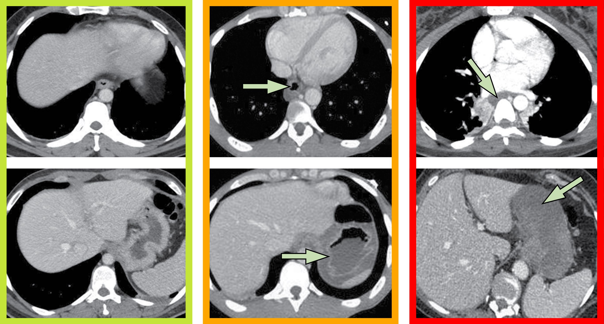
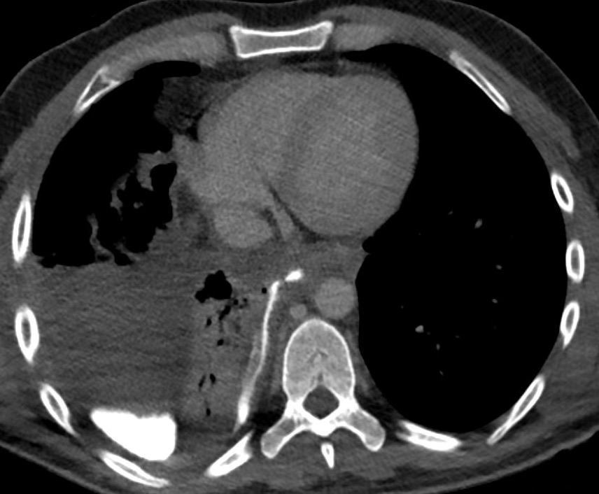

=== "Caustique"
    
    !!! tip "[Classification de **Chirica**](https://www.fmcgastro.org/texte-postu/postu-2023/prise-en-charge-de-lingestion-de-caustique/){:target="_blank"}"
        - **10% chirurgie** en Ⓤ si nécrose transmurale en **TDM** (fibro ssi enfant ou CI PDC)
        - TDM **3 à 6 heures après** l'ingestion = cervico-thoraco-abdo IV- + 90s (2 ml/kg, 350 mg iode/ml, ≥ 2 ml/s)

    <figure markdown="span">
        {width="900"}
    </figure>

    |  Grade |  `Œsophage` |  `Estomac` |
    | :----------: | :-------: |  :-------: | 
    | I | aspect normal (pas de risque de sténose) | aspect normal | 
    | II | PDC muqueuse IIa / externe IIb | œdème | 
    | III | nécrose transmurale | nécrose | 

    |   |  `Bases fortes (pH > 12)` |  `Acides forts (pH < 2)` | `Oxydants` |
    | :----------: | :-------: |  :-------: | :-------: |
    | **Exemples** | Destop (soude) | chlorhydrique, sulfurique, ... | eau de Javel, ammoniac, ... |    
    | **Sévérité** | +++ | +++ | - (généralement dilués) |
    | **Viscosité** | élevée => pharynx + œsophage | faible => estomac + duodénum | | 
    | **Volatilité** | faible | élevée /!\ inhalation |  |

=== "Perforation"

    <figure markdown="span">
        TDM **sans + 90s avec ingestion** PDC dilué à 10%  
         
        Syndrome de [Boerhaave](https://radiopaedia.org/articles/boerhaave-syndrome?lang=gb){:target="_blank"}  
        = perforation 1/3 inférieur sur vomissement
        {width="300"}
        => fistule œso-pleurale ? (parfois retardée)
    </figure>