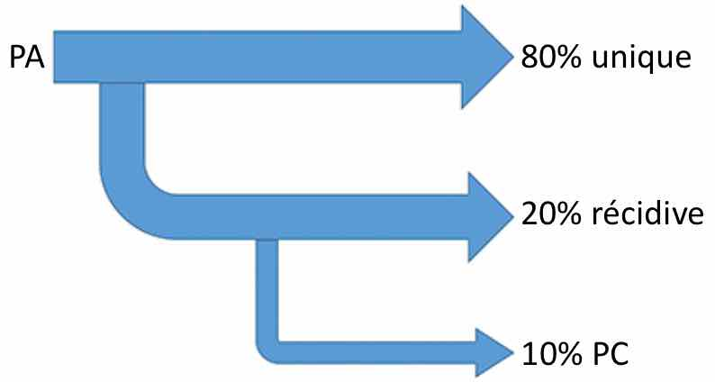
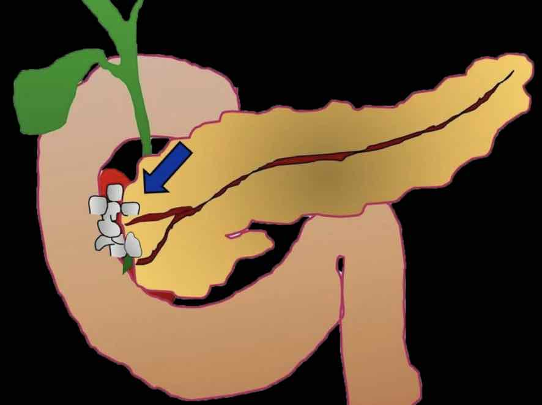
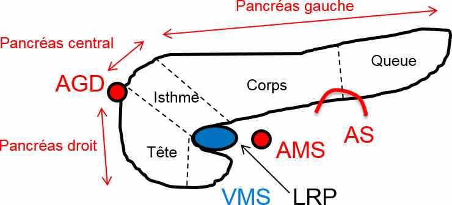
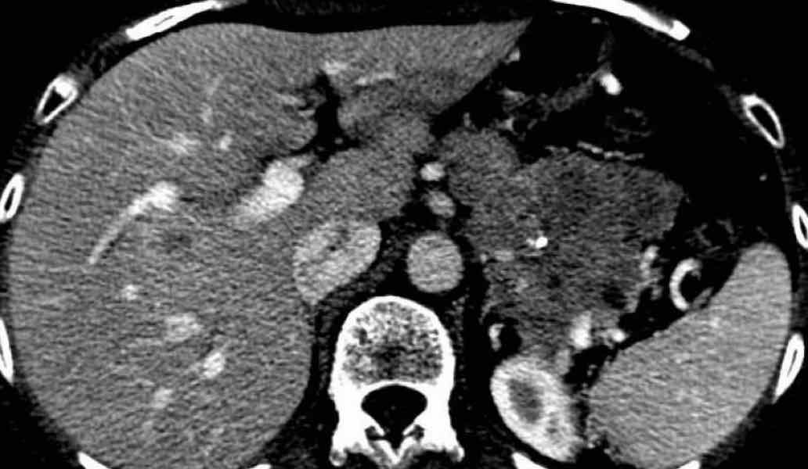
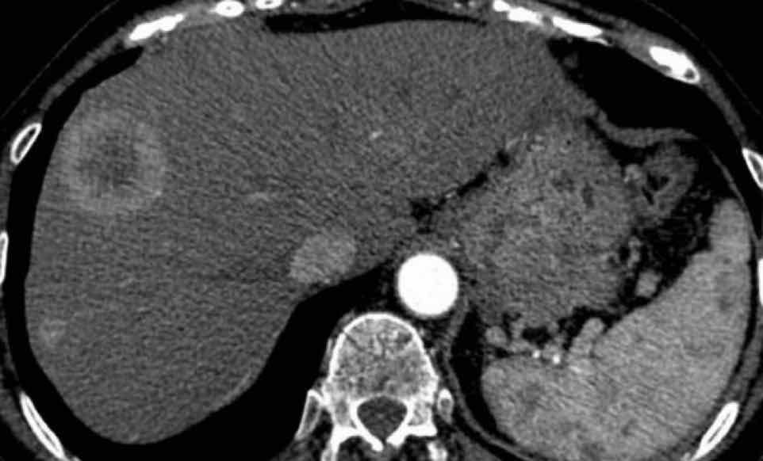
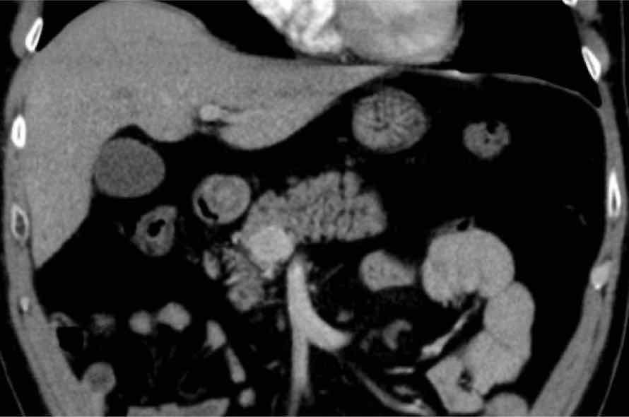
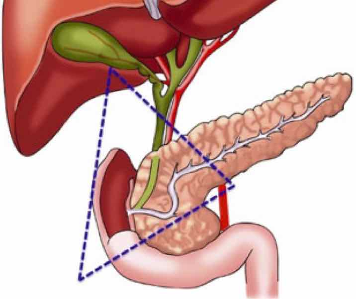
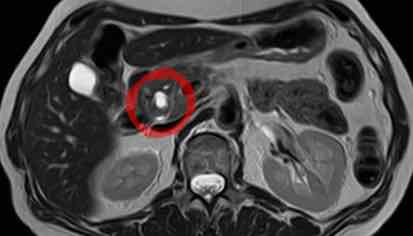
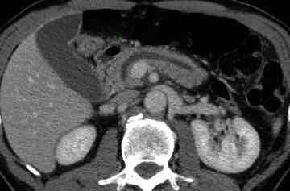
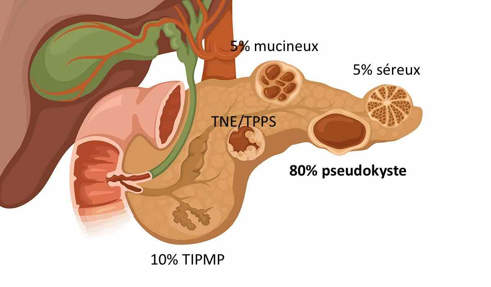

=== "PA"
    <figure markdown="span">
        [Atlanta 2012](https://onclepaul.net/wp-content/uploads/2011/07/pancr%C3%A9atites-Atlanta-r%C3%A9vis%C3%A9-2012FILEminimizer.pdf){:target="_blank"}  
    </figure>

    |  score CTSI (TDM ≥J3-J5) |   |  nécrose pancréatique |  | 
    | :----------: | :-------: | :----------: | :-------: |
    | `élargissement focal/diffus` | 1 | `≤ 30%` | 2 |
    | `infiltration péripancréatique` | 2 | `30-50%` | 4 |
    | `une/plusieurs collections` | 3/4 | `≥ 50%` | 6 |

    ``` mermaid
    flowchart TD
        A(nécrose) -->|oui 15%| B(pancréatite nécrosante);
        B -->|nécrose péripancréatique isolée 20%| C(collection nécrotique aiguë);
        B -->|nécrose mixte 75%| C;
        C -->|4 semaines| D(nécrose organisée pancréatique);

        A -->|non 85%| F(pancréatite œdémato-interstitielle);
        F --> G(collection liquidienne aiguë péripancréatique);
        G -->|4 semaines| H(pseudo-kyste);
    ```

    !!! danger "complications"
        - a. splénique et gastro/pancréatico-duodénales = **faux-anévrysme** / irrégularité
        - thrombose veine splénique/VMS/TP => infarctus splénique, HTP segmentaire
        - rupture du conduit pancréatique principal (40% en cas de nécrose isthmique)
        - perforation colique, épaississement pariétal et sténose digestive


=== "PC"
    <figure markdown="span">
        {width="430"}
    </figure>

    !!! info "causes"
        - OH et tabac +++
        - hyperCa<sup>2+</sup>, IRC
        - auto-immune
        - pancréas *divisum* 

    <figure markdown="span">
        {width="300"}
        [DKPA](https://onclepaul.fr/wp-content/uploads/2011/07/pancreatites-paraduod%C3%A9nales.pdf){:target="_blank"} = pancréatite paraduodénale = pancréatite du sillon  
        H50 OH-tabac, épicentre au niveau de la papille mineure,  
        paroi D2 épaissi avec PDC marquée et kystes
    </figure>


=== "ADK"
    <figure markdown="span">
        {width="550"}
    </figure>

    !!! tip "TDM (masse pancréatique => TDM thoracique + IRM hépatique)"
        - lésion céphalo-isthmique vs corporéo-caudale (en dh bord gauche VMS)
        - extension vasculaire : aorte, tronc cœliaque, AH, AMS, VMS, TP, VCI, vx spléniques
        - **cavernome portal** = CI résection car risque hémorragique
        - **ligament arqué** 10% /!\ ischémie hépatique si DPC
        - **artère hépatique** droite (naissance de l'AMS = 10%)

    !!! warning "résécabilité (classification NCCN cf. [TNCD](https://www.snfge.org/sites/www.snfge.org/files/tncd/2024-05/tncd_chap-09-cancer-pancre%CC%81as_2024-05-17_1.pdf){:target="_blank"})"
        - 20% résécable = aucun contact artériel, contact VMS/TP < 180° sans sténose
        - borderline = contact AMS/TC/AHC/VCI, thrombose VMS/TP reconstructible
        - localement avancé = **AMS/TC > 180°** ou **thrombose VMS/TP étendue**

    !!! danger "méta"
        - 80% **foie** (DD abcès en IRM = tb perfusionnels, PDC annulaire précoce)
        - 15% péritoine / gg à distance
        - 5% poumons


=== "TNE"
    <figure markdown="span">
        {width="300"}
        **80% non fonctionnelles**  
        grande taille avec kyste/nécrose/sang  
        </br>
        {width="300"}
        **métas hépatiques hypervascularisées**  
        DD = sein, rein, mélanome, thyroïde  
        </br>
        {width="300"}
        **insulinome** = bénin dans 90%, NEM1  
        surveillance si < 2 cm avec preuve histo  
        </br>
        {width="300"}
        triangle du **gastrinome** /!\ 90% malin  
        25% dans le pancréas < paroi duodénale et ganglions
    </figure>  


=== "TIPMP"
    <figure markdown="span">
        {width="300"}
        TIPMP des canaux secondaires = 50% dans l'**uncus** = 5% malignité  
        </br>
        {width="300"}
        atteinte du CPP si dilatation sans sténose **> 6 mm** = 60% malignité  
    </figure> 

    !!! warning "[indications chirurgicales](https://www.fmcgastro.org/texte-postu/postu-2019-paris/prise-en-charge-des-tipmp-recommandations-europeennes/){:target="_blank"} (sinon surveillance M6, 1 an, puis /an)"
        - absolues = **ictère**, **bourgeon ≥ 5 mm**, **CPP > 10 mm**
        - relatives = PA, kyste > 4 cm ou > 5mm/an, CPP 5-9 mm, bourgeon < 5 mm


=== "KYSTES"
    <figure markdown="span">
        {width="550"}
    </figure> 

    ``` mermaid
    flowchart TD
        E((paroi fine)) -->|uncus, communication CPP, multiples| G(TIPMP conduit secondaire); 
        E -->|microkyste périphérique| H(cystadénome séreux uniloculaire);
    ```

    ``` mermaid
    flowchart TD
        style F stroke-width:4px
        F((paroi épaisse)) -->|face post. corps/queue, ♀, cloisons perpendiculaires| I(tumeur kystique mucineuse);
        F -->|♀ jeune, sang, portion tissulaire| J(tumeur pseudo-papillaire et solide); 
        F -->|hypervascularisée| K(TNE);
    ```

    ``` mermaid
    flowchart TD
        D(((polylobé))) -->|uncus, communication CPP, multiples| L(TIPMP conduit secondaire);
        D -->|forme molle, graisse| M(malformation lymphatique);
        D -->|calcification centrale| N(cystadénome séreux);
    ```

    <figure markdown="span">
        </br>
        **VHL** = kystes vrais, cystadénomes séreux, et TNE
    </figure> 