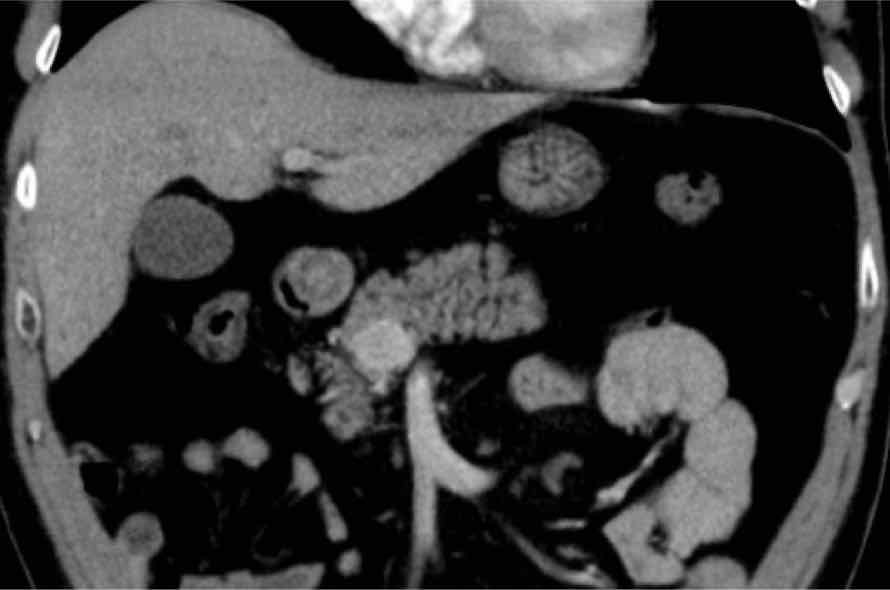

=== "PA"
    |  score CTSI (TDM ≥J3-J5) |   |  nécrose pancréatique |  | 
    | :----------: | :-------: | :----------: | :-------: |
    | `élargissement focal/diffus` | 1 | `≤ 30%` | 2 |
    | `infiltration péripancréatique` | 2 | `30-50%` | 4 |
    | `une/plusieurs collections` | 3/4 | `≥ 50%` | 6 |

    ``` mermaid
    flowchart TD
        A(nécrose) -->|oui 15%| B(pancréatite nécrosante);
        B -->|nécrose péripancréatique isolée 20%| C(collection nécrotique aiguë);
        B -->|nécrose mixte 75%| C;
        C -->|4 semaines| D(nécrose organisée pancréatique);

        A -->|non 85%| F(pancréatite œdémato-interstitielle);
        F --> G(collection liquidienne aiguë péripancréatique);
        G -->|4 semaines| H(pseudokyste);
    ```

    !!! danger "complications"
        - a. splénique et gastro/pancréatico-duodénales = **faux-anévrysme** / irrégularité
        - thrombose veine splénique/VMS/TP => infarctus splénique, HTP segmentaire
        - rupture du conduit pancréatique principal (40% en cas de nécrose isthmique)
        - perforation colique, épaississement pariétal et sténose digestive

    <figure markdown="span">
        [Atlanta 2012](https://onclepaul.net/wp-content/uploads/2011/07/pancr%C3%A9atites-Atlanta-r%C3%A9vis%C3%A9-2012FILEminimizer.pdf){:target="_blank"}
    </figure>


=== "ADK"
    !!! tip "TDM (masse pancréatique => TDM thoracique + IRM hépatique)"
        - lésion céphalo-isthmique vs corporéo-caudale (en dh bord gauche VMS)
        - extension vasculaire : aorte, tronc cœliaque, AH, AMS, VMS, TP, VCI, vx spléniques
        - **cavernome portal** = CI résection car risque hémorragique
        - **ligament arqué** 10% /!\ ischémie hépatique si DPC
        - **artère hépatique** droite (naissance de l'AMS = 10%)

    !!! warning "résécabilité (classification NCCN cf. [TNCD](https://www.snfge.org/sites/www.snfge.org/files/tncd/2024-05/tncd_chap-09-cancer-pancre%CC%81as_2024-05-17_1.pdf){:target="_blank"})"
        - 20% résécable = aucun contact artériel, contact VMS/TP < 180° sans sténose
        - borderline = contact AMS/TC/AHC/VCI, thrombose VMS/TP reconstructible
        - localement avancé = **AMS/TC > 180°** ou **thrombose VMS/TP étendue**

    !!! danger "méta"
        - 80% **foie** (DD abcès en IRM = tb perfusionnels, PDC annulaire précoce)
        - 15% péritoine / gg à distance
        - 5% poumons


=== "TNE"
    <figure markdown="span">
        {width="300"}
        **80% non fonctionnelles**  
        grande taille avec kyste/nécrose/sang  
        </br>
        {width="300"}
        **insulinome** = bénin dans 90%, NEM1  
        surveillance si < 2 cm avec preuve histo  
        </br>
        {width="300"}
        triangle du **gastrinome** /!\ 90% malin  
        25% dans le pancréas < paroi duodénale et ganglions
    </figure>  


=== "TIPMP"


=== "KYSTES"

    ``` mermaid
    flowchart TD
        A(kyste) -->|PA| B("`**pseudokyste**/NOP`");
        A -->|obstacle ductal| C(kyste rétentionnel);
        A --> D(forme);  
        D --> E((ronde));
        D --> F(((polylobé)));      
    ```

    ``` mermaid
    flowchart TD
        A((paroi fine)) -->|communication CPP, multiples| B(TIPMP conduit secondaire);
        A -->|microkyste périphérique| C(cystadénome séreux uniloculaire);
    ```

    ``` mermaid
    flowchart TD
        style A stroke-width:4px
        A((paroi épaisse)) -->|face post. corps/queue, ♀, cloisons| B(tumeur kystique mucineuse);
        A -->|♀ jeune, sang, portion tissulaire| C(tumeur pseudo-papillaire et solide); 
        A -->|hypervascularisée| D(TNE); 
    ```

    ``` mermaid
    flowchart TD
        A(((polylobé))) -->|communication CPP, multiples| B(TIPMP conduit secondaire);
        A -->|forme molle, graisse| C(malformation lymphatique);
        A -->|calcification centrale| D(cystadénome séreux);
    ```
