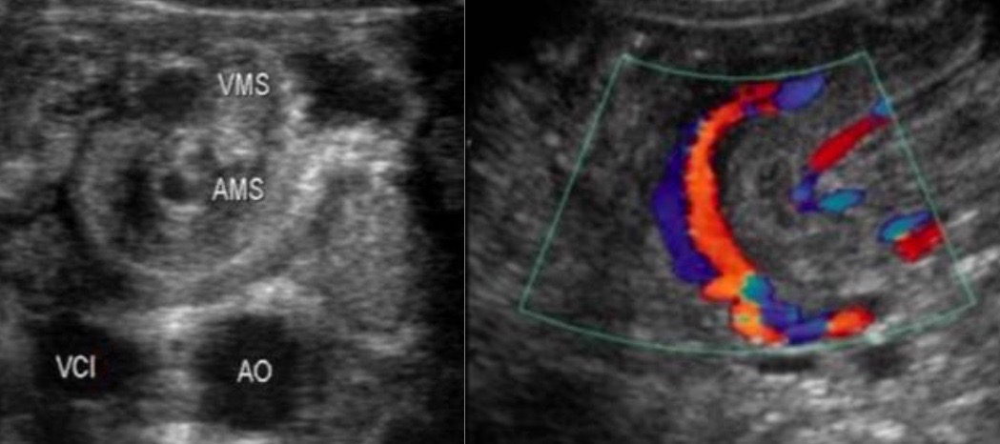
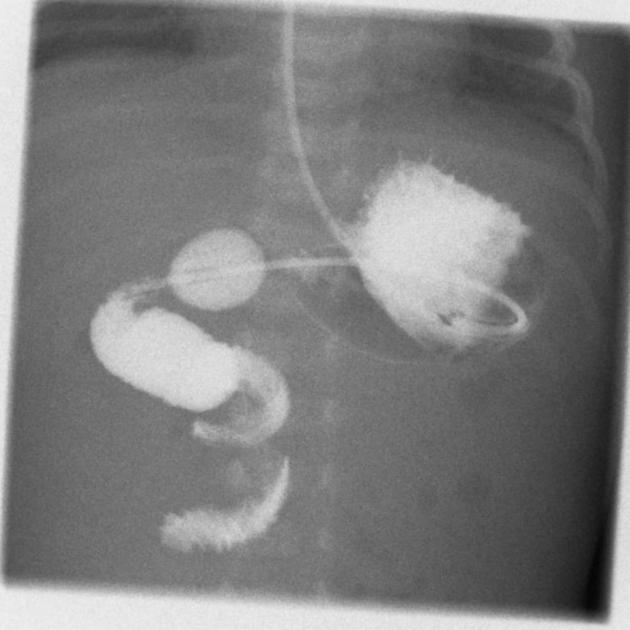

# Urgences pédiatriques

=== "APP"
    - non compressible, **> 6 mm** (TDM > 7 mm), hyperhémie, hyperécho autour, 25% stercolithe
    - contenu liquidien + ligne hyper (sous-muqueuse) + anneau hypo (musculeuse)
    - complications : plastron, abcès, péritonite
    - DD = [mucocèle](https://radiopaedia.org/articles/appendiceal-mucocele-2){:target="_blank"} (mucoviscidose ++), hyperplasie lymphoïde (âge scolaire ++)
    - DD d'exclusion = [adénolymphite mésentérique](https://radiopaedia.org/articles/mesenteric-adenitis){:target="_blank"} (> 3 gg > 5 mm)
    <figure markdown="span">
        {width="500"}
         
        {width="400"}
         
        {width="370"}
    </figure>
=== "IIA"
    <figure markdown="span">
        **95%** [**iléo-colique**](https://radiopaedia.org/articles/intussusception){:target="_blank"}, M3 - 3 ans, pneumopéritoine ?!  
    </figure>
    !!! tip "arguments pour une invagination iléo-colique"
        - diamètre > 2 cm et longueur > 3 cm
        - ganglion ou appendice dans le boudin
        - jonction iléo-colique non visualisée
        <figure markdown="span">
            {width="500"}
        </figure>
    <figure markdown="span">
        {width="300"}
        lavement eau sous scopie = 1 m de pression  
        = 90% réussite mais 2% perfo et 20% récidive
    </figure>
    !!! warning "invagination iléo-iléale = plutôt &gt; 2a"
        - diverticule de [Meckel](https://radiopaedia.org/articles/meckel-diverticulum-3){:target="_blank"}
        - **lymphome**, tumeur, purpura rhumatoïde
=== "PYLORE"
    - garçon **M1-M3**, vomis alimentaires en jet, [musculeuse > 3 mm et L > 14 mm](https://radiopaedia.org/articles/pyloric-stenosis-1){:target="_blank"}
    - négatif => répéter écho à 24-48h = tourner vers la droite
    <figure markdown="span">
        {width="550"}
        Sténose hypertrophique du pylore
    </figure>
=== "VOLVULUS"
    - **vomis bilieux NNé** < S2 à ventre plat, 80% < 1 an mais peut survenir à tout âge
    - complique une [mésentère commun incomplet](https://onclepaul.fr/wp-content/uploads/2011/07/volvulus-du-gr%C3%AAle-adulte-synth%C3%A8se.pdf){:target="_blank"} (malrotation intestinale)
    <figure markdown="span">
        {width="250"}
         
        {width="500"}
        signe du **tourbillon** => PEC chirurgicale immédiate
          
        {width="250"}
        écho non contributive / négative => opacification digestive haute
    </figure>
=== "TORSION TESTI"
    - <b>ado / NNé</b>, 3% des dl scrotales aiguës de l'enfant
    - DD orchiépididymite /!\ hypervascularisation testiculaire = orchite/torsion-détorsion
    - DD [torsion d'hydatide](https://comu-occitanie.fr/wp-content/uploads/2024/04/Presentation-echographie-testiculaire-JVial.pdf){:target="_blank"} (6-12 ans) = masse ovalaire infracm vacuolisée Doppler⊖
    <figure markdown="span">
        {width="500"}
    </figure>