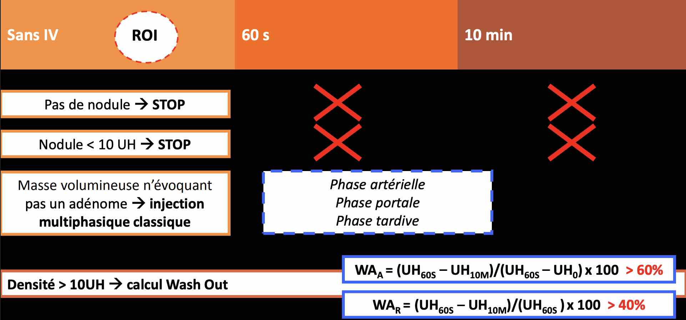
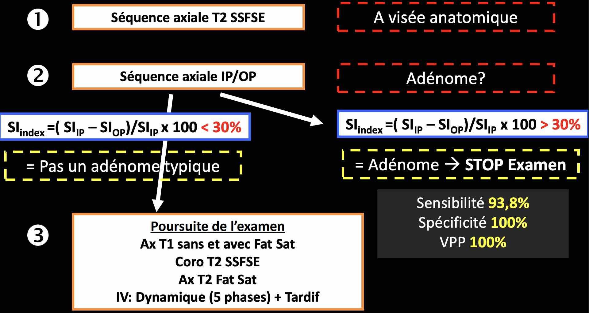

<figure markdown="span">
    [causes de métastase surrénalienne](https://radiopaedia.org/articles/adrenal-metastasis-1){:target="_blank"}  
     
    [{width="700"}](https://onclepaul.fr/wp-content/uploads/2011/07/L%C3%A9sions-surr%C3%A9naliennes.pdf){:target="_blank"}
    [adénome](https://radiopaedia.org/articles/adrenal-adenoma){:target="_blank"} si wash-out absolu > 60% ou wash-out relatif > 40%  
    SAUF si densité à 60s > 100 UH = suspecter phéochromocytome  
     
    [{width="700"}](https://onclepaul.fr/wp-content/uploads/2011/07/L%C3%A9sions-surr%C3%A9naliennes.pdf){:target="_blank"}
</figure>