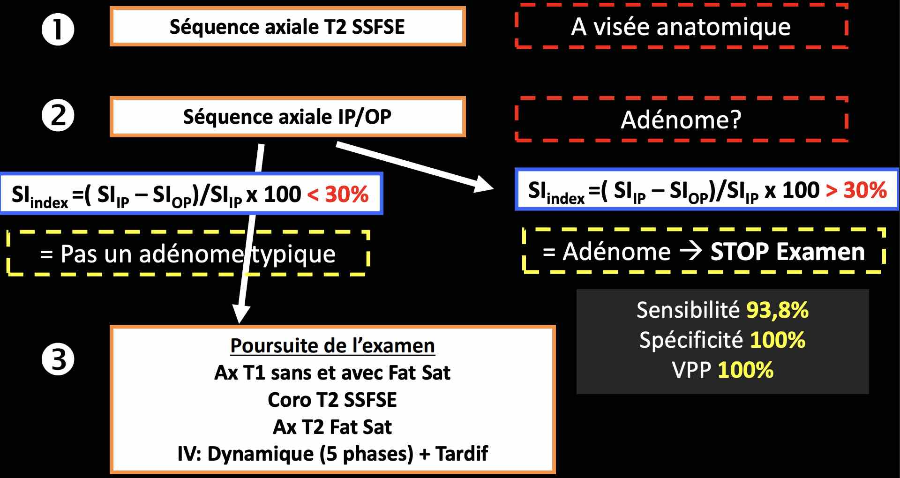

<figure markdown="span">
    [Réco adénome](https://www.radeos.org/maladie/fiche-adenome-surrenalien_928.html){:target="_blank"} HORS CONTEXTE NEO :
</figure>
|  `TDM IV-` | < 4 cm |  4-6 cm | 
| :----------: | :-------: | :----------: | 
| **< 10 UH** | bénin, pas de suivi | bénin, pas de suivi | 
| **10-20 UH** | bénin, pas de suivi | probablement bénin, contrôle M6-12 |
| **20-40 UH** | probablement bénin, contrôle M6-12 | avis chirurgical | 

 

!!! warning "[causes de métastase surrénalienne](https://radiopaedia.org/articles/adrenal-metastasis-1){:target="_blank"} = poumons, colon, sein, pancréas, CHC"

 

<figure markdown="span">
    [{width="700"}](https://onclepaul.fr/wp-content/uploads/2011/07/L%C3%A9sions-surr%C3%A9naliennes.pdf){:target="_blank"}
</figure>