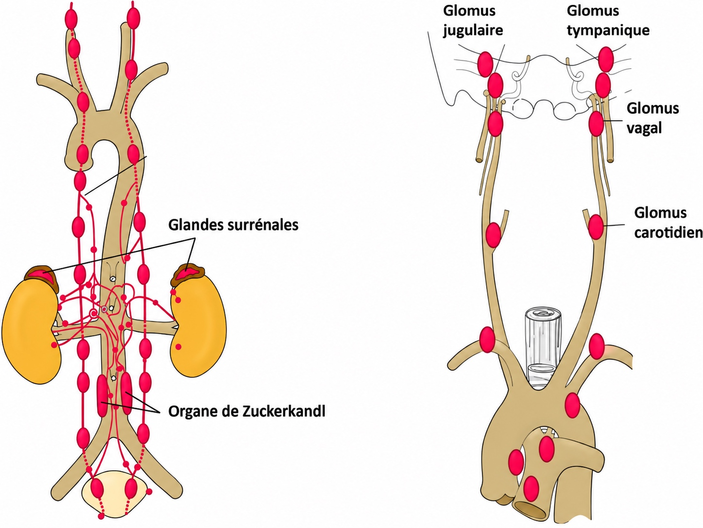

<figure markdown="span">
    **hyperplasie** si corps > 10 mm / bras > 5 mm  
     
    [Réco adénome](https://www.radeos.org/maladie/fiche-adenome-surrenalien_928.html){:target="_blank"} HORS CONTEXTE NEO + LESION HOMOGENE :
</figure>
|  `TDM IV-` | < 4 cm |  4-6 cm | 
| :----------: | :-------: | :----------: | 
| **< 10 UH** | bénin, pas de suivi | bénin, pas de suivi | 
| **10-20 UH** | bénin, pas de suivi | probablement bénin, contrôle M6-12 |
| **20-40 UH** | probablement bénin, contrôle M6-12 | avis chirurgical | 

 

<figure markdown="span">
    [{width="700"}](https://onclepaul.fr/wp-content/uploads/2011/07/L%C3%A9sions-surr%C3%A9naliennes.pdf){:target="_blank"}
</figure>

|   | [Phéochromocytome](https://radiopaedia.org/articles/phaeochromocytoma-1){:target="_blank"} (médullosurrénale) | [Corticosurrénalome](https://radiopaedia.org/articles/adrenocortical-carcinoma-1){:target="_blank"} (corticosurrénale)  |
| :----------: | :-------: | :----------: | 
| `épidémio` | 30a, 10% familial (NEM2, VHL, NF1, STB) | F50 |
| `clinique` | HTA, palpitations, sueurs | 50% Cushing (cortisol) ou hyperaldo |
| `particularités` | 10% asptq, 10% malin, 10% bilat | 5% bilat |
| `imagerie` | hypervascularisé, T2 > cortex rénal, Hdiff | volumineux, T2 = cortex rénal |
| `/!\` | CI biopsie (=> décharge adrénergique) | tropisme veineux, poumon/foie/péritoine |
| `dosage` | métanéphrines (catécholamines) | cortisol, aldostérone, androgènes |

!!! warning "[causes de métastase surrénalienne](https://radiopaedia.org/articles/adrenal-metastasis-1){:target="_blank"} = poumons, colon, sein, pancréas, CHC"
!!! info "[DD](https://radiopaedia.org/articles/adrenal-lesions-differential){:target="_blank"} = myélolipome, kyste, hématome, calcifications séquellaires (BK), angiome, lymphome"

<figure markdown="span">
     
    [Paragangliome](https://radiopaedia.org/articles/paraganglioma-1){:target="_blank"} = F40, 80% bénin, sécrétant ou non, hypervascularisé et HT2
    [{width="700"}](https://onclepaul.fr/wp-content/uploads/2011/07/L%C3%A9sions-surr%C3%A9naliennes.pdf){:target="_blank"}
</figure>