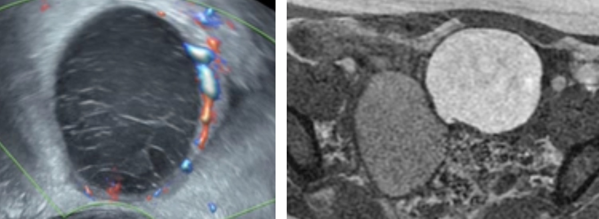

# Endométriose  

```
Balisage vaginal.
Séquences T2 dans les 3 plans, axiale et sagittale T1 Dixon, et axiale T2 EG jusqu'aux reins.

Utérus antéversé antéfléchi mesurant  mm.
Endomètre en hypersignal T2 mesurant  mm.
Intégrité de la zone jonctionnelle et du myomètre.

Ovaires latéraux folliculaires mesurant à droite et gauche  mm.
Pas d'endométriome ni d'implant hémorragique.
Pas de dilatation tubaire.

Pas de nodule d'endométriose du torus ou des ligaments utéro-sacrés.
Intégrité de la cloison recto-vaginale et de l'espace vésico-utérin.
Pas d'implant hémorragique péritonéal.

Pas de dilatation des cavités pyélo-calicielles.
Pas d'épanchement pelvien significatif.
Pas d'adénomégalie.
```

<figure markdown="span">
    {width="700"}
    score **dPEI** (prédit la survenue de complications post-op) = 1 pt/compartiment 
    </br>+ 1 pt pour vagin, base vessie, dilatation uretère, paroi pelvis
    </br>→ extension faible ≤ 2 / modérée 3-4 / majeure ≥ 5
</figure>

!!! tip "[Endométriome](https://radiopaedia.org/articles/endometrioma){:target="_blank"} (implant hémorragique si ≤ 1 cm, aspécifique si isolé)"
    - écho : **fin piqueté échogène homogène**, spots pariétaux hyper, ± septas, multiples++
    - ± niveau liquide-liquide, caillot (déclive, mobile, avasculaire), **hématosalpinx**
    - IRM : **HT1 ≥ graisse**, **shading** en T2 (HT2 20% voire hT2 si ancien)
    - complications : décidualisation pdt grossesse, surinfection, transformation maligne
    <figure markdown="span">
        {width="400"}
        DD **KLH** : couronne hypervascularisée et HT1 < graisse
    </figure>

!!! tip "**LUS** proximal (si critères non remplis « atteinte incertaine »)"
    épaississement > 3 mm, nodulaire/spiculé dans 2 plans, implant hémorragique

!!! tip "Atteinte digestive"
    - **adhérence**
    - atteinte pariétale **séreuse**
    - séreuse **+/-** musculeuse => rectosonographie en cas de décision chirurgicale
    - **musculeuse** : ép. +/- microkystes (largeur ? hauteur ? distance marge anale ? circonf ?)
    - **endoluminale** (préciser épaisseur et degré de sténose si coloscanner)

!!! tip "Atteinte [diaphragmatique](https://services.medicalcongress.online/congress/Medias/2012/JFR2012-Posters/c1e19078-c57c-4f2d-bc40-5534e9a9e884/pdf/poster.pdf){:target="_blank"} (T1 FS sag et coro)"
    - dl thoraciques ou scapulalgies cataméniales, **pneumothorax**/hémothorax
    - le + svt à droite en dh et en arrière de la VCI = hypodense et hyperT1/T2
    <figure markdown="span">
        {width="400"}
    </figure>