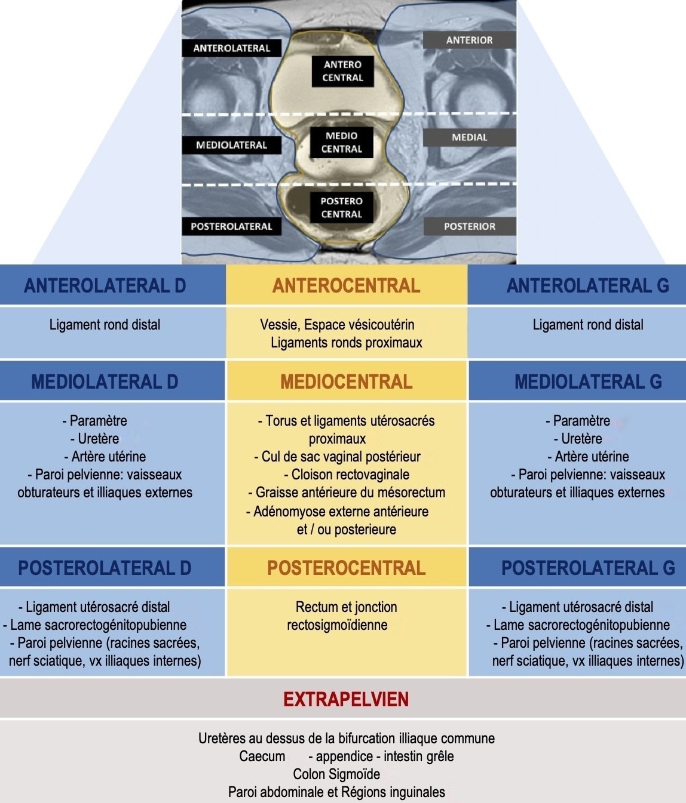
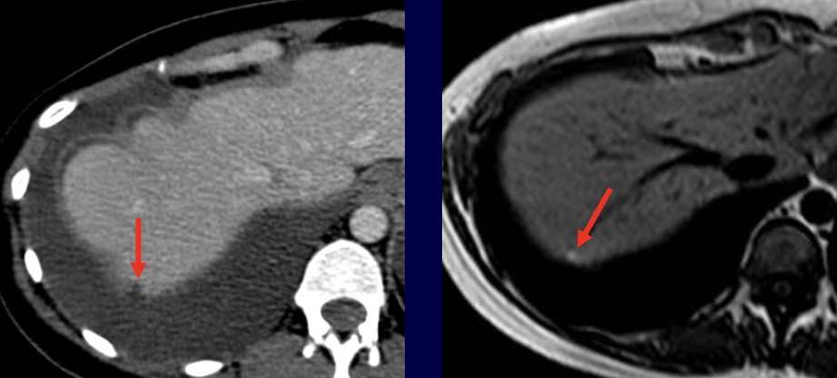

# Endométriose  

```
Utérus antéversé antéfléchi mesuré à 
Endomètre fin, hyperintense en T2, mesuré à
Intégrité de la zone jonctionnelle et du myomètre.

Ovaires latéro-utérins, folliculaires, mesurés à
Pas d'endométriome ou d'implant hémorragique.
Pas de dilatation tubaire.

Pas de nodule d'endométriose du torus ou des ligaments utéro-sacrés.
Pas d'implant hémorragique péritonéal.
Déplissement satisfaisant du culs-de-sac vaginal postérieur.
Intégrité de la cloison recto-vaginale et de l'espace vésico-utérin.

Pas de dilatation des cavités pyélo-calicielles.
Lame d'épanchement liquidien pelvien.
Pas d'adénomégalie.
```

<figure markdown="span">
    {width="700"}
    score **dPEI** (prédit la survenue de complications post-op) = 1 pt/compartiment 
    </br>+ 1 pt pour vagin, base vessie, dilatation uretère, paroi pelvis
    </br>→ extension faible ≤ 2 / modérée 3-4 / majeure ≥ 5
</figure>

!!! tip "**LUS** proximal (< 2 cm du torus)"
    épaississement > 5 mm / nodule / rétraction spiculée / implant hémorragique

!!! tip "Atteinte digestive"
    - **adhérence**
    - atteinte pariétale **séreuse**
    - séreuse **+/-** musculeuse => rectosonographie en cas de décision chirurgicale
    - **musculeuse** : ép. +/- microkystes (largeur ? hauteur ? distance marge anale ? circonf ?)
    - **endoluminale** (préciser épaisseur et degré de sténose si coloscanner)

!!! tip "Atteinte diaphragmatique (T1 FS sag et coro)"
    - dl thoraciques ou scapulalgies cataméniales, pneumothorax/hémothorax
    - le + svt à droite en dh et en arrière de la VCI = hypodense et hyperT1/T2
    <figure markdown="span">
        {width="400"}
    </figure>