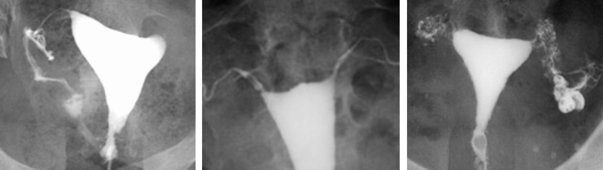
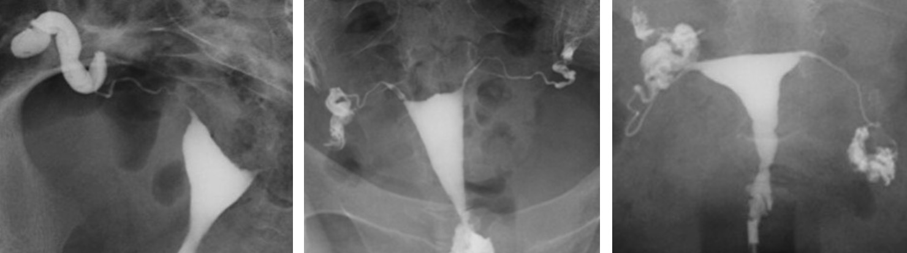
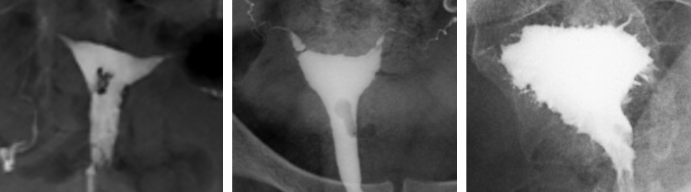
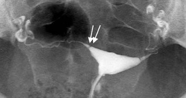

# Hystérosalpingographie

<p style="text-align: center">entre J6 et J12, ± ATB (doxycycline/azithromycine), spasfon, vessie vide</br>TV > désinfection > spéculum > désinfection > hystéromètre > purge > aspi > tulipe</br>si échec : sonde d'hystérosonographie, massages abdo, max 2 x 20 mL</p>

!!! warning "CI"
    - **βHCG**
    - infection
    - hydrosalpinx (risque infectieux)
    - allergie PCI (faire écho avec HYFOSY)
    - métrorragies (caillots intracavitaires, différer l'examen)

```
HYSTEROSALPINGOGRAPHIE

INDICATION
Bilan d'infertilité.

TECHNIQUE
Cliché sans préparation sur le pelvis.
Opacification de la cavité utérine avec un produit de contraste hydrosoluble.
Clichés en cours de remplissage, puis après évacuation.
Dose totale délivrée lors de l'examen :

RESULTATS
Pas d'opacité calcique sur le cliché sans préparation.
Aspect morphologique normal de la cavité utérine.
Opacification bilatérale et synchrone des trompes, d'aspect normal.
Brassage péritonéal bilatéral du produit de contraste, sans cloisonnement.
Pas d'anomalie de la région cervicale utérine sur le cliché en évacuation.

CONCLUSION
Perméabilité des deux trompes.
Pas d'anomalie morphologique.
```

!!! tip "Causes d'infertilité"
    === "obstruction proximale"
        - spasme tubaire / bouchon muqueux = corne utérine arrondie => salpingo sélective
        - polype, myome, synéchie
        - salpingite isthmique nodulaire (endométriose, BK) = boules de gui
        <figure markdown="span">
            {width="700"}
        </figure>
    === "obstruction distale"
        - hydrosalpinx => doxicycline 100 mg x2
        - phimosis tubaire = sténose de l'ampoule = passage péritonéal lent
        - adhérences et cloisonnements péritonéaux = pas de brassage péritonéal
        <figure markdown="span">
            {width="700"}
        </figure>
    === "images endocavitaires"
        - synéchies, polype, myome
        - utérus bicorne ou cloisonné
        - adénomyose = spicules ou microkystes sous-endométriaux
        <figure markdown="span">
            {width="700"}
        </figure>

<figure markdown="span">
    {width="330"}
    diaphragme tubaire physiologique
</figure>

