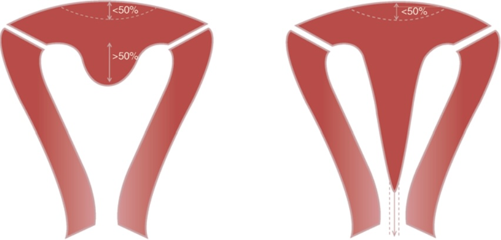
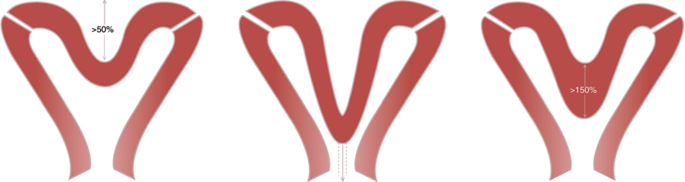
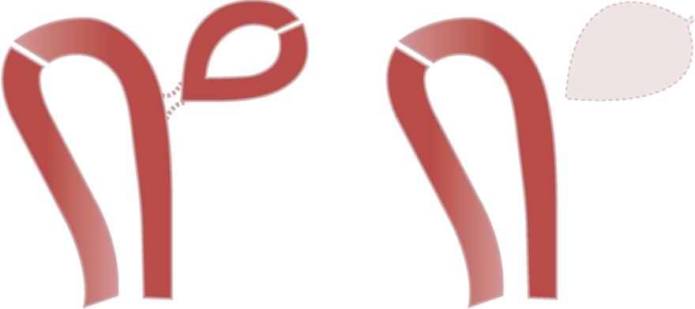
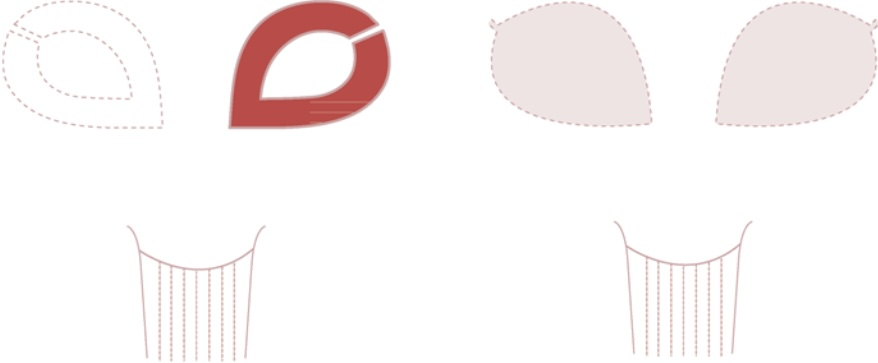
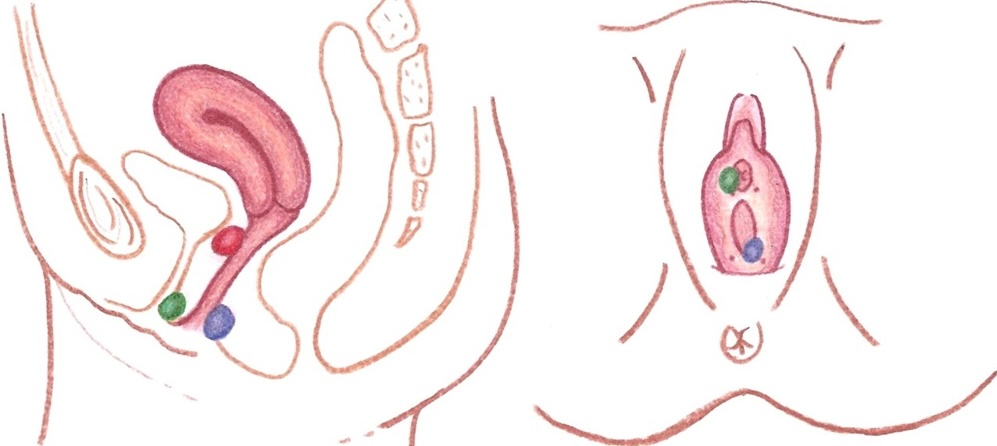

# Malformations de l'appareil génital

!!! tip "Malformations utérines : [classification ESHRE/ESGE](https://www.ncbi.nlm.nih.gov/pmc/articles/PMC3712660/pdf/det098.pdf){:target="_blank"}"
    === "U2 cloisonné +++"
        - a : partiel (≠ utérus à fond arqué = 4% pop°)
        - b : complet
        - **25% d'EPP** associée
        <figure markdown="span">
            {width="350"}
        </figure>
    === "U3 bicorne ++"
        - a : partiel
        - b : complet
        - c : bicorporéal cloisonné
        - 30% **malformation rénale**
        <figure markdown="span">
            {width="700"}
        </figure>
    === "U4 hémi-utérus"
        - a : avec corne rudimentaire
        - b : sans
        - **agénésie rénale** controlatérale +++
        <figure markdown="span">
            {width="350"}
        </figure>
    === "U5 : aplasie"
        - a : avec corne rudimentaire
        - b : sans
        - **agénésie rénale** +++
        <figure markdown="span">
            {width="350"}
        </figure>
    === "cervicale"
        - C0 : normal
        - C1 : cloisonné
        - C2 : bicervical
        - C3 : aplasie unilatérale
        - C4 : aplasie complète
    === "vaginale"
        - V0 : normal
        - V1 : cloisonnement longitudinal non obstructif
        - V2 : cloisonnement longitudinal obstructif (hémivagin borgne)
            - **agénésie rénale** systématique du côté de l'hématocolpos
        - V3 : cloisonnement transversal / hymen imperforé
        - V4 : aplasie

<figure markdown="span">
    {width="500"}
    🔴 kyste de **Gartner** (paroi vaginal antéro-latérale)
     🔵 kyste de **Bartholin** (postérolatéral à l'introitus vaginal)
     🟢 kyste d'une glande paraurétrale (de Skene)
      [IRM cérébrale fœtale](https://www.ncbi.nlm.nih.gov/pmc/articles/PMC8383736/){:target="_blank"}
</figure>

