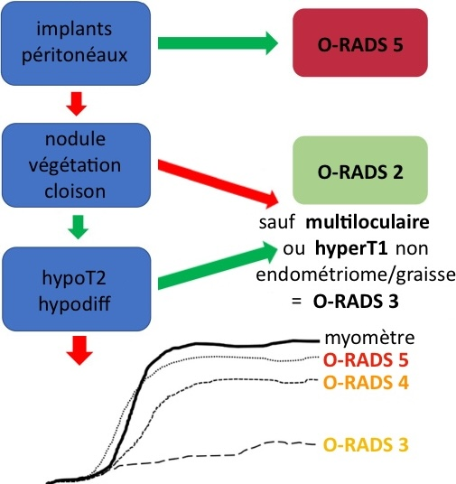

=== "écho"
    ```
    Examen par voie suspubienne puis endovaginale après accord de la patiente.

    Utérus antéversé antéfléchi mesurant  cm.
    Endomètre hyperéchogène mesurant  mm.
    Pas d'anomalie significative du myomètre.

    Ovaires latéraux folliculaires mesurant à droite/gauche  cm.
    Pas de dilatation tubaire.

    Pas d'épanchement pelvien significatif.
    Pas de dilatation des cavités pyélocalicielles.
    ```
=== "SOPK"
    ```
    Examen par voie suspubienne puis endovaginale après accord de la patiente.

    Ovaires latéro-utérins contenant moins de 25 follicules par ovaire.
    Ovaire droit mesurant  mm pour une surface estimée à  cc.
    Ovaire gauche mesurant  mm pour une surface estimée à  cc.
    Pas de dilatation tubaire.

    Utérus antéversé antéfléchi mesurant  cm.
    Endomètre hyperéchogène mesurant  mm.
    Pas d'anomalie significative du myomètre.

    Pas d'épanchement pelvien significatif.
    Pas de dilatation des cavités pyélocalicielles.
    ```
    <p style="text-align: center">ovaire polykystique si <b>> 5,5 cm² + > 25 follicules</b></p>
=== "CFA"
    ```
    Examen par voie suspubienne puis endovaginale après accord de la patiente.

    Ovaires latéraux folliculaires mesurant à droite/gauche  mm.

    Nombre et taille des follicules à droite et à gauche :
        - De moins de 5 mm :           
        - Entre 5 et 10 mm : 
        - De plus de 10 mm : 

    Doppler des artères utérines avec IR et IP :
        - à droite 
        - à gauche

    Pas de dilatation tubaire.
    Utérus antéversé antéfléchi mesurant  cm.
    Endomètre hyperéchogène mesurant  mm.
    Pas d'anomalie significative du myomètre.
    Pas d'épanchement pelvien significatif.
    Pas de dilatation des cavités pyélocalicielles.
    ```
    <p style="text-align: center">écho à <b>J3</b> du cycle, réserve ovarienne faible si < 5 follicules/ovaire</p>
=== "IRM"
    ```
    Ovaires latéraux folliculaires mesurant à droite/gauche  cm.
    
    Utérus antéversé antéfléchi mesurant  cm.
    Endomètre en hypersignal T2 mesurant  mm.
    Intégrité de la zone jonctionnelle et du myomètre.

    Pas d'adénomégalie.
    Pas d'épanchement pelvien significatif.
    Pas de dilatation des cavités pyélo-calicielles.
    ```

!!! tip "Lésions ovariennes : O-RADS [écho](https://www.acr.org/-/media/ACR/Files/RADS/O-RADS/US-v2022/O-RADS--US-v2022-Assessment-Categories.pdf){:target="_blank"} et [IRM](https://www.acr.org/-/media/ACR/Files/RADS/O-RADS/French-O-RADS-MR-Risk-Table-2020.pdf){:target="_blank"}"
    === "kyste uniloculaire"
        - contrôle **M3 si > 5 cm** (fonctionnel++), kyste ovarien/paraovarien = **IRM si > 8 cm**
        - cystadénome séreux bénin = contrôle à 1 an si post-ménopause
        - pseudokyste péritonéal = grd ± multiloc, atcd chir/inf, dystrophie macroantrale
    === "liquidien impur"
        - **endométriome** = isoéchogène = IRM (hyperT1 > graisse, shading T2)
        - kyste lutéal hémorragique = couronne hypervascularisée
        - kyste dermoïde à contenu sébacé pur = rare +++  
    === "multiloculaire"
        - **cystadénome mucineux** bénin / borderline si végétations = IRM
        - grossesse = hyperreactio luteinalis (sd d'hyperstimulation ovarienne)
        - goitre ovarien (hypoT2 franc), abcès tubo-ovarien, tumeur de la granulosa
    === "végétation (> 3 mm)"
        - uniloculaire qq végétations < 1 cm = **cystadénome séreux papillaire** bénin
        - uniloculaire végétations nbreuses / > 1 cm = cystadénome séreux borderline
        - grossesse = endométriome décidualisé
    === "mixte/solide"
        - kyste + nodule mural vascularisé = **cystadénocarcinome**
        - solide si > 80% de la masse = cystadénocarcinome, fibrome, [kyste dermoïde](https://www.radeos.org/maladie/fiche-kyste-dermoide-de-lovaire-teratome-kystique-mature_841.html){:target="_blank"}
        - métas = sd de Krukenberg = estomac/CCR et sein

<figure markdown="span">
    végétation = tumeur épithéliale / graisse = tumeur germinale (tératome)
    </br></br>
    [{width="340"}](https://www.acr.org/-/media/ACR/Files/RADS/O-RADS/MRI-Assessment-Categories-Algorithm-Feb-2024.pdf){:target="_blank"}
</figure>

</br>

??? quote "**TAP** carcinose"
    ```
    1/ ANNEXES


    2/ PERITOINE


    3/ GANGLIONS


    4/ ORGANES ABDOMINAUX


    5/ VARIANTES ANATOMIQUES


    6/ ETAGE SUS-DIAPHRAGMATIQUE
    ```

!!! info "[**FIGO**](http://oncologik.fr/referentiels/dsrc/ovaire#3.Classifications%202018%20FIGO%20et%20TNM%20(8%C3%A8me%20%C3%A9dition)%20des%20tumeurs%20%C3%A9pith%C3%A9liales%20de%20l'ovaire,%20trompes%20et%20p%C3%A9riton%C3%A9ales%20primitives){:target="_blank"} (TDM TAP + laparoscopie = 70% découvert stade ≥ III)"
    * I = tumeur limitée aux ovaires/trompes
    * II = carcinose péritonéale pelvienne
    * III = carcinose péritonéale extra-pelvienne / ADP rétropé
    * IV = méta à distance (pleurale, foie, gg inguinal, nodule ombilical, dig transmurale)

!!! warning "Critères de **non résécabilité** => chimio néoadjuvante"
    * ADP > veines rénales (au-delà du curage)
    * racine du mésentère
    * plus de 3 segments digestifs
    * trigone vésical => IRM (T2, DWI, DCE)
    * méta parenchymateuse (foie) ≠scalloping
    * atteinte extra-abdo (pleurale, nodule ombilical)
    * _petit omentum (hile hépatique)_

!!! danger "Variantes anatomiques pour **curage lombo-aortique**"
    * veine rénale rétro-aortique
    * duplication urétérale

