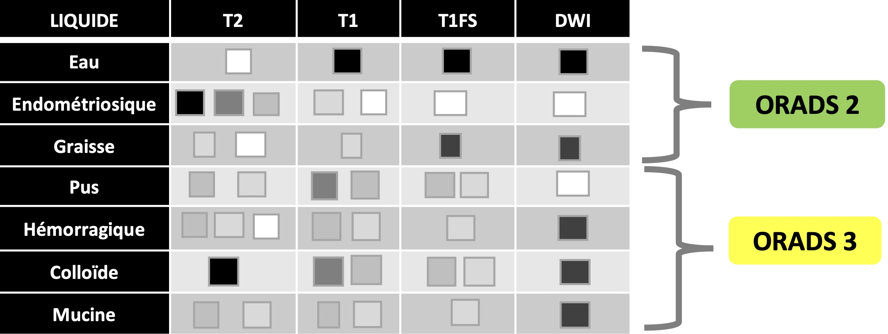
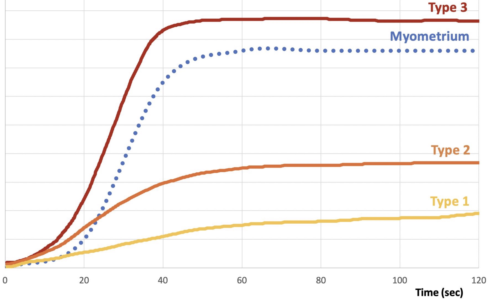

=== "écho"

    ```
    Examen par voie suspubienne puis endovaginale après accord de la patiente.

    Utérus antéversé antéfléchi mesurant  cm.
    Endomètre hyperéchogène mesurant  mm.
    Pas d'anomalie dans le myomètre.
    Pas de lésion endocavitaire décelable.

    Pas de dilatation tubaire.
    Ovaire droit latéro-utérin, folliculaire, 
    Ovaire gauche latéro-utérin, folliculaire, 
    Pas d'épanchement pelvien significatif.
    Pas de dilatation des cavités pyélocalicielles.
    ```

    | Score | [O-RADS US](https://edge.sitecorecloud.io/americancoldf5f-acrorgf92a-productioncb02-3650/media/ACR/Files/RADS/O-RADS/O-RADS--Ultrasound-v2022-Assessment-Categories.pdf){:target="_blank"} (IRM si > 7 cm ou ≥ score 3)|
    | :--- | :--- |
    | <span style="background-color: #c4e538; color: black; padding: 2px 6px; border-radius:4px; font-weight: bold;">2</span> | • Kyste simple\* / KLH / dermoïde / endométriome **< 10 cm**<br>• Kyste para-ovarien, faux kyste péritonéal, hydrosalpinx | 
    | <span style="background-color: #FFD966; color: black; padding: 2px 6px; border-radius:4px; font-weight: bold;">3</span> | • Kyste uni ou biloculaire / KLH / dermoïde / endométriome ≥ 10 cm<br>• Kyste uniloculaire à paroi irrégulière < 3 mm<br>• Kyste **multiloculaire sans atypie < 10 cm**<br> | 
    | <span style="background-color: #FFA500; color: black; padding: 2px 6px; border-radius:4px; font-weight: bold;">4</span> | • Kyste multiloculaire sans portion solide ≥ 10 cm / cloisons très vascularisées / paroi ou cloisons irrégulières<br>• Kyste multiloculaire avec portion solide faiblement vascularisée<br>• Kyste uniloculaire avec **1-3 végétations**<br>• Masse **solide modérément vascularisée** |
    | <span style="background-color: #ff0000; color: black; padding: 2px 6px; border-radius:4px; font-weight: bold;">5</span> | • Kyste uniloculaire **≥ 4 végétations**<br>• Portion solide **très vascularisée** / de **contours irréguliers**<br>• **Ascite** (en dehors des masses ORADS 2) / **implants péritonéaux** |

    <figure markdown="span">
       *si > 3 cm / 1 cm si post-ménopause
    </figure>

    !!! tip "Caractérisation"
        === "kyste uniloculaire"
            - contrôle **M12 si > 5 cm** (fonctionnel++), **IRM si > 7 cm**
            - [cystadénome séreux](https://radiopaedia.org/articles/ovarian-serous-cystadenoma?lang=gb){:target="_blank"} (bilatéral 20%) = contrôle à 1 an si > 3 cm post-ménopause
            - pseudokyste péritonéal = déformable, post-op/IGH, ± dystrophie macroantrale
        === "liquidien impur"
            - **endométriome** = isoéchogène = IRM (hyperT1 > graisse, shading T2)
            - kyste lutéal hémorragique = couronne hypervascularisée
            - kyste dermoïde à contenu sébacé pur = rare +++  
        === "multiloculaire"
            - **cystadénome mucineux** bénin / borderline si végétations = IRM
            - grossesse = *hyperreactio luteinalis* (sd d'hyperstimulation ovarienne)
            - goitre ovarien (hypoT2 franc), abcès tubo-ovarien, tumeur de la granulosa
        === "végétation (> 3 mm)"
            - uniloculaire qq végétations < 1 cm = **cystadénome séreux papillaire** bénin
            - uniloculaire végétations nbreuses / > 1 cm = cystadénome séreux borderline
            - grossesse = endométriome décidualisé
        === "mixte/solide"
            - kyste + nodule mural vascularisé = **cystadénocarcinome**
            - solide si > 80% de la masse = cystadénocarcinome, fibrome, [kyste dermoïde](https://www.radeos.org/maladie/fiche-kyste-dermoide-de-lovaire-teratome-kystique-mature_841.html){:target="_blank"}
            - métas = sd de Krukenberg = estomac/CCR et sein


=== "IRM"

    ```
    Séquences T2 dans les trois plans centrées sur le pelvis.
    Acquisitions 3D T1 Dixon, ainsi que axiales diffusion et T2 jusqu'aux reins.
    Après injection de gadolinium, séries dynamiques axiales T1 FS et 3D T1 FS tardif.

    Ovaires droit latéro-utérin folliculaire mesurant  mm.
    Ovaires gauche latéro-utérin folliculaire mesurant  mm.

    Utérus antéversé antéfléchi mesurant  mm.
    Endomètre en hypersignal T2 mesurant  mm.
    Intégrité de la zone jonctionnelle et du myomètre.

    Pas d'adénomégalie.
    Pas d'épanchement pelvien significatif.
    Pas de dilatation des cavités pyélo-calicielles.
    ```

    ``` mermaid
    graph TD
        B(Implants péritonéaux ?) -->|OUI| R5(O-RADS 5)
        B -->|NON| C(Contenu graisseux ?)
        
        C -->|OUI| R2a(O-RADS 2)
        C -->|NON| E(Portion tissulaire ?*)
        
        E -->|OUI| F(HypoT2 + hypoDWI ?)
        F -->|OUI| R2b(O-RADS 2)
        F -->|NON| G(Perfusion)
        
        G -->|Type 1| R3a(O-RADS 3)
        G -->|Type 2| R4(O-RADS 4)
        G -->|Type 3| R5b(O-RADS 5)
        
        E -->|NON| H(Multiloculaire ?)
        H -->|OUI| R3b(O-RADS 3)
        H -->|NON| I(Uniloculaire cf. tableau)

        I -->|eau/endométriome| R2c(O-RADS 2)
        I -->|pus/sang/colloïde/mucine| R3c(O-RADS 3)

        style R2a fill:#c4e538,stroke:#333,stroke-width:2px
        style R2b fill:#c4e538,stroke:#333,stroke-width:2px
        style R2c fill:#c4e538,stroke:#333,stroke-width:2px
        style R3a fill:#FFD966,stroke:#333,stroke-width:2px
        style R3b fill:#FFD966,stroke:#333,stroke-width:2px
        style R3c fill:#FFD966,stroke:#333,stroke-width:2px
        style R4 fill:#FFA500,stroke:#333,stroke-width:2px
        style R5 fill:#ff0000,stroke:#333,stroke-width:2px
        style R5b fill:#ff0000,stroke:#333,stroke-width:2px
    ```

    <figure markdown="span">
    [O-RADS IRM et caractérisation](https://onlinelibrary.wiley.com/doi/epdf/10.1002/jmri.28947){:target="_blank"}  
    \*végétation, nodule, cloisons ou parois irrégulières  
    lésion considérée **solide si composante tissulaire > 80%**  
    **végétation** = tumeur épithéliale / **graisse** = tumeur germinale (tératome)  
    </br>
        {width="750"}  
        [{width="650"}](https://edge.sitecorecloud.io/americancoldf5f-acrorgf92a-productioncb02-3650/media/ACR/Files/RADS/O-RADS/O-RADS-MRI-Risk-Score-Assessment.pdf){:target="_blank"}
    </figure>


=== "O-RADS 1"

    ``` mermaid
    graph TD
        A[<b>Ovaires pseudo-tumoraux</b>] --> B(pathologie folliculaire)
        A --> C(perturbation du stroma ovarien)

        B -->|pelvis adhérentiel| D(dystrophie<br>macro-antrale)
        B -->|PMA| E(sd d'hyperstim)

        C -->|torsion<br>méta<br>insuff <3| F(œ massif)
        C -->|atcd torsion<br>atcd chir.| G(fibromatose)
        C -->|♀ ménopausée<br>bilatérale| H(hyperplasie<br>stromale)

        H -->|hyperandrogénie| I(hyperthécose)
    ```
   
    <figure markdown="span">
    </figure>

    | Masses non ovariennes | tissulaires | kystiques | 
    | :---: | :---: | :---: | 
    | `Utérine` | myome FIGO 7 | myome kystique | 
    | `Digestive` | GIST, adk app | mucocèle app | 
    | `Péritonéale` | TFS | kyste mésothélial, lymphangiome | 

    <figure markdown="span">
    </figure>

    ``` mermaid
    graph TD
        A[<b>Nodules péritonéaux</b>] -->|atcd EPP| B(EPP pseudo-tumorale)
        A -->|DIU| C(actinomycose)
        A -->|Maghreb| D(tuberculose)
    ```

=== "bilan d'extension TDM"

    ```
    Masse annexielle
    Pas d'ascite ni de lésion péritonéale individualisable.
    Pas d'adénomégalie rétropéritonéale ni pelvienne.
    Pas de veine rénale rétro-aortique.
    Pas de duplication urétérale.

    Par ailleurs :
    Restant des organes abdomino-pelviens sans particularité.
    Pas de lésion secondaire pulmonaire ni d'adénomégalie médiastinale.
    Cadre osseux sans lésion suspecte.
    ```

    !!! tip "**carcinose extra-pelvienne** = grand omentum > coupole droite > gouttières paracoliques"

    !!! info "[**FIGO**](http://oncologik.fr/referentiels/dsrc/ovaire#3.Classifications%202018%20FIGO%20et%20TNM%20(8%C3%A8me%20%C3%A9dition)%20des%20tumeurs%20%C3%A9pith%C3%A9liales%20de%20l'ovaire,%20trompes%20et%20p%C3%A9riton%C3%A9ales%20primitives){:target="_blank"} (TDM TAP + laparoscopie = 75% découvert stade ≥ III)"
        * **I** = tumeur limitée aux ovaires/trompes
        * **II** = carcinose péritonéale pelvienne
        * **III** = carcinose péritonéale extra-pelvienne / ADP rétropé
        * **IV** = méta à distance (pleurale, foie, gg inguinal, nodule ombilical, dig transmurale)

    !!! warning "Critères de **non résécabilité** => chimio néoadjuvante"
        * ADP > veines rénales (au-delà du curage)
        * racine du mésentère
        * plus de 3 segments digestifs
        * trigone vésical => IRM (T2, DWI, DCE)
        * méta parenchymateuse (foie) ≠scalloping
        * atteinte extra-abdo (pleurale, nodule ombilical)
        * _petit omentum (hile hépatique)_

    !!! danger "Variantes anatomiques pour **curage lombo-aortique**"
        * veine rénale rétro-aortique
        * duplication urétérale

