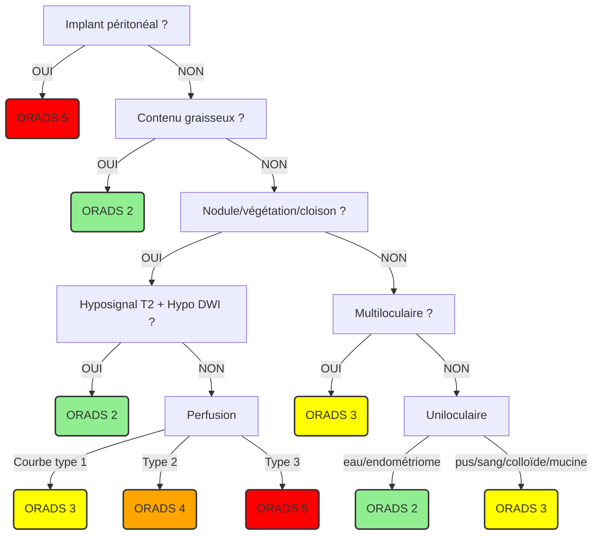

```
Séquences T2 dans les trois plans centrées sur le pelvis.
Acquisitions axiales T1 Dixon, diffusion et T2 jusqu'aux reins.
Après injection de gadolinium, séries dynamiques axiales T1 FS et 3D T1 FS tardif.

Ovaires droit latéro-utérin folliculaire mesurant  mm.
Ovaires gauche latéro-utérin folliculaire mesurant  mm.

Utérus antéversé antéfléchi mesurant  mm.
Endomètre en hypersignal T2 mesurant  mm.
Intégrité de la zone jonctionnelle et du myomètre.

Pas d'adénomégalie.
Pas d'épanchement pelvien significatif.
Pas de dilatation des cavités pyélo-calicielles.
```

!!! tip "Lésions ovariennes : O-RADS [écho](https://edge.sitecorecloud.io/americancoldf5f-acrorgf92a-productioncb02-3650/media/ACR/Files/RADS/O-RADS/O-RADS--Ultrasound-v2022-Assessment-Categories.pdf){:target="_blank"} et [IRM](https://edge.sitecorecloud.io/americancoldf5f-acrorgf92a-productioncb02-3650/media/ACR/Files/RADS/O-RADS/O-RADS-MRI-Risk-Score-Assessment.pdf){:target="_blank"}"
    === "kyste uniloculaire"
        - contrôle **M3 si > 5 cm** (fonctionnel++), kyste ovarien/paraovarien = **IRM si > 8 cm**
        - cystadénome séreux bénin = contrôle à 1 an si post-ménopause
        - pseudokyste péritonéal = grd ± multiloc, atcd chir/inf, dystrophie macroantrale
    === "liquidien impur"
        - **endométriome** = isoéchogène = IRM (hyperT1 > graisse, shading T2)
        - kyste lutéal hémorragique = couronne hypervascularisée
        - kyste dermoïde à contenu sébacé pur = rare +++  
    === "multiloculaire"
        - **cystadénome mucineux** bénin / borderline si végétations = IRM
        - grossesse = hyperreactio luteinalis (sd d'hyperstimulation ovarienne)
        - goitre ovarien (hypoT2 franc), abcès tubo-ovarien, tumeur de la granulosa
    === "végétation (> 3 mm)"
        - uniloculaire qq végétations < 1 cm = **cystadénome séreux papillaire** bénin
        - uniloculaire végétations nbreuses / > 1 cm = cystadénome séreux borderline
        - grossesse = endométriome décidualisé
    === "mixte/solide"
        - kyste + nodule mural vascularisé = **cystadénocarcinome**
        - solide si > 80% de la masse = cystadénocarcinome, fibrome, [kyste dermoïde](https://www.radeos.org/maladie/fiche-kyste-dermoide-de-lovaire-teratome-kystique-mature_841.html){:target="_blank"}
        - métas = sd de Krukenberg = estomac/CCR et sein



<figure markdown="span">
    [{width="700"}](https://edge.sitecorecloud.io/americancoldf5f-acrorgf92a-productioncb02-3650/media/ACR/Files/RADS/O-RADS/O-RADS-MRI-Risk-Score-Assessment.pdf){:target="_blank"}  
    végétation = tumeur épithéliale / graisse = tumeur germinale (tératome)
</figure>

</br>

??? quote "**TAP** carcinose"
    ```
    1/ ANNEXES


    2/ PERITOINE


    3/ GANGLIONS


    4/ ORGANES ABDOMINAUX


    5/ VARIANTES ANATOMIQUES


    6/ ETAGE SUS-DIAPHRAGMATIQUE
    ```

!!! info "[**FIGO**](http://oncologik.fr/referentiels/dsrc/ovaire#3.Classifications%202018%20FIGO%20et%20TNM%20(8%C3%A8me%20%C3%A9dition)%20des%20tumeurs%20%C3%A9pith%C3%A9liales%20de%20l'ovaire,%20trompes%20et%20p%C3%A9riton%C3%A9ales%20primitives){:target="_blank"} (TDM TAP + laparoscopie = 70% découvert stade ≥ III)"
    * I = tumeur limitée aux ovaires/trompes
    * II = carcinose péritonéale pelvienne
    * III = carcinose péritonéale extra-pelvienne / ADP rétropé
    * IV = méta à distance (pleurale, foie, gg inguinal, nodule ombilical, dig transmurale)

!!! warning "Critères de **non résécabilité** => chimio néoadjuvante"
    * ADP > veines rénales (au-delà du curage)
    * racine du mésentère
    * plus de 3 segments digestifs
    * trigone vésical => IRM (T2, DWI, DCE)
    * méta parenchymateuse (foie) ≠scalloping
    * atteinte extra-abdo (pleurale, nodule ombilical)
    * _petit omentum (hile hépatique)_

!!! danger "Variantes anatomiques pour **curage lombo-aortique**"
    * veine rénale rétro-aortique
    * duplication urétérale

