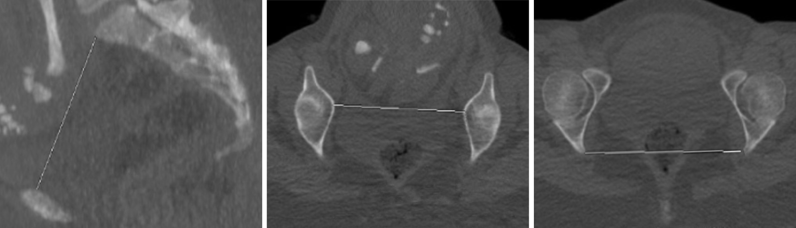

# Pelviscanner

```
PELVISCANNER

INDICATION
Confrontation fœto-pelvienne.

TECHNIQUE
Acquisition basse dose centrée sur le pelvis.

RESULTATS
Diamètre promonto-rétropubien :  cm (N > 10,5 cm)
Diamètre transverse médian :  cm (N > 12,5 cm)
Indice de Magnin (PRP + TM) :  (favorable si > 23)
Diamètre bi-épineux :  cm (N > 10,5 cm)
Présentation fœtale : 
```

<figure markdown="span">
    {width="700"}
</figure>