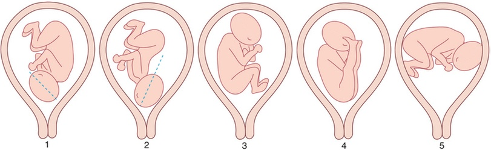

# Pelvimétrie par scanner

```
Confrontation fœto-pelvienne.
```
```
Acquisition basse dose centrée sur le pelvis.
```
```
Diamètre promonto-rétropubien :  cm (N > 10,5 cm)
Diamètre transverse médian :  cm (N > 12,5 cm)
Indice de Magnin (PRP + TM) :  (favorable si > 23)
Diamètre bi-épineux :  cm (N > 10 cm)
Présentation fœtale : 
```

<figure markdown="span">
    {width="700"}  
    [{width="700"}](https://clemedicine.com/6-foetus-normal-etude-morphologique-et-depistage/){:target="_blank"}
    1/2 : **96% céphalique** fléchie/défléchie  
    3/4 : **3% siège** complet/décomplété  
    5 : 0,5% transverse   
</figure>