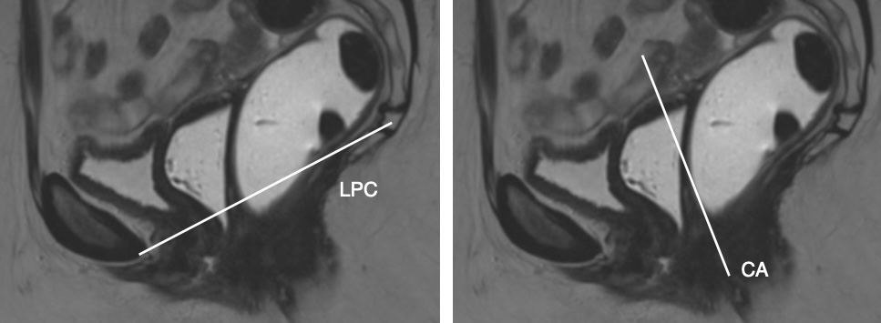

# Dysfonctions pelvi-périnéales

```
Du point de vue morphologique : 
Utérus antéversé antéfléchi mesurant 
Endomètre hyperéchogène mesurant
Ovaires latéro-utérins, fibreux, en rapport avec le statut post-ménopausique.
Pas de syndrome de masse ni d'adénomégalie dans le pelvis.
Trophicité conservée des faisceaux puborectaux et iliococcygien du muscle releveur de l'anus.

Du point de vue dynamique :
Compartiment antérieur :
Compartiment moyen :
Compartiement postérieur :
- Pas de rectocèle antérieure.
- Respect de la cloison rectovaginale.
- Pas de prolapsus muqueux intracanalaire.
```

!!! tip "Grades de sévérité"
    -  **cysto/hystéro/péritonéocèle** = minime 1-3 cm, modérée 3-6 cm, sévère > 6 cm
        - hypermobilité urétrale = horizontalisation > 30° + col sous la LPC
        - trigonoptose = bandelette sous-urétrale
    - **rectocèle antérieure** = physiologique < 2 cm, modérée 2-4 cm, sévère > 4 cm
        - anisme = fermeture paradoxale de l'angle anorectal en poussée
        - intussusception = intra-rectale < intra-anale < extra-anale

    <figure markdown="span">
        {width="500"}
    </figure>

