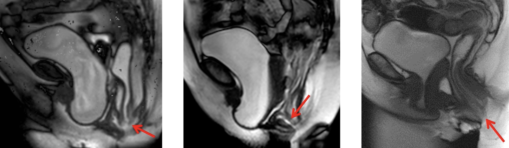

# Dysfonctions pelvi-périnéales

```
Après balisage vaginal et rectal, séquence 3D T2, séquences sagittale T2 dynamiques en poussée progressive répétée, puis 3 plans T2 en poussée maximale bloquée.

Du point de vue morphologique : 
Utérus antéversé antéfléchi mesurant  mm.
Endomètre en hypersignal T2 d'épaisseur millimétrique.
Ovaires latéro-utérins fibreux, sans syndrome de masse.
Pas d'épanchement ni d'adénomégalie dans le pelvis.
Trophicité respectée du muscle releveur de l'anus.

Du point de vue dynamique :
Compartiment antérieur :
Compartiment moyen :
- Pas de descente de l'utérus.
- Respect de la cloison rectovaginale.
Compartiment postérieur :
- Pas de rectocèle antérieure.
- Pas de prolapsus muqueux intracanalaire.
```

<figure markdown="span">
    Examen réussi si **vidange rectale**  
    Echec => défécographie (position assise)  
</figure>

| Grades | cystocèle/hystérocèle/péritonéocèle vaginale |
| :---: | :---: | 
| 1 | intra-vaginal | 
| 2 | affleure l'introitus |
| 3 | extériorisé | 

!!! tip "**Rectocèle** antérieure = rétentionniste ?"
    <figure markdown="span">
        {width="250"}
        significative si > 2 cm de profondeur
    </figure>

!!! tip "**Prolapsus rectal** (intussusception) = obstructif ?"
    <figure markdown="span">
        grade 1 physiologique = intra-rectal
        {width="750"}
        2 = affleure le canal anal, 3 = intra-anal, 4 = extériorisé  
        → même gradation pour les **péritonéocèles rectales**
    </figure>

!!! tip "**Asynchronisme ano-rectal** = anisme "
    <figure markdown="span">
        {width="250"}
        fermeture paradoxale du muscle élévateur en poussée
    </figure>

!!! tip "**Périnée descendant** "
    <figure markdown="span">
        {width="250"}
        > 6 cm sous la ligne pubo-coccygienne
    </figure>

!!! warning "Complications"
    - dilatation des uretères
    - allongement hypertrophique lèvre antérieure col (> 3 cm)
    - ulcère solitaire du rectum (pseudopolypoïde face antérieure)
