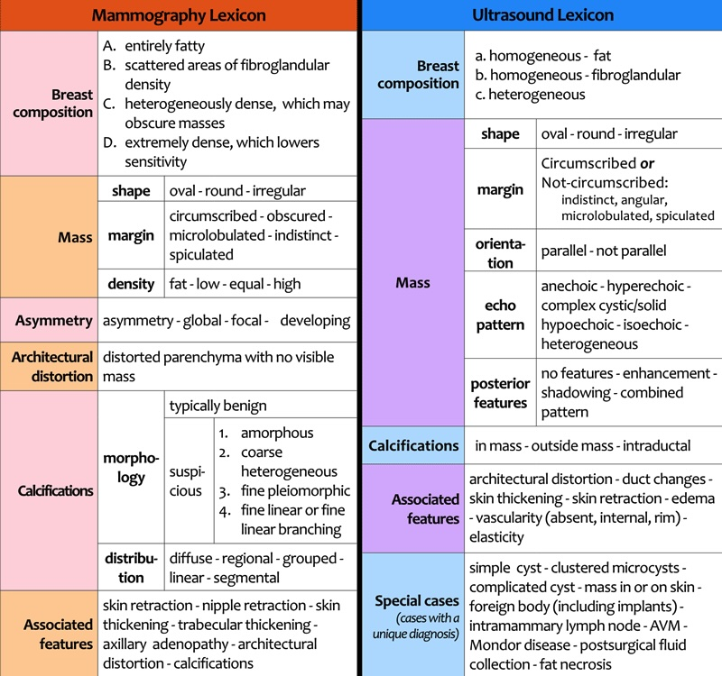

```
Densité de type 
Pas de microcalcifications, d’opacité nodulo-stellaire ni de distorsion architecturale.
Pas d’anomalie du revêtement cutané ni des creux axillaires.
```

```
Échostructure de type  
Pas de nodule tissulaire ni de plage atténuante suspecte. 
```

<figure markdown="span">
    [{width="700"}](https://radiologyassistant.nl/breast/bi-rads/bi-rads-for-mammography-and-ultrasound-2013){:target="_blank"}
</figure>