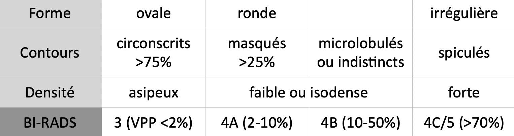
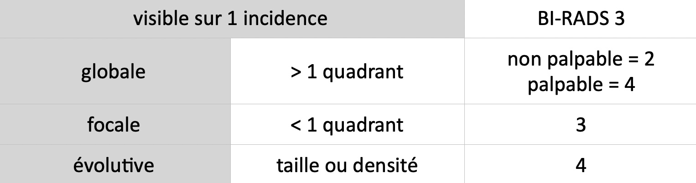
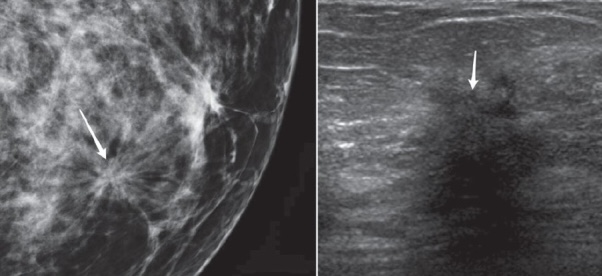
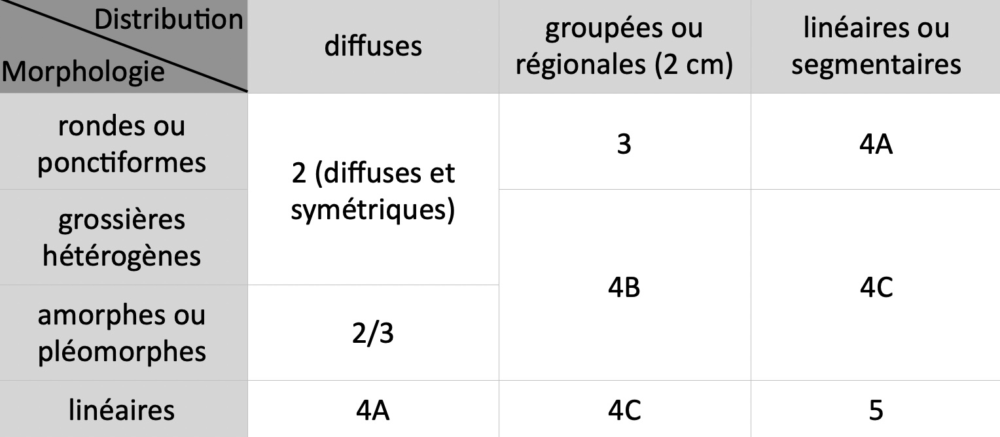
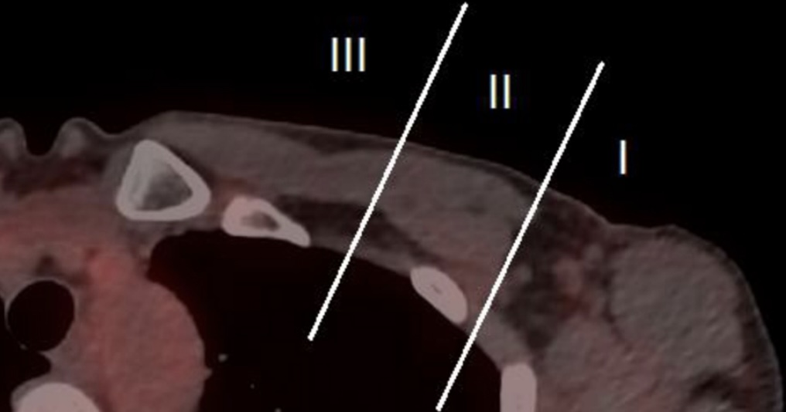
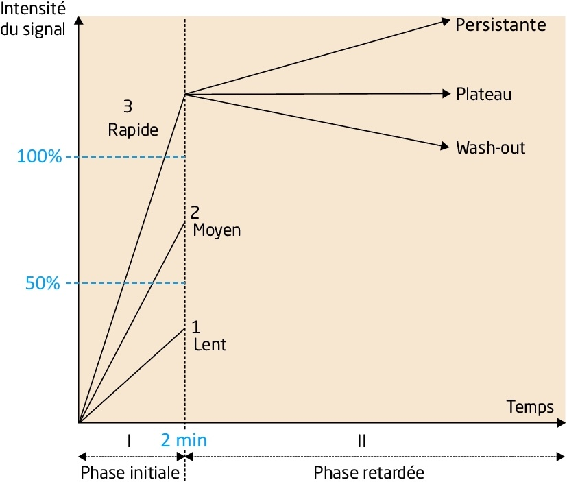
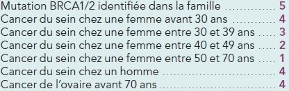

# [Seins](https://www.acr.org/-/media/ACR/Files/RADS/BI-RADS/BIRADS-Poster.pdf){:target="_blank"}

=== "mammo"
    ```
    MAMMOGRAPHIE BILATÉRALE
    Densité mammaire de type
    Absence de masse, d'asymétrie de densité, de distorsion architecturale ou de foyer de microcalcifications.
    Absence d'adénopathie axillaire.

    ECHOGRAPHIE BILATÉRALE
    Composition tissulaire
    Absence d'altération échostructurale à droite comme à gauche.
    Absence d'anomalie des creux axillaires.


    CONCLUSION
    Examen classé BI-RADS 2 bilatéral (pas d'anomalie suspecte).
    ```
    <p style="text-align: center">BI-RADS 3 = surveillance 4-6 mois / 4-5 = biopsie</p>

    === "Masse"
        <figure markdown="span">
            {width="500"}
            </br>**BI-RADS 3 ssi écho** = ovale/ronde, orientation parallèle, contours circonscrits, </br>homogène, sans atténuation postérieure => contrôle M4 M+8 M+12
        </figure>
    === "Asymétrie"
        <figure markdown="span">
            {width="500"}
        </figure>
    === "Distorsion"
        <figure markdown="span">
            {width="400"}
            </br>BI-RADS <b>4C</b> (centre clair) ou <b>5</b> (centre dense)
        </figure>
    === "Calcifications"
        <figure markdown="span">
            [{width="500"}](https://radiologyassistant.nl/breast/bi-rads/bi-rads-for-mammography-and-ultrasound-2013#mammography-breast-imaging-lexicon-calcifications){:target="_blank"}
            </br>Foyer microcalcifications ssi <b> > 5 sur 1 cm </b>
        </figure>
    === "Signes associés"
        - gg intra-mammaire ssi hile graisseux + vaisseaux adjacents + quadrant supéro-ext
        - lésions cutanées (kyste sébacé), rétraction cutané, œdème/épaississement cutané 
        - ectasie galactophorique isolée
        - atteinte de la plaque aréolo-mammelonnaire
        - envahissement muscle pectoral (extension en hauteur ?), paroi thoracique
    === "Seins traités"
        - désorganisation architecturale (plutôt que « distorsion »)
        - sérome/lymphocèle, cystostéatonécrose, kyste huileux
        - prothèse = type et localisation, rupture intra/extracapsulaire, siliconome
    === "ADP"
        - rond, hypoéchogène, hile effacé, vascularisation périphérique
        - épaississement du cortex diffus/focal > 3 mm (faible VPP)
        <figure markdown="span">
            {width="300"}
            Niveaux de Berg
        </figure>
=== "IRM"
    ```
    Pas d'anomalie des téguments et du tissu sous-cutané.
    Quantification fibroglandulaire de type
    Répartition symétrique hétérogène du tissu fibroglandulaire.
    Rehaussement matriciel bilatéral et symétrique
    Absence de rehaussement suspect masse ou non masse.
    Pas d'adénomégalie axillaire ou mammaire interne.
    ```
    <p style="text-align: center"><a href="https://cngof.fr/app/pdf/ANCIENNES%20JOURN%C3%89ES//2011/2011_GM/pathologies_mammaires_et_cancer_du_cein/IRM_mammaire_une_bonne_indication_un_bon_compte_rendu.pdf?x29325#:~:text=Actuellement%2C%20l'IRM%20mammaire%20n,traitement%20chirurgical%20radical%20par%20mastectomie."target="_blank">Indications</a> = haut risque, K lobulaire infiltrant, < 40 ans, </br>discordance clinique/mammo/écho, chimio néoadj</p>
    <figure markdown="span">
        {width="480"}
    </figure>


!!! tip "Suivi des femmes à haut risque"
    - mutation [BRCA](https://www.e-cancer.fr/content/download/198925/2674462/file/Plaquette_Femmes_porteuses_d_une%20mutation_de_BRCA1_ou_BRCA2_mel_20170529.pdf){:target="_blank"}, ATCD irradiation tho. (Hodgkin), p53/Cowden/Peutz-Jeghers
    - **IRM + mammo oblique /an 30-65 ans**, puis mammo face-oblique /an
    - antécédent K sein => IRM + mammo face-oblique /an
    <figure markdown="span">
        {width="420"}
        consultation oncogénétique si score d'Eisinger ≥ 3
    </figure>

!!! tip "Suivi des femmes à **risque intermédiaire**"
    - ATCD personnel K sein = mammo/an sans limitation de durée
    - ATCD lésion histologique à risque = mammo/an pdt 10 ans
        - métaplasie cylindrique atypique, hyperplasie épithéliale atypique