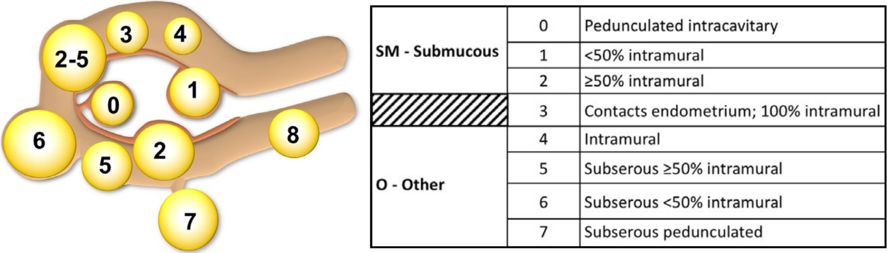
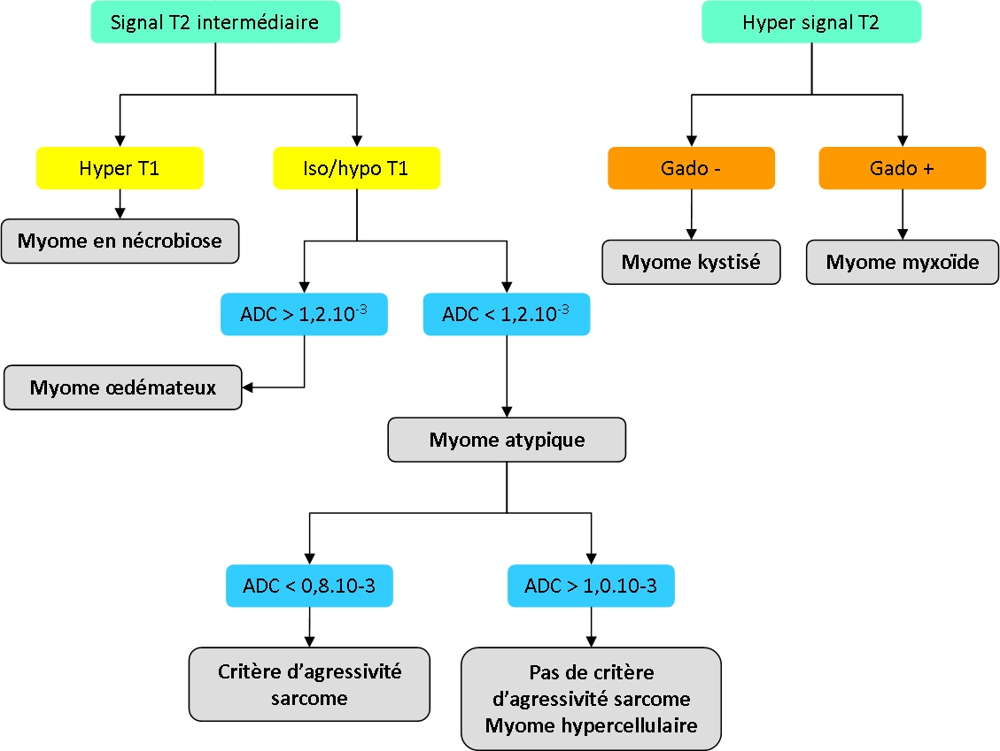
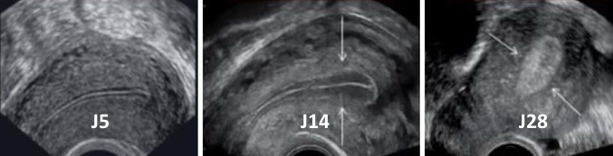
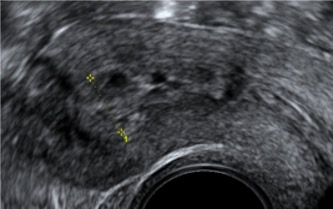

=== "écho"
    ```
    Examen par voie suspubienne puis endovaginale après accord de la patiente.

    Utérus antéversé antéfléchi mesurant  mm.
    Endomètre hyperéchogène mesurant  mm.
    Pas d'anomalie significative du myomètre.

    Ovaires latéraux folliculaires mesurant à droite/gauche  mm.
    Pas de dilatation tubaire.

    Pas d'épanchement pelvien significatif.
    Pas de dilatation des cavités pyélocalicielles.
    ```
=== "IRM"
    ```
    Utérus antéversé antéfléchi mesurant  mm.
    Endomètre hyperintense en T2 mesurant  mm.
    Intégrité de la zone jonctionnelle et du myomètre.
    Ovaires latéraux folliculaires mesurant à droite/gauche  mm.

    Pas d'adénomégalie.
    Pas d'épanchement pelvien significatif.
    Pas de dilatation des cavités pyélo-calicielles.
    ```
=== "K endomètre"
    ```
    Utérus antéversé antéfléchi mesurant  mm.
    Masse endométriale mesurant  mm.
    Envahissement de plus/moins de 50% du myomètre.

    Respect de la séreuse.
    Pas d'anomalie annexielle.
    Pas d'atteinte du stroma cervical.
    Pas d'extension vaginale, paramétriale, vésicale ou digestive.

    Pas d'adénopathie pelvienne ou lomboaortique.
    Pas d'épanchement pelvien significatif.
    Pas de dilatation des cavités pyélocalicielles.
    ```
    <p style="text-align: center"><a href="http://oncologik.fr/referentiels/dsrc/uterus-corps-endometre#12.Classification%20FIGO%202023"target="_blank">FIGO</a></p>
=== "K col"
    ```
    Utérus antéversé antéfléchi mesurant  mm.
    Endomètre en hypersignal T2 mesurant  mm.
    Ovaires latéro-utérins fibreux.

    Masse centrée sur le col utérin mesurant  mm.
    Pas d'extension aux paramètres, au vagin, ni à l'isthme utérin.
    Pas d'atteinte du rectum ni de la vessie.

    Pas d'adénopathie pelvienne ou lomboaortique.
    Pas d'épanchement pelvien significatif.
    Pas de dilatation des cavités pyélocalicielles.
    ```
    <p style="text-align: center"><a href="http://oncologik.fr/referentiels/interregion/uterus-col#5.Classification%20FIGO%20(2018)"target="_blank">FIGO</a></p>

<figure markdown="span">
    {width="730"}
    > 5 myomes / > 5 cm => IRM
    {width="670"}
</figure>

!!! tip "**Endomètre** normal (ménopause ≤ 5 mm, ≤ 10 mm sous THS)"
    - phase menstruelle J1-4 = hyperéchogène 1-4 mm
    - proliférative J5-13 = hypoéchogène 5-9 mm
    - ovulatoire J14 = aspect en cible 10 mm
    - sécrétoire J15-28 = hyperéchogène 8 - 15 mm
    <figure markdown="span">
        {width="550"}
    </figure>

!!! tip "**Adénomyose** interne = 40% des femmes"
    - focale/diffuse superficielle/profonde (cut-off 1/3 myomètre)
    - IRM = microkystes sous-endométriaux, **ZJ > 11 mm** ou > 40% du myomètre
    - écho = utérus globuleux, **interface floue** endo/myomètre, microlacunes myométriales


!!! tip "[Tamoxifène](https://radiopaedia.org/articles/tamoxifen-associated-endometrial-changes-2){:target="_blank"}"
    - **épaississement glandulo-kystique** de l'endomètre (mais /!\ K RR 1,6)
    - polypes glandulo-kystiques, ↗ myomes et adénomyose
    <figure markdown="span">
        {width="230"}
    </figure>