# Accueil

<p style="text-align: center"><a href="https://www.imaios.com/fr/login"target="_blank">imaios</a> &nbsp;&nbsp;&nbsp;&nbsp;&nbsp; <a href="https://radiopaedia.org/"target="_blank">radiopaedia</a> &nbsp;&nbsp;&nbsp;&nbsp;&nbsp; <a href="https://www.radrap.ch/comptesrendus"target="_blank">CR types</a> &nbsp;&nbsp;&nbsp;&nbsp;&nbsp; <a href="https://radref.org/ref.php"target="_blank">radref</a> <br> <a href="https://www.ccam-radiologie.fr/echographie-abdomen-pelvis/"target="_blank">ccam</a> &nbsp;&nbsp;&nbsp;&nbsp;&nbsp; <a href="https://aderim.radiologie.fr/"target="_blank">aderim</a> &nbsp;&nbsp;&nbsp;&nbsp;&nbsp; <a href="https://www.imaios.com/fr/e-mri/sequences/sequences-acronymes"target="_blank">acronymes séquences IRM</a>
</br>rempl cima / elindo, Lens 1314, pass</p>

=== "Abdo"
    === "H"
        ```
        Foie de taille et de morphologie normales, sans lésion focale.
        Tronc porte avec flux hépatopète et veines sus-hépatiques hépatofuges.
        Pas de calcul vésiculaire. Pas de dilatation des voies biliaires. 
        Pas d'anomalie du pancréas explorable.
        Rate homogène de taille normale.
        Pas de dilatation des cavités pyélocalicielles.
        Reins de taille et de morphologie normales, sans lésion focale.
        Absence de lésion individualisable dans le rétropéritoine médian.
        Vessie en faible réplétion, sans anomalie décelable.
        Pas d'épanchement péritonéal.
        ```
    === "F"
        ```
        Foie de taille et de morphologie normales, sans lésion focale.
        Tronc porte avec flux hépatopète et veines sus-hépatiques hépatofuges.
        Pas de calcul vésiculaire. Pas de dilatation des voies biliaires. 
        Pas d'anomalie du pancréas explorable.
        Rate homogène de taille normale.
        Pas de dilatation des cavités pyélocalicielles.
        Reins de taille et de morphologie normales, sans lésion focale.
        Absence de lésion individualisable dans le rétropéritoine médian.
        Pas d'anomalie en projection de l'utérus et des annexes.
        Vessie en faible réplétion, sans anomalie décelable.
        Pas d'épanchement péritonéal.
        ```
    === "VB"
        ```
        Vésicule biliaire à parois fines, non distendue, sans image lithiasique.
        Pas de dilatation des voies biliaires. Perméabilité des vaisseaux hépatiques.
        Foie de taille et de morphologie normales, sans lésion focale.
        Pas d'anomalie du pancréas explorable.
        Rate homogène de taille normale.
        Pas de dilatation des cavités pyélocalicielles.
        Reins de taille et de morphologie normales, sans lésion focale.
        Absence de lésion individualisable dans le rétropéritoine médian.
        Vessie en faible réplétion, sans anomalie décelable.
        Pas d'épanchement péritonéal.
        ```
    === "reins"    
        ```
        Reins :
        Grand axe mesurant à droite et gauche  mm.
        Différenciation cortico-médullaire satisfaisante.
        Pas de dilatation des cavités pyélo-calicielles.
        Pas d'image lithiasique ni de lésion suspecte.

        Vessie :
        En réplétion, avec contenu anéchogène.
        Pas d'anomalie de paroi décelable.
        Pas d'épanchement péritonéal.
        Pas de syndrome de masse pelvien ni rétropéritonéal.
        ```
    === "cirrhose"
        ```
        Dysmorphie hépatique avec contours bosselés.
        Echostructure homogène, sans lésion focale suspecte.
        Tronc porte et branches portales hépatopètes.
        Vitesse maximale dans le tronc porte :  cm/s.
        Pas de dilatation des voies biliaires.
        Grand axe de la rate :  cm.
        Absence d'ascite.
        Pas de voie de dérivation porto-systémique décelable.
        ```

        <figure markdown="span">
            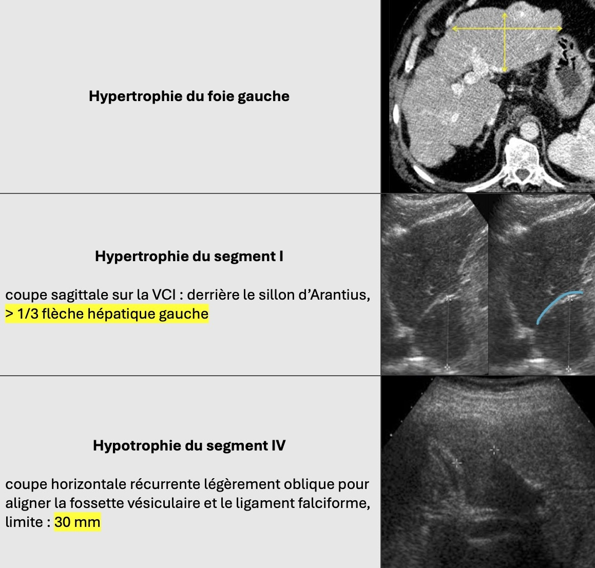{width="580"}
            [Surveillance cirrhose](https://www.has-sante.fr/upload/docs/application/pdf/2013-03/05r26_form_surveillance_cirrhose_formulaires_de_bilan_echographique_hepatique.pdf){:target="_blank"}  
            **HTP** si vitesse TP < 10 cm/s
        </figure>

    <figure markdown="span">
        [Lésion hépatiques](https://echo.interniste.com/echographie-foie-us-fr-c2-s0){:target="_blank"}  
        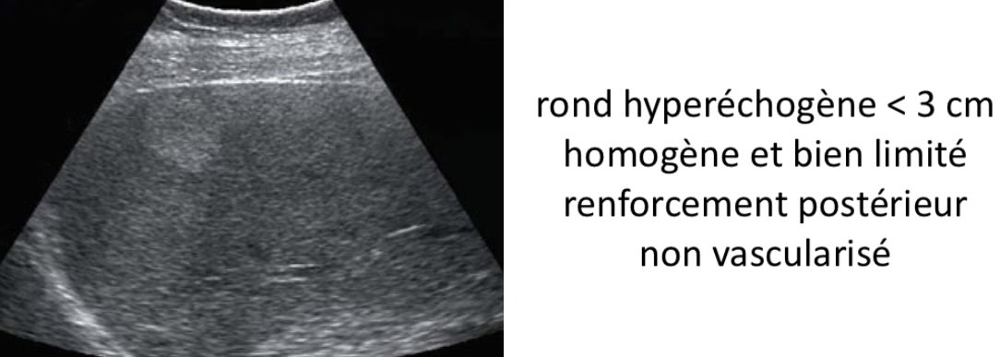{width="430"}  
        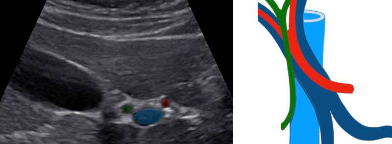{width="400"}  
        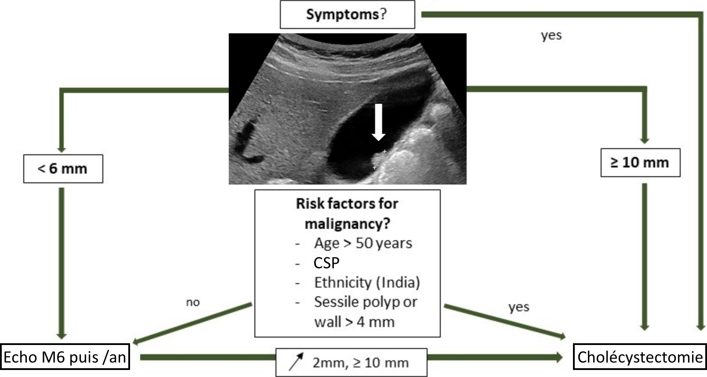{width="680"}
        [polypes cholestéroliques](https://radiopaedia.org/articles/gallbladder-cholesterol-polyps){:target="_blank"}  
    </figure>

=== "Cervical"
    <figure markdown="span">
        [Thyroïde](outils/thyroide.md)  
    </figure>

    === "normal"
        ```
        Pas de ganglion suspect dans les chaînes ganglionnaires cervicales.
        Pas de lésion focale dans les glandes submandibulaire et parotides.
        Perméabilité des axes vasculaires jugulaires et carotidiens.
        Thyroïde de taille normale sans image nodulaire.
        ```

        <figure markdown="span">
            [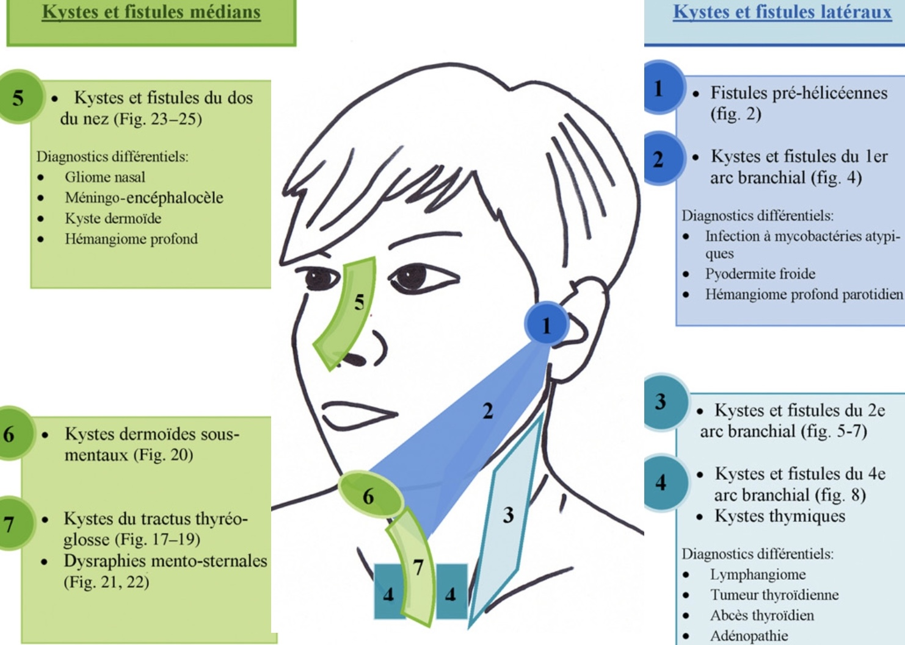{width="700"}](https://www.sfdermato.org/media/pdf/fmc/kystes-et-fistules-43aafeeba119ceb9a20059d95f63e615.pdf){:target="_blank"}
        </figure>

    === "gg"
        ```
        Ganglions jugulo-carotidiens bilatéraux de petit axe infracentimétrique, de forme ovalaire (rapport grand axe sur petit axe > 2), avec hile hyperéchogène central linéaire, d'échostructure homogène, bien limités, avec un environnement péri-ganglionnaire normal.
        Pas de ganglion suspect dans les chaînes ganglionnaires cervicales.
        Perméabilité des axes vasculaires jugulaires et carotidiens.
        Pas de lésion focale dans les glandes submandibulaires.
        Thyroïde de taille normale sans image nodulaire.
        ```

        <figure markdown="span">
            [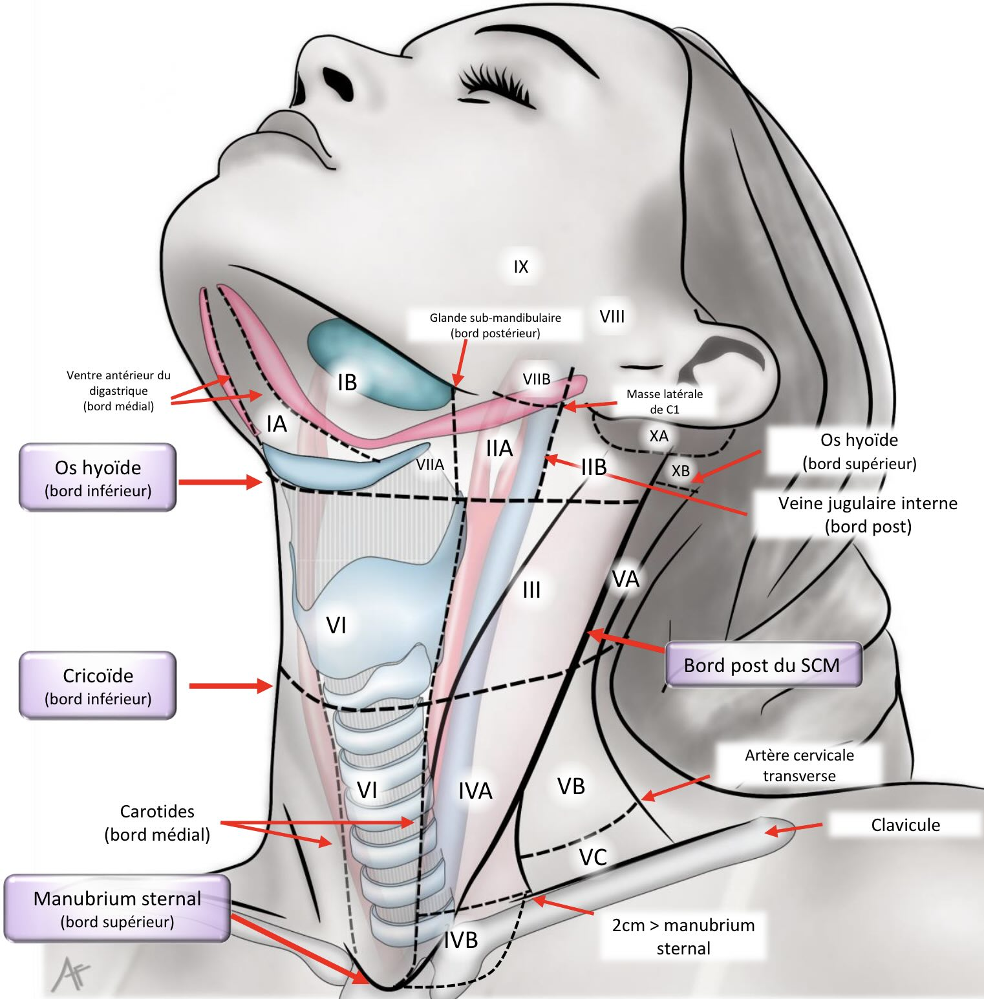{width="550"}](https://onclepaul.fr/wp-content/uploads/2011/07/Aires-lymphatiques-cervicales-AF-2022.pdf){:target="_blank"}  
        </figure>

    === "glandes salivaires"
        ```
        Pas d'image lithiasique ni de dilatation canalaire dans les glandes sous-mandibulaires.
        Pas de lésion focale dans le lobe superficiel des glandes parotides.
        Pas de ganglion suspect dans les chaînes ganglionnaires cervicales.
        Perméabilité des axes vasculaires jugulaires et carotidiens.
        Thyroïde de taille normale sans image nodulaire.
        ```

        <figure markdown="span">
            [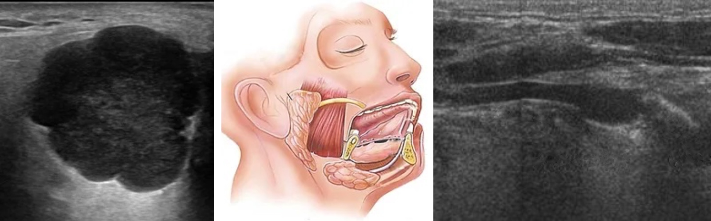{width="700"}](https://radiopaedia.org/articles/pleomorphic-adenoma-of-the-salivary-glands){:target="_blank"} 
        </figure>

=== "Paroi"

    === "inguinale"
        ```
        Examen debout lors de manœuvres de Valsalva répétées, puis en décubitus.
        
        Pas de hernie ou autre lésion inguinale décelable.
        Pas d'épanchement dans l'articulation coxo-fémorale.
        Pas d'ascite ni de syndrome de masse dans le pelvis.
        Vessie en semi-réplétion, sans anomalie pariétale.
        ```

        ```
        Examen debout lors de manœuvres de Valsalva répétées, puis en décubitus.
        
        Hernie inguinale

        Pas de hernie inguinale controlatérale décelable.

        Consignes de consultation aux urgences en cas de tuméfaction irréductible et inflammatoire qui ferait suspecter une strangulation intestinale.
        ```

        <figure markdown="span">
            [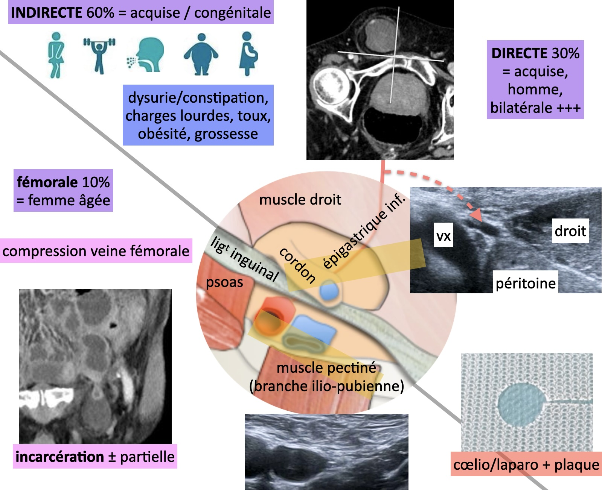{width="650"}](https://radiopaedia.org/articles/inguinal-hernia){:target="_blank"}
            [complications post-op](https://lamediatheque.radiologie.fr/mediatheque/media.aspx?mediaId=50350&channel=3277){:target="_blank"} = hématome, lymphocèle, varicocèle, meshome  
            [DD](https://www.intercomsante57.fr/html/profsante/pdf/L-echographie-dans-les-hernies.pdf){:target="_blank"} douleurs inguinales = arthrose hanche/rachis, pubalgie du sportif  
            [Diastasis](https://radiopaedia.org/articles/diastasis-recti){:target="_blank"} des muscles grands droits si > 20 mm  
            [Hernie de Spiegel](https://radiopaedia.org/articles/spigelian-hernia-1){:target="_blank"} = ligne semi-lunaire
        </figure>

    === "ganglions"

        ```title="normal"
        Formation hypoéchogène homogène ovalaire de petit axe infracentimétrique, avec hile hyperéchogène central linéaire, aux contours bien limités, avec un environnement normal, en faveur d'un ganglion physiologique.
        ```

        ```title="adénomégalie"
        Formation hypoéchogène homogène arrondie mesurant  mm, aux contours bien limités, avec un environnement normal, en faveur d'une adénomégalie.
        ```

        | Ganglion | [Territoires de drainage](https://www.chem-sante.fr/elearning/parcours_41/biblio_0/mg_2015_941_384.pdf){:target="_blank"}  |
        | :----------: | :-----------------------------------: |
        | `pré-auriculaire` | partie supérieure du visage |
        | `rétro-auriculaire` | cuir chevelu, oreille |
        | `jugulo-carotidien` | thyroïde, oropharynx, anneau de Waldeyer |
        | `sus-claviculaire D` | médiastin, poumons, œsophage |
        | `Troisier (G)` | poumons, abdo-pelv, testicules |
        | `axillaire` | membre sup, sein, paroi thoracique |
        | `inguinal` | membre inf, OGE, paroi abdo inf |

    === "kyste"

        !!! tip "[kyste épidermoïde](https://www.youtube.com/watch?app=desktop&v=HP9j2y5PQoE){:target="_blank"} / d'inclusion épidermique / sébacé = 90% des kystes ss-cut"
            - croissance lente, 70% dur > 30% mou, parallèle à la peau
            - finement hétérogène, paroi épaisse hypo, renforcement post
            - **pas de vascularisation**, amincissement dermique > 50%
            - 10% rupture/infection = contours lobulés, hypervasc périph
            - DD = [kyste pilonidal](https://radiopaedia.org/articles/pilonidal-sinus){:target="_blank"}, méta mélanome, sarcome superficiel (rare ++)
            <figure markdown="span">
                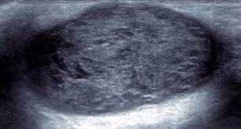{width="300"}
            </figure>
            ```
            Formation ovalaire sous-cutanée aux contours réguliers mesurant  mm.
            Contenu hypoéchogène hétérogène avec renforcement acoustique postérieur.
            Absence de vascularisation intrinsèque décelable au Doppler.
            Amincissement dermique focal en regard.
            
            Aspect évocateur de kyste épidermoïde, sans signe de complication.
            ```
            ```
            Formation ovalaire sous-cutanée aux contours irréguliers mesurant  mm.
            Contenu hypoéchogène hétérogène avec renforcement acoustique postérieur.
            Infiltration des tissus mous adjacents avec hyperhémie péri-lésionnelle.
            Absence de vascularisation intrinsèque décelable au Doppler.

            Aspect évocateur d'une infection de kyste épidermoïde.

            Intérêt d'un contrôle échographique en cas de d'évolution défavorable.
            ```

    === "lipome"

        !!! tip "[lipome](https://onclepaul.fr/wp-content/uploads/2011/07/Boules-masses-nodules.pdf){:target="_blank"}"
            - masse superficielle compressible et indolore
            - bien limitée, < 5 cm, pas de flux doppler, septas fibreux < 2 mm
            <figure markdown="span">
                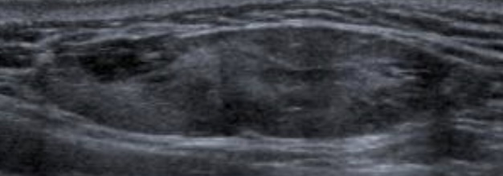{width="300"}
            </figure>
            ```
            Formation ovalaire superficielle d'allure graisseuse, aux contours bien limités, mesurant  mm.
            Topographie sus-aponévrotique et sans extension au fascia et au plan musculaire.
            Absence de vascularisation décelable au Doppler.

            Aspect évocateur de lipome, sans signe d'atypie.

            Un contrôle échographique sera nécessaire en cas d'évolutivité.
            ```

        !!! tip "[tumeur desmoïde](https://radiopaedia.org/articles/desmoid-tumour){:target="_blank"}"
            - paroi abdominale, dans le plan musculaire, croissance lente
            - masse hypoéchogène bien circonscrite
            <figure markdown="span">
                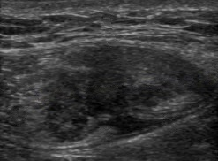{width="220"}
            </figure>

=== "H"

    === "prostate"

        ```
        Reins :
        Grand axe mesurant à droite et gauche  mm.
        Différenciation parenchymo-sinusale satisfaisante.
        Pas de dilatation des cavités pyélo-calicielles.
        Pas d'image lithiasique ni de lésion suspecte.

        Vessie pré-mictionnelle :
        En semi-réplétion ( ml), avec contenu anéchogène, sans lésion nodulaire.
        Détrusor modérément épaissi, sans diverticule.
        Pas d'épanchement péritonéal.

        Prostate par voie sus-pubienne :
        Contours réguliers. 
        Volume estimé à  cc.
        Protrusion intravésicale du lobe médian.
        Pas d'anomalie du carrefour vésiculo-déférentiel.

        Vessie post-mictionnelle :
        Résidu de  ml.
        ```

        <figure markdown="span">
            [Densité de PSA](outils/PSAd.md)  
        </figure>

        <figure markdown="span">
            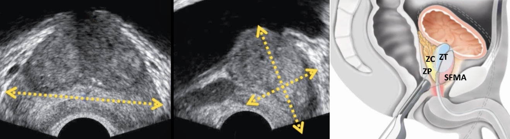{width="750"}
            hypertrophie si > 30 cc &nbsp;&nbsp;&nbsp;&nbsp;&nbsp; RPM significatif si > 50 cc ou > 20% du volume pré-mictionnel
            </br>  
        </figure>

    === "prostate jeune"

        ```
        Reins :
        Grand axe mesurant à droite et gauche  mm.
        Différenciation parenchymo-sinusale satisfaisante.
        Pas de dilatation des cavités pyélo-calicielles.
        Pas d'image lithiasique ni de lésion suspecte.

        Vessie pré-mictionnelle :
        En semi-réplétion ( ml), avec contenu anéchogène.
        Détrusor fin, sans lésion nodulaire.
        Pas d'épanchement péritonéal.

        Prostate par voie sus-pubienne :
        Contours réguliers. 
        Volume estimé à  cc.
        Pas d'anomalie du carrefour vésiculo-déférentiel.

        Vessie post-mictionnelle :
        Résidu de  ml.
        ```

    === "testicules"

        ```
        Testicules de taille normale et symétriques.
        Echostructure homogène, sans lésion focale suspecte.
        Vascularisation testiculaire symétrique sans particularité. 
        Epididymes et cordons spermatiques d'aspect normal.
        Pas d'hydrocèle significative.
        ```
    
        ```
        Testicule droit :
        Volume testiculaire estimé à  cc (selon la formule de Lambert).
        Echostructure homogène, sans lésion focale suspecte.
        Epididymes et cordons spermatiques d'aspect normal.
        Pas d'hydrocèle significative.

        Testicule gauche :
        Volume testiculaire estimé à  cc (selon la formule de Lambert).
        Echostructure homogène, sans lésion focale suspecte.
        Epididymes et cordons spermatiques d'aspect normal.
        Pas d'hydrocèle significative.
        ```

        <figure markdown="span">
            [Volume](outils/volumes.md)  
        </figure>

        <figure markdown="span">
            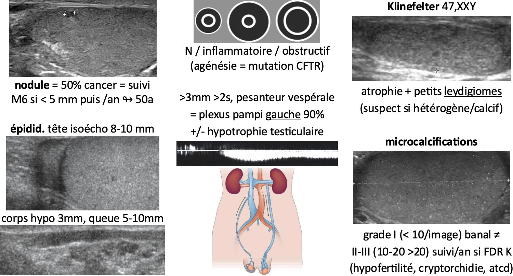{width="800"}
            12-20 cc (1-2 cc ≤ 12 ans) → formule de Lambert = cm³ x 0,71  
            [Pathos](https://onclepaul.net/wp-content/uploads/2011/07/DU-TESTICULE-2011-AGFILEminimizer.pdf){:target="_blank"} &nbsp;&nbsp;&nbsp;&nbsp;&nbsp; [Tumeur adénomatoïde](https://radiopaedia.org/articles/adenomatoid-tumours-of-the-scrotum){:target="_blank"} &nbsp;&nbsp;&nbsp;&nbsp;&nbsp; [Ectasie tubulaire du rete testis](https://radiopaedia.org/articles/tubular-ectasia-of-rete-testis){:target="_blank"}  
            </br>
            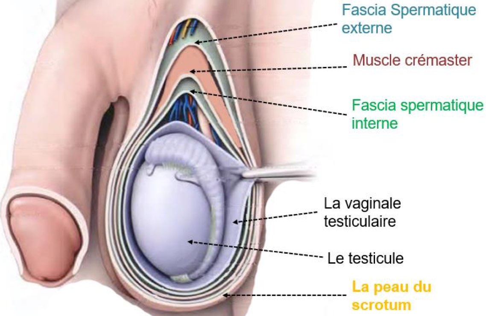{width="470"}
            [enveloppes testiculaires](https://anatomie-fmpm.uca.ma/wp-content/uploads/2020/07/testicules-et-voies-spermatiques.pdf){:target="_blank"} = albuginée < vaginale < fascias spermatiques  
            </br>
            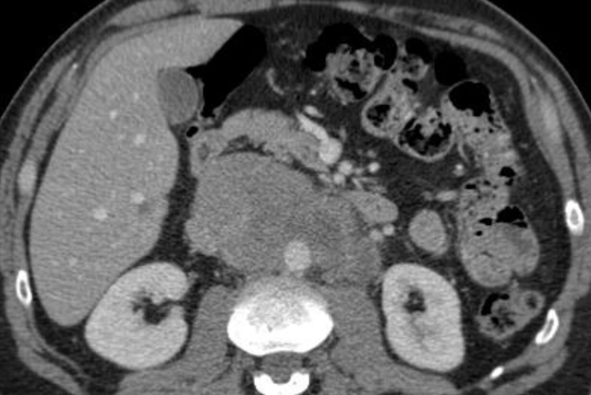{width="300"}
            [tumeur](https://radiopaedia.org/articles/testicular-cancer){:target="_blank"} => **TDM TAP** (métas poumons, foie, cerveau, os)  
            </br>
            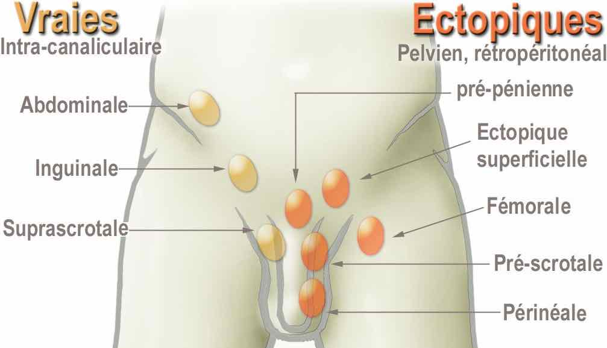{width="550"}
            **cryptorchidie** = descente spontanée avant M3 ++ sinon orchidopexie, RR cancer x30
        </figure>

=== "F"

    === "endo jeune"
        ```
        Examen par voie suspubienne puis endovaginale après accord de la patiente.

        Utérus antéversé antéfléchi mesurant  cm.
        Endomètre hyperéchogène mesurant  mm.
        Pas d'anomalie dans le myomètre.
        Pas de lésion endocavitaire décelable.

        Pas de dilatation tubaire.
        Ovaires latéraux, folliculaires, de taille normale.
        Pas d'épanchement pelvien significatif.
        Pas de dilatation des cavités pyélocalicielles.
        ```

    === "endo vieille"
        ```
        Examen par voie suspubienne puis endovaginale après accord de la patiente.

        Utérus antéversé antéfléchi mesurant  cm.
        Endomètre hyperéchogène mesurant  mm.
        Pas d'anomalie dans le myomètre.
        Pas de lésion endocavitaire décelable.
        Ovaires non individualisables.
        Pas de syndrome de masse pelvien.
        Pas d'épanchement pelvien significatif.
        Pas de dilatation des cavités pyélocalicielles.
        ```

    === "sus-pub"
        ```
        Examen par voie suspubienne exclusive (voie endovaginale non souhaitée par la patiente).

        Utérus antéversé antéfléchi mesurant  cm.
        Endomètre difficilement individualisable mesurant environ  mm.
        Pas d'anomalie dans le myomètre ni de lésion endocavitaire décelable.
        Ovaires non individualisables en raison d'interpositions digestives.
        Pas de syndrome de masse pelvien ni rétropéritonéal.
        Pas de dilatation des cavités pyélocalicielles.
        Pas d'épanchement pelvien significatif.
        ```

    === "EPP"
        ```
        Examen par voie suspubienne puis endovaginale après accord de la patiente.

        Utérus antéversé antéfléchi mesurant  cm, avec endomètre de  mm.
        Pas d'anomalie dans le myomètre ni de lésion endocavitaire.
        Absence de nodule rétractile en regard du torus.
        Intérgrité de la cloison recto-vaginale et de l'espace vésico-utérin.
        Pas de dilatation tubaire. Ovaires latéraux, folliculaires, sans endométriome.
        Pas d'épanchement pelvien significatif.
        Pas de dilatation des cavités pyélocalicielles.
        ```

    === "SOPK"
        ```
        Examen par voie suspubienne puis endovaginale après accord de la patiente.

        Ovaires latéraux dont la surface mesure à droite et gauche  cm².
        Ils contiennent moins de 20 follicules par ovaire.
        Pas de dilatation tubaire.

        Utérus antéversé antéfléchi mesurant  cm.
        Endomètre hyperéchogène mesurant  mm.
        Pas d'anomalie dans le myomètre.

        Pas d'épanchement pelvien significatif.
        Pas de dilatation des cavités pyélocalicielles.
        ```

        <figure markdown="span">
            ovaire polykystique si [> 20 follicules 2-9 mm / > 6 cm² / > 10 ml](https://radiopaedia.org/articles/polycystic-ovarian-syndrome-1){:target="_blank"}  
            </br> 
        </figure>

    === "CFA"
        ```
        Examen par voie suspubienne puis endovaginale après accord de la patiente.

        Ovaires latéraux folliculaires mesurant à droite et gauche  mm.

        Nombre et taille des follicules à droite/gauche :
            - De moins de 5 mm : 
            - Entre 5 et 10 mm : 
            - De plus de 10 mm : 

        Doppler des artères utérines avec IR/IP :
            - à droite : 
            - à gauche : 

        Pas de dilatation tubaire.
        Utérus antéversé antéfléchi mesurant  cm.
        Endomètre hyperéchogène mesurant  mm.
        Pas d'anomalie significative du myomètre.
        Pas d'épanchement pelvien significatif.
        Pas de dilatation des cavités pyélocalicielles.
        ```

        <p style="text-align: center">écho à <b>J3</b> du cycle, réserve ovarienne faible si < 5 follicules/ovaire</p>

    <figure markdown="span">
        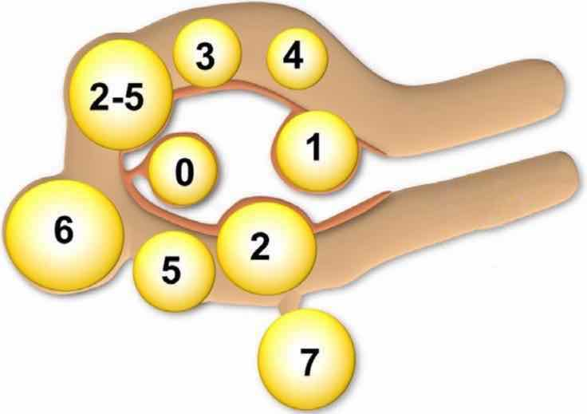{width="300"}
        0-1-2 sous-muqueux &nbsp;&nbsp;&nbsp; 3-4-5 intramuraux &nbsp;&nbsp;&nbsp; 6-7 sous-séreux  
        > 5 myomes ou > 5 cm => IRM
    </figure> 
    !!! tip "[Endomètre](https://cglre.org/endometre-page-1/){:target="_blank"} (ménopause < 5 mm, < 10 mm si THS)"
        - phase menstruelle J1-4 = hyperéchogène 1-4 mm
        - proliférative J5-13 = hypoéchogène 5-9 mm
        - ovulatoire J14 = aspect en cible 10 mm
        - sécrétoire J15-28 = hyperéchogène 8-15 mm
        <figure markdown="span">
            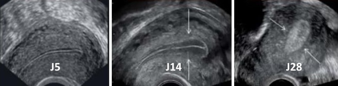{width="550"}
        </figure>
    <figure markdown="span">
        [malposition DIU](https://www.gyneco-online.com/node/2710#:~:text=Il%20existe%20différents%20mal%20positionnements,du%20DIU%20pénètre%20le%20myomètre){:target="_blank"}  
    </figure>
    !!! tip "[Adénomyose interne](https://cglre.org/adenomyose1/){:target="_blank"} = 40% des femmes"
        - focale/diffuse superficielle/profonde (cut-off 1/3 myomètre)
        - IRM = microkystes sous-endométriaux ± sang, **ZJ ≥ 12 mm** et > 40% du myomètre
        - écho = utérus globuleux, **interface floue** endo/myomètre, microlacunes myométriales
        <figure markdown="span">
            [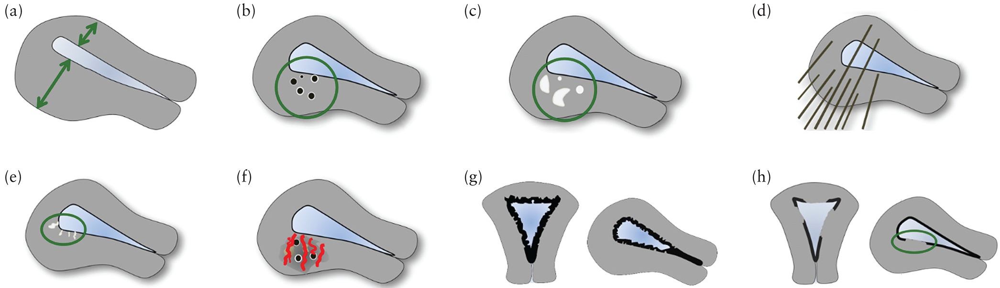{width="800"}](https://obgyn.onlinelibrary.wiley.com/doi/full/10.1002/uog.14806){:target="_blank"}  
            (a) épaississement asymétrique, (b) microkystes, (c) plages hyperéchogènes, (d) cônes d'ombre radiaires, (e) aspect strié, (f) vascularisation translésionnelle, (g) zone jonctionnelle irrégulière ou interrompue (h)
        </figure>
    
    !!! tip "[Tamoxifène](https://radiopaedia.org/articles/tamoxifen-associated-endometrial-changes-2){:target="_blank"}"
        - **épaississement glandulo-kystique** de l'endomètre (mais /!\ K RR 1,6)
        - polypes glandulo-kystiques, ↗ myomes et adénomyose
    </br>

=== "Rx"
    === "thorax"
        === "vieux"
            ```
            Aspect déroulé de la crosse aortique.
            Respect de la silhouette cardiomédiastinale par ailleurs.
            Pas d'opacité en projection des champs pulmonaires.
            Pas de comblement des récessus costo-diaphragmatiques.
            Remaniements dégénératifs modérés du rachis.
            ``` 

            <figure markdown="span">
                [sd radiographiques](https://onclepaul.fr/wp-content/uploads/2011/07/La-radiographie-du-thorax-pathologique-RD-2021-pdf.pdf){:target="_blank"} 
            </figure>   

        === "jeune"
            ```
            Silhouette cardiomédiastinale d'aspect normal.
            Pas d'opacité en projection des champs pulmonaires.
            Pas de comblement des récessus costo-diaphragmatiques.
            Structures osseuses sans particularité significative.
            ``` 

            <figure markdown="span">
                [sd radiographiques](https://onclepaul.fr/wp-content/uploads/2011/07/La-radiographie-du-thorax-pathologique-RD-2021-pdf.pdf){:target="_blank"} &nbsp;&nbsp;&nbsp;&nbsp;&nbsp;&nbsp;&nbsp;&nbsp;&nbsp;&nbsp; [pédiatrie](https://onclepaul.net/wp-content/uploads/2011/07/5-Cours-radiopediatrie-MERM-Imagerie-Thoracique-pediatrique.pdf){:target="_blank"}  
            </figure>   

        === "gril costal"
            ```
            Absence de lésion osseuse post-traumatique décelable.
            Silhouette cardiomédiastinale d'aspect normal.
            Pas d'opacité en projection des champs pulmonaires.
            Pas de comblement des récessus costo-diaphragmatiques.
            ``` 

    === "rachis"
        === "RLB vieux"
            ```
            Respect de la hauteur et bon alignement des corps vertébraux.
            Pas de pincement des espaces intersomatiques.
            Arthrose articulaire postérieure prédominant aux derniers étages lombaires.
            Pas de remaniement dégénératif significatif des articulations coxo-fémorales.
            Aspect normal des interlignes articulaires sacro-iliaques.
            Pas de lésion osseuse suspecte et parties molles sans particularité.
            ``` 
        === "RLB jeune"
            ```
            Pas de pincement des espaces intersomatiques.
            Respect de la hauteur et bon alignement des corps vertébraux.
            Aspect normal des interlignes articulaires sacro-iliaques et coxo-fémorales.
            Pas de lésion osseuse suspecte et parties molles sans particularité.
            ``` 
        === "RACE jeune"
            ```
            Lordose cervicale conservée.
            Bon alignement des corps vertébraux.
            Pas de pincement des espaces intersomatiques.
            Pas de sténose osseuse des foramens intervertébraux.
            Pas d'épaississement des parties molles prévertébrales.
            ``` 
        === "RACE vieux"
            ```
            Lordose cervicale conservée.
            Bon alignement des corps vertébraux.
            Uncodiscarthrose étagée prédominant en .
            Pas de franche sténose osseuse des foramens intervertébraux.
            Pas d'épaississement des parties molles prévertébrales.
            ```
        === "scoliose"
            ```
            Scoliose  mesurant ° entre  et .
            Pas de déséquilibre frontal entre l'épineuse de T1 et le sacrum.
            Bascule du bassin par sous-dénivelation vers la 
            Absence de malformation vertébrale décelable.
            Pas d'anomalie transitionnelle lombo-sacrée.
            Stade d'ossification Risser 
            Parties molles sans particularité.
            ```    

            <figure markdown="span">
                [scoliose](https://radiopaedia.org/articles/scoliosis){:target="_blank"} si angle de Cobb > 10°  
                <br>
                {width="450"}
            </figure>   

    === "membres"
        === "épaule"
            ```
            Pas de lésion osseuse post-traumatique.
            Pas de diminution de l'espace sous-acromial.
            Respect de l'articulation acromio-claviculaire.
            Intégrité de l'interligne articulaire gléno-huméral.
            Pas de calcification en projection des tendons de la coiffe des rotateurs.
            Pas de lésion suspecte dans les structures osseuses et les parties molles.
            ```   

            <figure markdown="span">
                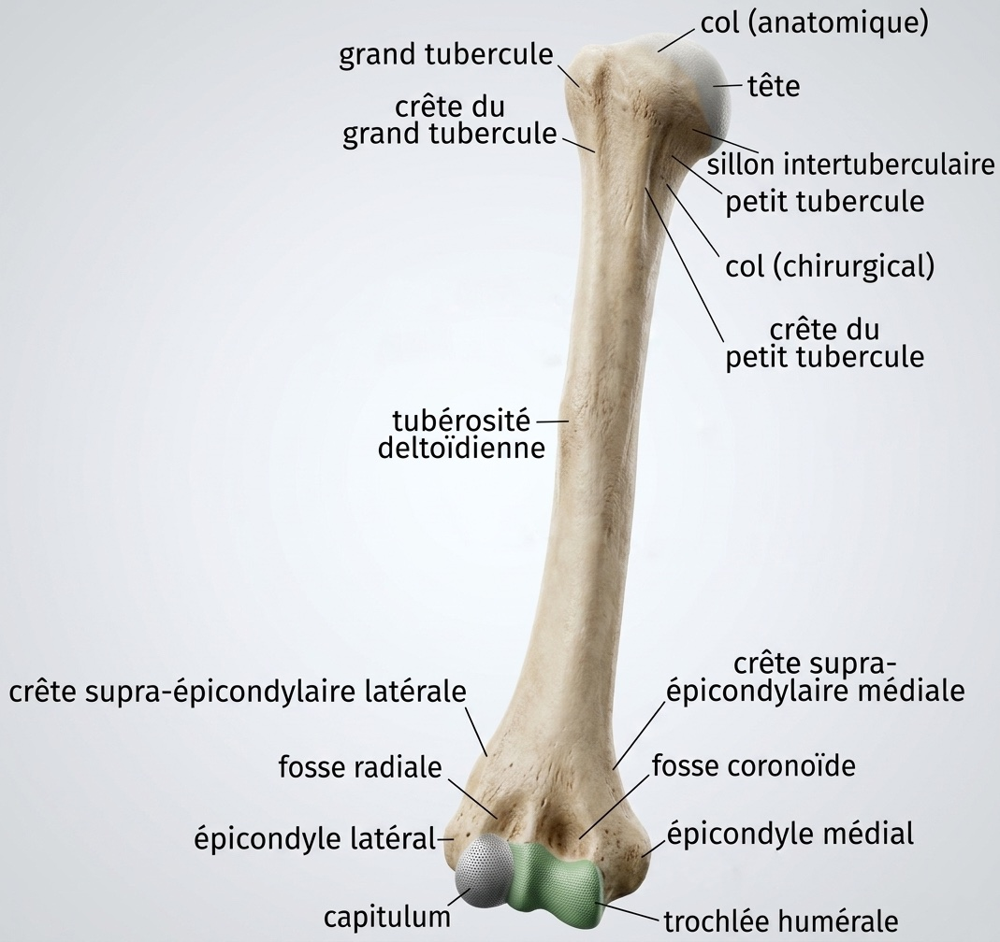{width="550"}  
                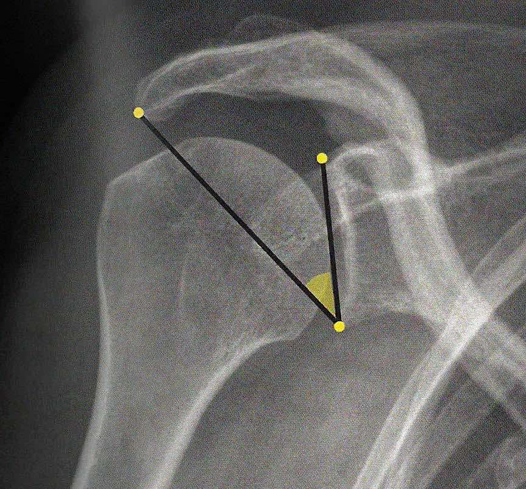{width="350"}
                [angle CSA](https://radiopaedia.org/articles/critical-shoulder-angle){:target="_blank"} < 30° arthrose / > 35° rupture coiffe  
                <br>
                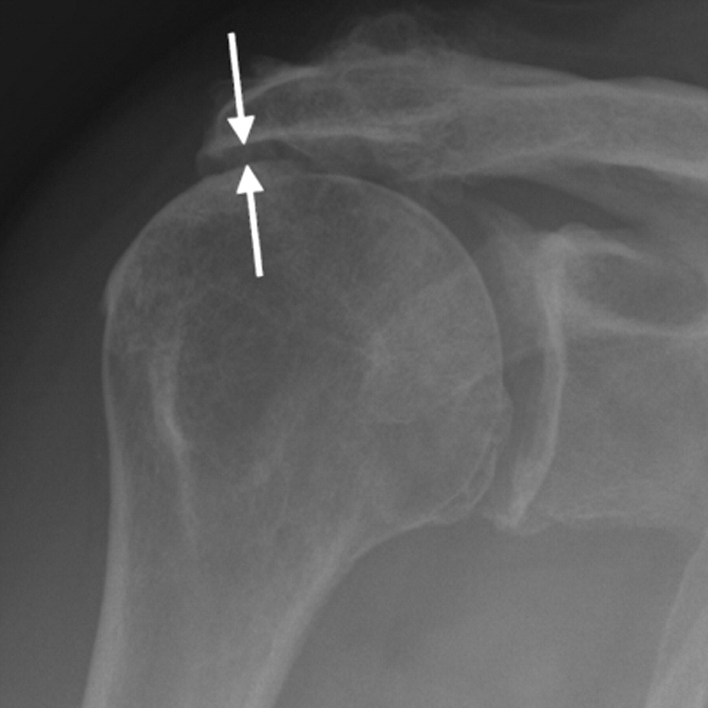{width="350"}
                [distance acromio-humérale](https://radiopaedia.org/articles/acromiohumeral-interval){:target="_blank"} < 7 mm rupture coiffe
            </figure>       
        === "coude"
            ```
            Bon alignement des structures osseuses et respect des rapports anatomiques.
            Absence de lésion osseuse décelable, notamment post-traumatique.
            Pas de signe d'épanchement articulaire.
            Parties molles sans particularité.
            ```
        === "poignet"
            ```
            Respect des interlignes articulaires du carpe et des phalanges.
            Pas d'érosion osseuse ni de lésion suspecte.
            Pas de lésion post-traumatique récente.
            Parties molles sans particularité.
            ```

            <figure markdown="span">
                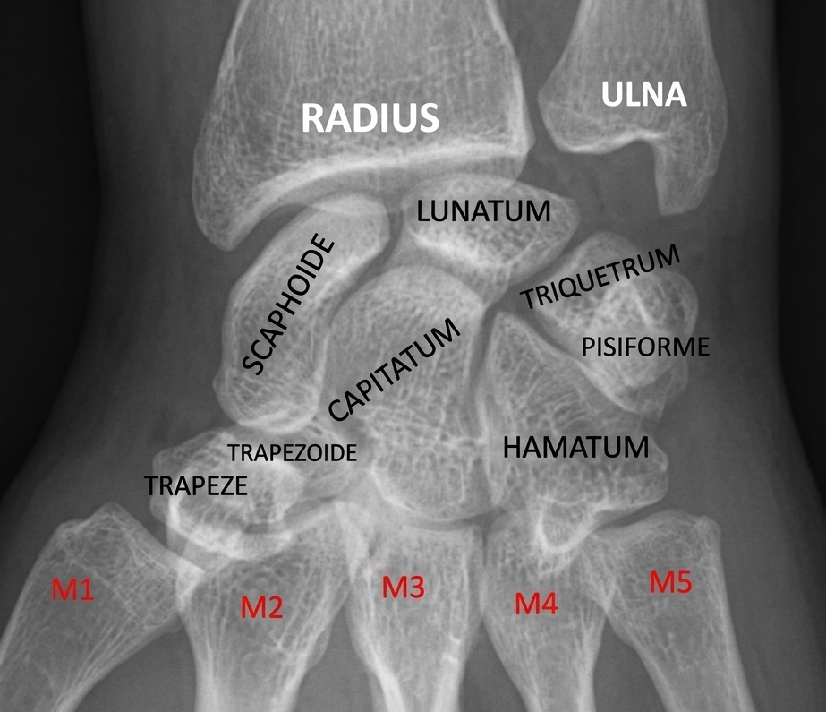{width="400"}  
            </figure>
        === "hanche"
            ```
            Pas de remaniement dégénératif significatif des articulations coxo-fémorales.
            Pas d'anomalie des articulations sacro-iliaques.
            Pas de lésion osseuse suspecte.
            Parties molles sans particularité.
            ``` 
        === "genou"
            ```
            Pas d’épanchement intra-articulaire.
            Respect des interlignes fémoro-tibiaux et fémoro-patellaire.
            Pas de lésion osseuse suspecte et parties molles sans particularité.
            ```
        === "cheville"
            ```
            Bon alignement des structures osseuses et respect des rapports anatomiques.
            Pas d'élargissement pathologique de la mortaise crurale.
            Absence de lésion post-traumatique récente.
            Parties molles, notamment périmalléolaires, sans particularité.
            ```        
        === "pied"
            ```
            Respect des interlignes articulaires du tarse et des phalanges.
            Pas d'érosion osseuse ni de lésion suspecte.
            Pas de lésion post-traumatique récente.
            Parties molles sans particularité.
            ```

            <figure markdown="span">
                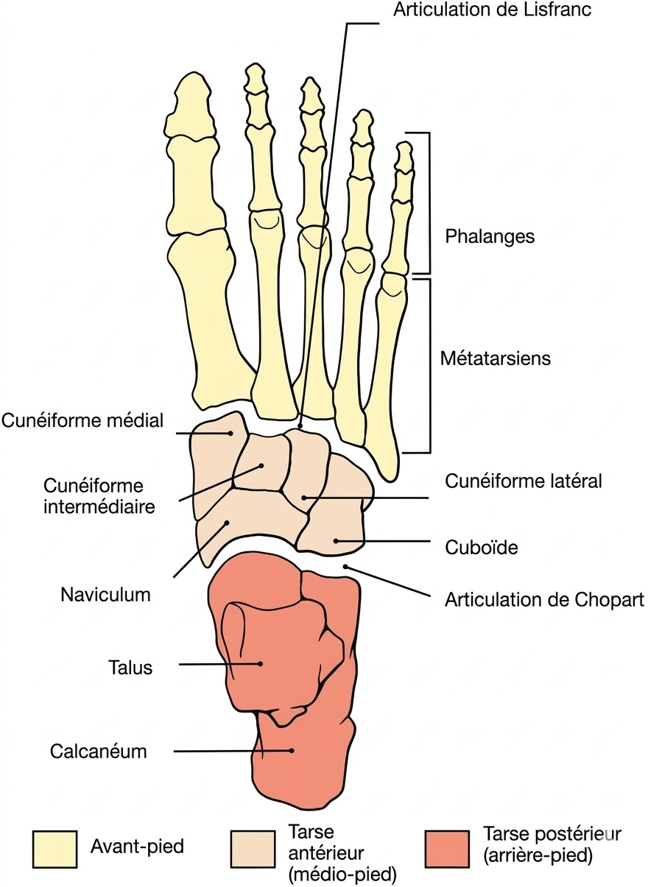{width="500"}  
            </figure>

    === "DMO"
        ```
        T-score du rachis lombaire (L1-L4) =  (norme > -1)
        T-score du col fémoral droit =  (norme > -1)
        T-score du col fémoral gauche =  (norme > -1)
        ```      

        | T-score | critères OMS |  
        | :----------: | :-------: | 
        | > -1 | normal | 
        | de -1 à -2,5 | ostéopénie | 
        | ≤ -2,5 | ostéoporose | 

    === "pano"
        ```
        Pas de lacune apico-dentaire.
        Bonne ventilation des cuvettes maxillaires.
        Condyles mandibulaires sans anomalie.
        Pas de lésion osseuse focale.
        ```  

        <figure markdown="span">
            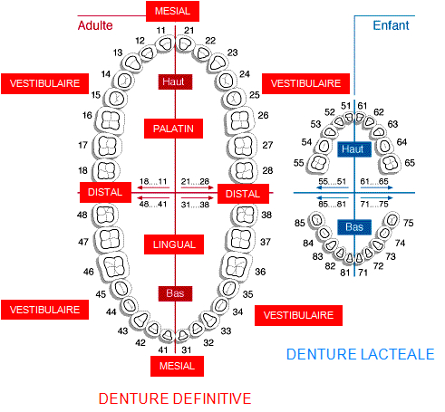{width="600"}
            denture lactéale terminée à M30, dentition définitive de 6 à 20 ans
            </br>
            désinclusion (ouverture du sac folliculaire avec formation des racines) < éruption
            </br>
            /!\ rétention (obstacle) / inclusion (reste dans le sac folliculaire)  
            </br>
            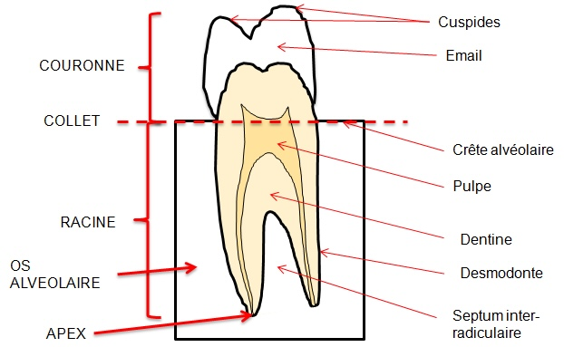{width="500"}  
        </figure>

    === "cavum"
        ```
        Bombement antérieur des parties molles du cavum.
        Pas de retentissement significatif sur la filière naso-pharyngée.
        Fente aérienne mesurant  mm (norme > 5 mm).
        Cadre osseux sans particularité.
        ``` 

        <figure markdown="span">
            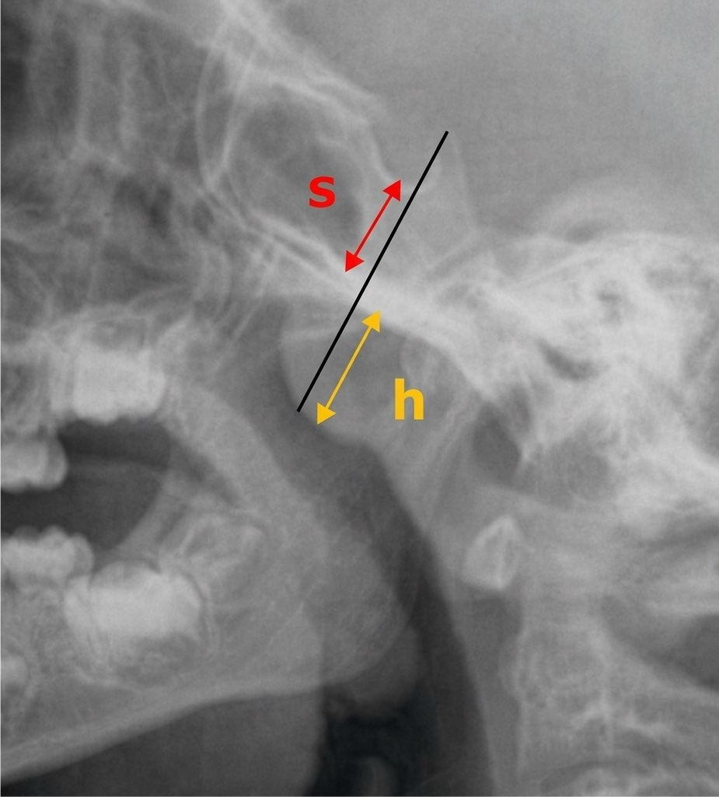{width="400"}
            hypertrophie végétations adénoïdes = h>s et fente < 5 mm
        </figure>

    === "ASP"
        ```
        Absence d'air libre sous les coupoles diaphragmatiques.
        Absence de niveaux hydro-aériques visibles.
        Coprostase banale dans le cadre colique.
        Bases pulmonaires sans particularité.
        Pas d'anomalie des structures osseuses.
        ``` 