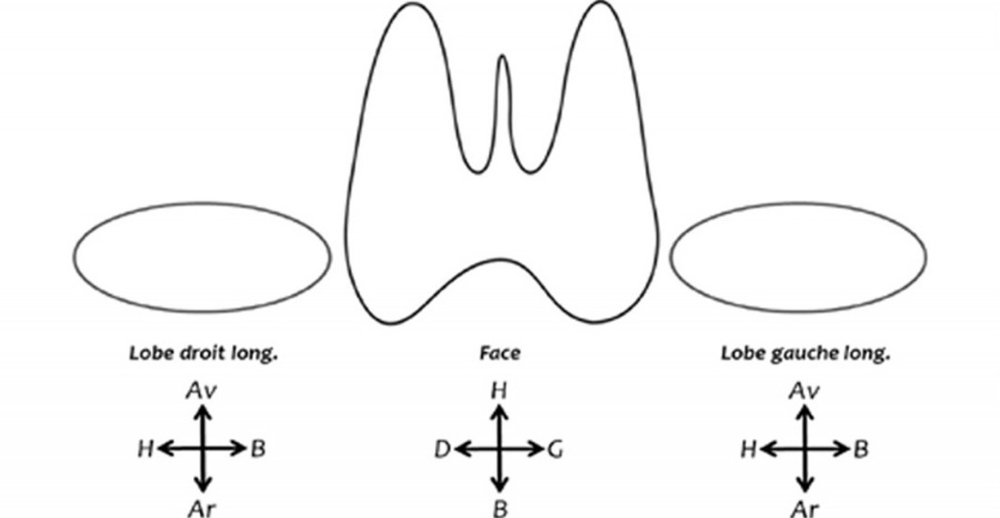

# Accueil

<p style="text-align: center"><a href="https://www.imaios.com/fr/login"target="_blank">Imaios</a>&nbsp;&nbsp;&nbsp;&nbsp;&nbsp;&nbsp;&nbsp;&nbsp;<a href="https://radiopaedia.org/"target="_blank">Radiopaedia</a>&nbsp;&nbsp;&nbsp;&nbsp;&nbsp;&nbsp;&nbsp;&nbsp;<a href="https://www.radrap.ch/comptesrendus"target="_blank">modèles de CR</a>
</br> id reco : rempl cima, mdp : elindo</p>

=== "ABDO"
    ```
    Foie de taille et de morphologie normale, sans lésion focale.
    Perméabilité du tronc porte et des veines sus-hépatiques.
    Pas de dilatation des voies biliaires.
    Vésicule biliaire alithiasique, non distendue et à parois fines.
    Pancréas d'analyse limitée (interpositions aérodigestives), sans anomalie visible.
    Rate de taille normale.

    Reins de taille et de morphologie normale, sans lésion suspecte ni image lithiasique.
    Vessie en semi-réplétion, au contenu anéchogène, avec des parois fines et régulières.
    Pas d'épanchement péritonéal.
    ```
    <figure markdown="span">
        {width="700"}
    </figure>
    <figure markdown="span">
        {width="450"}
    </figure>
=== "REINS"
    ```
    Rein droit :
    Grand axe mesurant
    Bonne différenciation parenchymo-sinusale.
    Pas de dilatation des cavités pyélo-calicielles.
    Pas de lésion suspecte ni d'image lithiasique.

    Rein gauche :
    Grand axe mesurant
    Bonne différenciation parenchymo-sinusale.
    Pas de dilatation des cavités pyélo-calicielles.
    Pas de lésion suspecte ni d'image lithiasique.

    Vessie :
    En bonne réplétion, avec contenu anéchogène.
    Pas d'anomalie de paroi décelable.
    Pas d'épanchement péritonéal.
    ```
    <figure markdown="span">
        {width="700"}
    </figure>
=== "PROS"
    ```
    Reins :
    Grand axe mesurant
    Bonne différenciation parenchymo-sinusale.
    Pas de dilatation des cavités pyélo-calicielles.
    Pas de lésion suspecte ni d'image lithiasique.

    Vessie pré-mictionnelle :
    Bonne réplétion, contenu anéchogène.
    Pas d'anomalie de paroi décelable.
    Pas d'épanchement péritonéal.

    Prostate par voie sus-pubienne :
    Dimensions mesurant
    Lobé médian avec protrusion vésicale
    Echostructure homogène avec contours réguliers.
    Vésicules séminales sans particularité.

    Vessie post-mictionnelle :
    Résidu de 
    ```
    <figure markdown="span">
        {width="700"}
        <figcaption>hypertrophie si > 30 cc</figcaption>
    </figure>
=== "TESTIS"
    ```
    Testicule droit :
    Dimensions mesurant
    Selon la formule de Lambert (Lxlxhx0,71), volume estimé à 
    Echostructure homogène, sans lésion focale suspecte.
    Epididyme sans particularité.
    Canal déférent suivi jusqu'à l'anneau inguinal.
    Lame d'hydrocèle.

    Testicule gauche :
    Dimensions mesurant
    Selon la formule de Lambert (Lxlxhx0,71), volume estimé à 
    Echostructure homogène, sans lésion focale suspecte.
    Epididyme sans particularité.
    Canal déférent suivi jusqu'à l'anneau inguinal.
    Lame d'hydrocèle.

    Etude Doppler :
    Vascularisation testiculaire symétrique sans particularité.
    Pas de varicocèle décelable, notamment en position debout et en manœuvre de Valsalva.
    ```
    <figure markdown="span">
        {width="700"}
        <figcaption>12-20 cc</figcaption>
    </figure>
=== "THYR"
    ```
    Lobe droit mesurant
    Lobe gauche mesurant
    Epaisseur de l'isthme mesurant

    Contours réguliers.
    Echostructure homogène hyperéchogène par rapport au plan musculaire.
    Vascularisation sans particularité au Doppler.
    Pas d'image nodulaire.

    Pas d'anomalie du tractus thyréoglosse.
    Pas d'adénopathie dans les secteurs II, III, IV et VI.
    Perméabilité des vaisseaux jugulo-carotidiens.
    ```
    <figure markdown="span">
        [{width="700"}](https://cireol.net/wp-content/uploads/2017/05/2017-CIREOL-EUTIRADS.pdf){:target="_blank"}
        <figcaption>goitre si > 20 cc</figcaption>
    </figure>
    <figure markdown="span">
        {width="300"}
    </figure>
=== "ORL"
    ```
    Absence d'anomalie des glandes sous-mandibulaires, notamment pas de dilatation canalaire.
    Absence d'anomalie des glandes parotides, notamment pas de dilatation canalaire.

    Absence de ganglion suspect des chaînes ganglionnaires cervicales.
    Perméabilité des axes vasculaires jugulaires et carotidiens.
    ```
    <figure markdown="span">
        [{width="700"}](https://onclepaul.fr/wp-content/uploads/2011/07/Aires-lymphatiques-cervicales-AF-2022.pdf){:target="_blank"}
    </figure>
    <figure markdown="span">
        [{width="700"}](https://www.sfdermato.org/media/pdf/fmc/kystes-et-fistules-43aafeeba119ceb9a20059d95f63e615.pdf){:target="_blank"}
    </figure>
=== "ING"
    ```
    Absence de hernie inguinale mise en évidence à l'exploration de la paroi abdominale en décubitus dorsal, en position debout et lors des manœuvres de Valsalva.
    ```
    <figure markdown="span">
        {width="550"}
    </figure>
=== "PELV"
    ```

    ```
    <figure markdown="span">
        {width="700"}
    </figure>