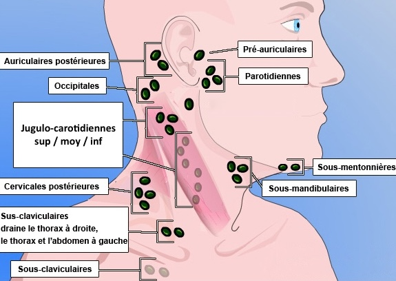

# Accueil

<p style="text-align: center"><a href="https://www.imaios.com/fr/login"target="_blank">Imaios</a>&nbsp;&nbsp;&nbsp;&nbsp;&nbsp;&nbsp;&nbsp;&nbsp;<a href="https://radiopaedia.org/"target="_blank">Radiopaedia</a>&nbsp;&nbsp;&nbsp;&nbsp;&nbsp;&nbsp;&nbsp;&nbsp;<a href="https://www.radrap.ch/comptesrendus"target="_blank">modèles de CR</a>
</br>rempl cima / elindo</p>

=== "ABDO"
    ```
    Foie de taille et de morphologie normale, sans lésion focale.
    Perméabilité du tronc porte et des veines sus-hépatiques.
    Pas de dilatation des voies biliaires.
    Vésicule biliaire alithiasique, non distendue et à parois fines.
    Rate de taille normale.

    Pancréas d'analyse limitée (interpositions aérodigestives), sans anomalie visible.
    Reins de taille et de morphologie normale, sans lésion suspecte ni image lithiasique.
    Vessie en semi-réplétion, au contenu anéchogène, avec des parois fines et régulières.
    Pas d'épanchement péritonéal.
    ```
    <figure markdown="span">
        {width="430"}
    </figure>
    <p style="text-align: center"><a href="https://echo.interniste.com/echographie-foie-us-fr-c2-s0"target="_blank">Lésions hépatiques</a></br><b>HTP</b> si TP > 13 mm et vitesse < 10 cm/s</p>
    <figure markdown="span">
        {width="700"}
        </br>
        {width="500"}
    </figure>
=== "REINS"
    ```
    Rein droit :
    Grand axe mesurant
    Bonne différenciation parenchymo-sinusale.
    Pas de dilatation des cavités pyélo-calicielles.
    Pas de lésion suspecte ni d'image lithiasique.

    Rein gauche :
    Grand axe mesurant
    Bonne différenciation parenchymo-sinusale.
    Pas de dilatation des cavités pyélo-calicielles.
    Pas de lésion suspecte ni d'image lithiasique.

    Vessie :
    En bonne réplétion, avec contenu anéchogène.
    Pas d'anomalie de paroi décelable.
    Pas d'épanchement péritonéal.
    ```
    <figure markdown="span">
        {width="700"}
    </figure>
=== "THYR"
    ```
    Isthme mesurant
    Lobe droit mesurant
    Lobe gauche mesurant

    Contours réguliers.
    Echostructure homogène hyperéchogène par rapport au plan musculaire.
    Vascularisation sans particularité au Doppler.
    Pas d'image nodulaire.

    Pas d'anomalie du tractus thyréoglosse.
    Pas d'adénopathie dans les secteurs II, III, IV et VI.
    Perméabilité des vaisseaux jugulo-carotidiens.
    ```
    <figure markdown="span">
        [{width="650"}](https://cireol.net/wp-content/uploads/2017/05/2017-CIREOL-EUTIRADS.pdf){:target="_blank"}
        </br>
        <b>4-10 cc/lobe</b>, Doppler < 40 cm/s
    </figure>
    === "Basedow"
        - goitre hypoéchogène homogène
        - hypervascularisation intense > 100 cm/s
        - récidive : plus hétérogène et moins vascularisé
        <figure markdown="span">
            {width="500"}
        </figure>
    === "Hashimoto"
        - goitre hypoéchogène multinodulaire
        - hypervascularisation modérée 60 cm/s
        - suivi/an, travées fibreuses hyperécho, /!\ lymphome/cancer
        <figure markdown="span">
            {width="500"}
        </figure>
    === "De Quervain"
        - contexte viral, douloureux
        - plages hypoéchogène mal limitées peu vascularisées
        - contrôle à M3 si pseudonodulaire
        <figure markdown="span">
            {width="500"}
        </figure>
=== "ORL"
    ```
    Aspect normal des glandes parotides, sans lésion focale dans le lobe superficiel.
    Pas d'image lithiasique ou de dilatation canalaire dans les glandes submandibulaires.
    Absence de ganglion cervical suspect.
    ```
    <figure markdown="span">
        {width="700"}
    </figure>
    <figure markdown="span">
        [{width="550"}](https://onclepaul.fr/wp-content/uploads/2011/07/Aires-lymphatiques-cervicales-AF-2022.pdf){:target="_blank"}
    </figure>
    <figure markdown="span">
        [{width="700"}](https://www.sfdermato.org/media/pdf/fmc/kystes-et-fistules-43aafeeba119ceb9a20059d95f63e615.pdf){:target="_blank"}
    </figure>
=== "ING"
    ```
    Absence de hernie inguinale mise en évidence à l'exploration de la paroi abdominale en décubitus dorsal, en position debout et lors des manœuvres de Valsalva.
    ```
    <figure markdown="span">
        [{width="550"}](https://lamediatheque.radiologie.fr/mediatheque/media.aspx?mediaId=50350&channel=3277){:target="_blank"}
    </figure>
=== "TESTIS"
    ```
    Testicule droit :
    Dimensions mesurant
    Echostructure homogène, sans lésion focale suspecte.
    Epididyme sans particularité.
    Canal déférent suivi jusqu'à l'anneau inguinal.
    Lame d'hydrocèle.

    Testicule gauche :
    Dimensions mesurant
    Echostructure homogène, sans lésion focale suspecte.
    Epididyme sans particularité.
    Canal déférent suivi jusqu'à l'anneau inguinal.
    Lame d'hydrocèle.

    Etude Doppler :
    Vascularisation testiculaire symétrique sans particularité.
    Pas de varicocèle décelable, notamment à gauche en position debout et en manœuvre de Valsalva.
    ```
    <figure markdown="span">
        {width="700"}
        </br>
        12-20 cc
    </figure>
=== "PROS"
    ```
    Reins :
    Grand axe mesurant
    Bonne différenciation parenchymo-sinusale.
    Pas de dilatation des cavités pyélo-calicielles.
    Pas de lésion suspecte ni d'image lithiasique.

    Vessie pré-mictionnelle :
    Bonne réplétion, contenu anéchogène.
    Pas d'anomalie de paroi décelable.
    Pas d'épanchement péritonéal.

    Prostate par voie sus-pubienne :
    Dimensions mesurant
    Lobé médian avec protrusion vésicale
    Echostructure homogène avec contours réguliers.
    Vésicules séminales sans particularité.

    Vessie post-mictionnelle :
    Résidu de 
    ```
    <figure markdown="span">
        {width="700"}
        hypertrophie si > 30 cc
    </figure>