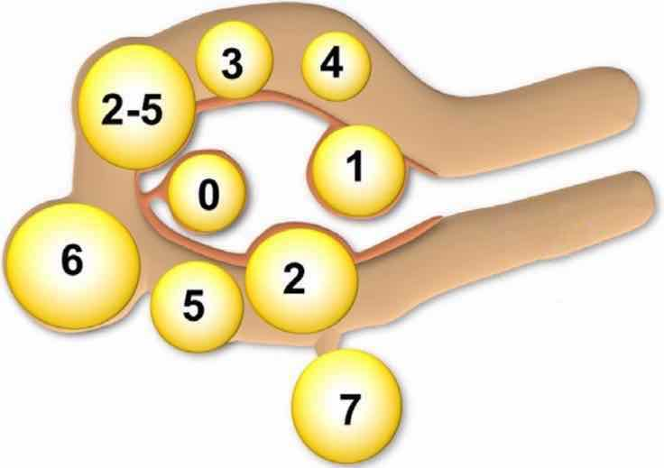
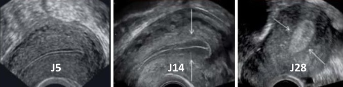

# Accueil

<p style="text-align: center"><a href="https://www.imaios.com/fr/login"target="_blank">imaios</a>&nbsp;&nbsp;&nbsp;&nbsp;&nbsp;<a href="https://radiopaedia.org/"target="_blank">radiopaedia</a>&nbsp;&nbsp;&nbsp;&nbsp;&nbsp;<a href="https://www.radrap.ch/comptesrendus"target="_blank">CR types</a> &nbsp;&nbsp;&nbsp;&nbsp;&nbsp; <a href="https://radref.org/ref.php"target="_blank">radref</a>&nbsp;&nbsp;&nbsp;&nbsp;&nbsp;<a href="https://www.ccam-radiologie.fr/echographie-abdomen-pelvis/"target="_blank">ccam</a>&nbsp;&nbsp;&nbsp;&nbsp;&nbsp;<a href="https://aderim.radiologie.fr/"target="_blank">aderim</a>
</br>rempl cima / elindo, Lens 1314, pass</p>

=== "ABDO"
    ```
    Reins :
    Grand axe mesurant à droite et gauche  mm.
    Différenciation cortico-médullaire satisfaisante.
    Pas de dilatation des cavités pyélo-calicielles.
    Pas de lésion suspecte ni d'image lithiasique.

    Vessie :
    En réplétion, avec contenu anéchogène.
    Pas d'anomalie de paroi décelable.
    Pas d'épanchement péritonéal.
    ```
    ```
    Foie de taille et de morphologie normales, sans lésion focale.
    Tronc porte avec flux hépatopète et veines sus-hépatiques hépatofuges.
    Vésicule biliaire alithiasique. Pas de dilatation des voies biliaires. 
    Pas d'anomalie du pancréas explorable.
    Rate homogène de taille normale.
    Pas de dilatation des cavités pyélocalicielles.
    Reins de taille et de morphologie normales, sans lésion focale.
    Vessie en faible réplétion, sans anomalie décelable.
    Pas d'épanchement péritonéal.
    ```
    ```
    Pas d'anomalie en projection de l'utérus et des annexes.
    ```
    <figure markdown="span">
        </br>
        {width="580"}
        [Surveillance cirrhose](https://www.has-sante.fr/upload/docs/application/pdf/2013-03/05r26_form_surveillance_cirrhose_formulaires_de_bilan_echographique_hepatique.pdf){:target="_blank"} avec **HTP** si vitesse TP < 10 cm/s
    </figure>
    ```
    Dysmorphie hépatique avec contours bosselés.
    Echostructure homogène, sans lésion focale suspecte.
    Tronc porte et branches portales hépatopètes.
    Vitesse maximale dans le tronc porte :  cm/s.
    Grand axe de la rate :  cm.
    Pas de voies de dérivation porto-systémiques décelable.
    Pas d'ascite.
    ```
    <figure markdown="span">
        </br>
        [Lésion hépatiques](https://echo.interniste.com/echographie-foie-us-fr-c2-s0){:target="_blank"}  
        {width="430"}  
        {width="680"}  
        {width="500"}
    </figure>

=== "THYR"
    ```
    Volumes des lobes droit et gauche estimés à  cc.
    Respect du gradient musculo-parenchymateux.
    Pas d'hypervascularisation au Doppler.
    Pas d'anomalie du tractus thyréoglosse.    
    Pas d'adénopathie dans les secteurs II, III, IV et VI.
    Echostructure thyroïdienne homogène sans image nodulaire.
    ```
    ```
    Comparaison à l'échographie de
    
    Volumes des lobes droit et gauche estimés à  cc.
    Respect du gradient musculo-parenchymateux.
    Pas d'hypervascularisation au Doppler.

    Nodule EU-TIRADS
    Nodule EU-TIRADS
    Nodule EU-TIRADS
    Pas d'autre image nodulaire significative.
    Pas d'adénopathie dans les secteurs II, III, IV et VI.
    ```
    <figure markdown="span">
        [{width="700"}](https://cdn-radeos.fra1.digitaloceanspaces.com/capsule/24/resources/capsule-24-ressource-36-comment-faire-et-interpreter-une-echographie-thyroidienne.pdf){:target="_blank"}
        [{width="700"}](https://cireol.net/wp-content/uploads/2017/05/2017-CIREOL-EUTIRADS.pdf){:target="_blank"}
        contours irréguliers = au moins 3 lobulations/spicules, microcalcifications = au moins 5  
        nodule EU-TIRADS 3 ≤ 2 cm ou 4 ≤ 1,5 cm => surveillance à 1a, puis 2-3a plus tard, puis 5a  
        <b>4-10 cc/lobe</b> (< 9 cc ♀ et < 8 cc ado), Doppler < 40 cm/s
        </br>↗ taille significative si + 2 mm dans 2 diamètres et/ou 50% en volume
        </br>
        20% [lobe pyramidal](https://radiopaedia.org/articles/pyramidal-lobe-of-thyroid){:target="_blank"} = reliquat du tractus thyréoglosse  
        [cytoponction](https://lamediatheque.radiologie.fr/mediatheque/media.aspx?mediaId=2896&channel=3277){:target="_blank"}
    </figure>
    === "Basedow"
        - goitre hypoéchogène **homogène**, Ac anti-récepteur de la TSH (TRAK)
        - hypervascularisation intense **> 1 m/s** ("thyroid inferno" > 50% parenchyme)
        - récidive : plus hétérogène et moins vascularisé
        <figure markdown="span">
            {width="500"}
        </figure>
    === "Hashimoto"
        - goitre hypoéchogène **micronodulaire**, Ac anti-TPO +/- anti-Tg
        - hypervascularisation modérée **< 1 m/s**
        - suivi/an, travées fibreuses hyperécho, /!\ lymphome/cancer
        <figure markdown="span">
            {width="500"}
        </figure>
    === "De Quervain"
        - contexte viral, douloureux
        - plages hypoéchogènes mal limitées peu vascularisées
        - contrôle à M3 si pseudonodulaire
        <figure markdown="span">
            {width="500"}
        </figure>
    === "Hyperpara"
        - 80% [adénome](https://radiopaedia.org/articles/parathyroid-adenoma){:target="_blank"} parathyroïdien > 15% hyperplasie > 5% carcinome
        - nodule hypoéchogène homogène > 1 cm
        - légèrement plus vascularisé que le parenchyme thyroïdien
        <figure markdown="span">
            {width="500"}
        </figure>
    ```
    Pas d'image lithiasique ni de dilatation canalaire dans les glandes sous-mandibulaires.
    Pas de lésion focale dans le lobe superficiel des glandes parotides.
    Pas de ganglion suspect dans les chaînes ganglionnaires cervicales.
    Perméabilité des axes vasculaires jugulaires et carotidiens.
    Thyroïde de taille normale sans image nodulaire significative.
    ```
    <figure markdown="span">
        {width="700"}
    </figure>
    <figure markdown="span">
        [{width="550"}](https://onclepaul.fr/wp-content/uploads/2011/07/Aires-lymphatiques-cervicales-AF-2022.pdf){:target="_blank"}
    </figure>
    <figure markdown="span">
        [{width="700"}](https://www.sfdermato.org/media/pdf/fmc/kystes-et-fistules-43aafeeba119ceb9a20059d95f63e615.pdf){:target="_blank"}
    </figure>

=== "PAROI"
    ```
    Examen en position debout lors de manœuvres de Valsalva répétées.
    
    Absence de hernie ou autre lésion inguinale décelable.
    ```
    ```
    Hernie inguinale

    Pas de hernie inguinale controlatérale déceable en position debout lors de manœuvres de Valsalva répétées.

    Consignes de consultation aux urgences en cas de tuméfaction inguinale irréductible et inflammatoire qui ferait suspecter une strangulation intestinale.
    ```
    <figure markdown="span">
        [{width="650"}](https://www.youtube.com/watch?v=k7uc1u4TYF4){:target="_blank"}
        [DD](https://www.intercomsante57.fr/html/profsante/pdf/L-echographie-dans-les-hernies.pdf){:target="_blank"} douleurs inguinales = arthrose hanche/rachis, pubalgie du sportif  
        [Diastiasis](https://radiopaedia.org/articles/diastasis-recti){:target="_blank"} des muscles grands droits si > 20 mm
    </figure>

    | Ganglion | [Territoires de drainage](https://www.chem-sante.fr/elearning/parcours_41/biblio_0/mg_2015_941_384.pdf){:target="_blank"}  |
    | :----------: | :-----------------------------------: |
    | `pré-auriculaire` | partie supérieure du visage |
    | `rétro-auriculaire` | cuir chevelu, oreille |
    | `jugulo-carotidien` | thyroïde, oropharynx, anneau de Waldeyer |
    | `sus-claviculaire D` | médiastin, poumons, œsophage |
    | `Troisier (G)` | poumons, abdo-pelv, testicules |
    | `axillaire` | membre sup, sein, paroi thoracique |
    | `inguinal` | membre inf, OGE, paroi abdo inf |

    !!! tip "[kyste épidermoïde](https://www.youtube.com/watch?app=desktop&v=HP9j2y5PQoE){:target="_blank"} / d'inclusion épidermique / sébacé = 90% des kystes ss-cut"
        - croissance lente, 70% dur > 30% mou, parallèle à la peau
        - finement hétérogène, paroi épaisse hypo, renforcement post
        - **pas de vascularisation**, amincissement dermique > 50%
        - 10% rupture/infection = contours lobulés, hypervasc périph
        - DD = [kyste pilonidal](https://radiopaedia.org/articles/pilonidal-sinus){:target="_blank"}, méta mélanome, sarcome superficiel (rare ++)
        <figure markdown="span">
            {width="300"}
        </figure>
        ```
        Formation ovalaire sous-cutanée aux contours réguliers mesurant  mm.
        Son contenu est hypoéchogène hétérogène avec un renforcement postérieur.
        Absence de vascularisation décelable au Doppler.
        Amincissement dermique focal en regard.
        
        Aspect évocateur de kyste épidermoïde, sans signe de complication.
        ```
        ```
        Formation ovalaire sous-cutanée aux contours irréguliers mesurant  mm.
        Son contenu est hypoéchogène hétérogène avec un renforcement postérieur.
        Infiltration des tissus mous adjacents avec hyperhémie péri-lésionnelle.
        Absence de vascularisation intrinsèque.

        Aspect évocateur d'une infection de kyste épidermoïde.

        Intérêt d'un contrôle échographique en cas de persistance d'évolution défavorable.
        ```
    !!! tip "[lipome](https://onclepaul.fr/wp-content/uploads/2011/07/Boules-masses-nodules.pdf){:target="_blank"}"
        - masse superficielle compressible et indolore
        - bien limitée, < 5 cm, pas de flux doppler, septas fibreux < 2 mm
        <figure markdown="span">
            {width="300"}
        </figure>
        ```
        Formation ovalaire superficielle d'allure graisseuse, aux contours bien limités, mesurant  mm.
        Topographie sus-aponévrotique et sans extension au fascia et au plan musculaire.
        Absence de vascularisation décelable au Doppler.

        Aspect évocateur de lipome, sans signe d'atypie.

        Un contrôle échographique sera nécessaire en cas d'évolutivité.
        ```
    !!! tip "[tumeur desmoïde](https://radiopaedia.org/articles/desmoid-tumour){:target="_blank"}"
        - paroi abdominale, dans le plan musculaire, croissance lente
        - masse hypoéchogène bien circonscrite
        <figure markdown="span">
            {width="220"}
        </figure>

=== "H"
    ```
    Reins :
    Grand axe mesurant à droite et gauche  mm.
    Différenciation parenchymo-sinusale satisfaisante.
    Pas de dilatation des cavités pyélo-calicielles.
    Pas d'image lithiasique ni de lésion suspecte.

    Vessie pré-mictionnelle :
    En semi-réplétion, avec contenu anéchogène, sans lésion nodulaire.
    Détrusor modérément épaissi, sans diverticule.
    Pas d'épanchement péritonéal.

    Prostate par voie sus-pubienne :
    Contours réguliers. 
    Volume estimé à  cc.
    Protrusion intravésicale du lobe médian.
    Intégrité du carrefour vésiculo-déférentiel.

    Vessie post-mictionnelle :
    Résidu de  ml.
    ```
    <figure markdown="span">
        {width="700"}
        hypertrophie si > 30 cc &nbsp;&nbsp;&nbsp;&nbsp;&nbsp;&nbsp;&nbsp;&nbsp; RPM significatif si > 20 cc
        </br>  
    </figure>
    ```
    Testicules de taille normale et symétriques.
    Echostructure homogène, sans lésion focale suspecte.
    Vascularisation testiculaire symétrique sans particularité. 
    Epididymes et cordons spermatiques d'aspect normal.
    Pas d'hydrocèle significative.
    ```
    <figure markdown="span">
        {width="800"}
        12-20 cc &nbsp;&nbsp;&nbsp;&nbsp;&nbsp; [Pathos](https://onclepaul.net/wp-content/uploads/2011/07/DU-TESTICULE-2011-AGFILEminimizer.pdf){:target="_blank"} &nbsp;&nbsp;&nbsp;&nbsp;&nbsp; [Tumeur adénomatoïde](https://radiopaedia.org/articles/adenomatoid-tumours-of-the-scrotum){:target="_blank"} &nbsp;&nbsp;&nbsp;&nbsp;&nbsp; [Ectasie tubulaire du rete testis](https://radiopaedia.org/articles/tubular-ectasia-of-rete-testis){:target="_blank"}  
        </br>
        {width="300"}
        lésion = **TDM TAP** (métas poumons, foie, cerveau, os)  
        </br>
        {width="550"}
        **cryptorchidie** = descente spontanée avant M3 ++ sinon orchidopexie, RR cancer x30
    </figure>

=== "F"
    ```
    Examen par voie suspubienne puis endovaginale après accord de la patiente.

    Utérus antéversé antéfléchi mesurant  cm.
    Endomètre hyperéchogène mesurant  mm.
    Pas d'anomalie dans le myomètre.
    Pas de lésion endocavitaire décelable.
    Pas de douleur ni de nodule en regard du torus.

    Pas de dilatation tubaire.
    Ovaires latéraux, folliculaires, de taille normale.
    Pas d'épanchement pelvien significatif.
    Pas de dilatation des cavités pyélocalicielles.
    ```
    <figure markdown="span">
        {width="300"}
        0-1-2 sous-muqueux &nbsp;&nbsp;&nbsp; 3-4-5 intramuraux &nbsp;&nbsp;&nbsp; 6-7 sous-séreux  
        > 5 myomes ou > 5 cm => IRM
    </figure> 
    !!! tip "[Endomètre](https://cglre.org/endometre-page-1/){:target="_blank"} (ménopause ≤ 5 mm, ≤ 10 mm si THS)"
        - phase menstruelle J1-4 = hyperéchogène 1-4 mm
        - proliférative J5-13 = hypoéchogène 5-9 mm
        - ovulatoire J14 = aspect en cible 10 mm
        - sécrétoire J15-28 = hyperéchogène 8 - 15 mm
        <figure markdown="span">
            {width="550"}
        </figure>
    !!! tip "[Adénomyose interne](https://cglre.org/adenomyose1/){:target="_blank"} = 40% des femmes"
        - focale/diffuse superficielle/profonde (cut-off 1/3 myomètre)
        - IRM = microkystes sous-endométriaux, **ZJ > 11 mm** ou > 40% du myomètre
        - écho = utérus globuleux, **interface floue** endo/myomètre, microlacunes myométriales
    
    !!! tip "[Tamoxifène](https://radiopaedia.org/articles/tamoxifen-associated-endometrial-changes-2){:target="_blank"}"
        - **épaississement glandulo-kystique** de l'endomètre (mais /!\ K RR 1,6)
        - polypes glandulo-kystiques, ↗ myomes et adénomyose
    </br>
    ```title="SOPK"
    Examen par voie suspubienne puis endovaginale après accord de la patiente.

    Ovaires latéraux folliculaires mesurant à droite et gauche  cc.
    Ils contiennent moins de 20 follicules par ovaire.
    Pas de dilatation tubaire.

    Utérus antéversé antéfléchi mesurant  cm.
    Endomètre hyperéchogène mesurant  mm.
    Pas d'anomalie dans le myomètre.

    Pas d'épanchement pelvien significatif.
    Pas de dilatation des cavités pyélocalicielles.
    ```
    <figure markdown="span">
        ovaire polykystique si [> 20 follicules ou > 10 ml](https://radiopaedia.org/articles/polycystic-ovarian-syndrome-1){:target="_blank"}  
        </br> 
    </figure>
    ```title="CFA"
    Examen par voie suspubienne puis endovaginale après accord de la patiente.

    Ovaires latéraux folliculaires mesurant à droite et gauche  mm.

    Nombre et taille des follicules à droite/gauche :
        - De moins de 5 mm : 
        - Entre 5 et 10 mm : 
        - De plus de 10 mm : 

    Doppler des artères utérines avec IR/IP :
        - à droite : 
        - à gauche : 

    Pas de dilatation tubaire.
    Utérus antéversé antéfléchi mesurant  cm.
    Endomètre hyperéchogène mesurant  mm.
    Pas d'anomalie significative du myomètre.
    Pas d'épanchement pelvien significatif.
    Pas de dilatation des cavités pyélocalicielles.
    ```
    <p style="text-align: center">écho à <b>J3</b> du cycle, réserve ovarienne faible si < 5 follicules/ovaire</p>

=== "Rx"
    ```title="RACHIS"
    Respect de la hauteur et bon alignement des corps vertébraux.
    Intégrité des rapports articulaires et des espaces intersomatiques.
    Aspect normal des interlignes articulaires sacro-iliaques et coxo-fémorales.
    Pas de lésion osseuse suspecte et parties molles sans particularité.
    ```    
    <figure markdown="span">
        {width="400"} 
        </br> 
    </figure>

    ```title="RT"
    Silhouette cardiomédiastinale d'aspect normal.
    Pas d'anomalie en projection des champs pulmonaires.
    Pas de comblement des récessus costo-diaphragmatiques.
    Structures osseuses sans particularité significative.
    ``` 
    <figure markdown="span">
        {width="800"}
        [syndromes radiographiques](https://onclepaul.fr/wp-content/uploads/2011/07/La-radiographie-du-thorax-pathologique-RD-2021-pdf.pdf){:target="_blank"} &nbsp;&nbsp;&nbsp;&nbsp;&nbsp; [pédiatrie](https://onclepaul.net/wp-content/uploads/2011/07/5-Cours-radiopediatrie-MERM-Imagerie-Thoracique-pediatrique.pdf){:target="_blank"} et [bronchiolite](https://onclepaul.net/wp-content/uploads/2011/07/5-Cours-radiopediatrie-MERM-Imagerie-Thoracique-pediatrique.pdf){:target="_blank"}  
        </br> 
    </figure>
    ```title="PANO"
    Pas de lacune apico-dentaire.
    Bonne ventilation des cuvettes maxillaires.
    Condyles de taille et de forme normales.
    Pas de lésion osseuse suspecte.
    ```  
    <figure markdown="span">
        {width="600"}
        denture lactéale terminée à M30, dentition définitive de 6 à 20 ans
        </br>
        désinclusion (ouverture du sac folliculaire avec formation des racines) < éruption
        </br>
        /!\ rétention (obstacle) / inclusion (reste dans le sac folliculaire)  
        </br>
        {width="500"}  
        </br>
    </figure>
    ```title="CAVUM"
    Discret épaississement des tissus mous du cavum, avec aspect convexe des contours antéro-inférieurs, sans retentissement significatif sur la filière naso-phrayngée.
    Cadre osseux sans particularité.
    ```  
    <figure markdown="span">
        [Hypertrophie végétations adénoïdes](https://www.radeos.org/maladie/fiche-hypertrophie-des-vegetations-adenoides_1663.html){:target="_blank"}
    </figure>