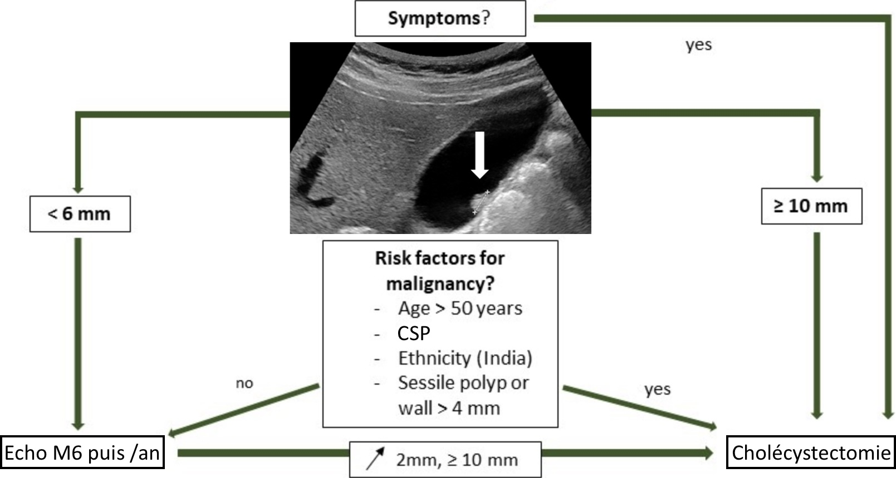

# Accueil

<p style="text-align: center"><a href="https://www.imaios.com/fr/login"target="_blank">imaios</a>&nbsp;&nbsp;&nbsp;&nbsp;&nbsp;&nbsp;&nbsp;<a href="https://radiopaedia.org/"target="_blank">radiopaedia</a>&nbsp;&nbsp;&nbsp;&nbsp;&nbsp;&nbsp;&nbsp;<a href="https://www.radrap.ch/comptesrendus"target="_blank">CR types</a>&nbsp;&nbsp;&nbsp;&nbsp;&nbsp;&nbsp;&nbsp;<a href="https://radref.org/ref.php"target="_blank">radref</a>&nbsp;&nbsp;&nbsp;&nbsp;&nbsp;&nbsp;&nbsp;<a href="https://www.ccam-radiologie.fr/echographie-abdomen-pelvis/"target="_blank">ccam</a>&nbsp;&nbsp;&nbsp;&nbsp;&nbsp;&nbsp;&nbsp;<a href="https://aderim.radiologie.fr/"target="_blank">aderim</a>
</br>rempl cima / elindo, Lens 1314</p>

=== "ABDO"
    ```
    Reins :
    Grand axe mesurant à droite/gauche  mm.
    Contours réguliers et différenciation parenchymo-sinusale satisfaisante.
    Pas de dilatation des cavités pyélo-calicielles.
    Pas de lésion suspecte ni d'image lithiasique.

    Vessie :
    En réplétion, avec contenu anéchogène.
    Pas d'anomalie de paroi décelable.
    Pas d'épanchement péritonéal.
    ```
    ```
    Foie de taille et de morphologie normales, sans lésion focale.
    Tronc porte avec flux hépatopète et veines sus-hépatiques hépatofuges.
    Pas de dilatation des voies biliaires. Vésicule biliaire alithiasique.
    Pancréas d'analyse limitée (interpositions aérodigestives), sans anomalie visible.
    Rate de taille normale.

    Pas de dilatation des cavités pyélocalicielles.
    Reins de taille et de morphologie normales, sans lésion focale.
    Vessie en faible réplétion, sans anomalie décelable.
    Pas d'épanchement péritonéal.
    ```
    ```
    Utérus d'aspect normal avec endomètre hyperéchogène fin.
    Ovaires latéro-utérins folliculaires sans particularité.
    ```
    <figure markdown="span">
        {width="430"}
    </figure>
    <p style="text-align: center"><a href="https://echo.interniste.com/echographie-foie-us-fr-c2-s0"target="_blank">Lésions hépatiques</a></br><b>HTP</b> si TP > 13 mm et vitesse < 10 cm/s</p>
    <figure markdown="span">
        {width="600"}
        </br>
        {width="700"}
        </br>
        {width="500"}
    </figure>

=== "THYR"
    ```
    Contours réguliers et échostructure hyperéchogène homogène.
    Volumes des lobes droit/gauche estimés à  cc.
    Pas d'hypervascularisation au Doppler.

    Pas d'image nodulaire significative.

    Pas d'anomalie du tractus thyréoglosse.    
    Perméabilité des vaisseaux jugulo-carotidiens.
    Pas d'adénopathie dans les secteurs II, III, IV et VI.
    ```
    ```
    Comparaison à l'échographie de
    
    Contours thyroïdiens réguliers.
    Respect du gradient musculo-parenchymateux.
    Volumes des lobes droit/gauche estimés à  cc.

    Nodule 
    Pas d'autre image nodulaire significative.
    Pas d'adénopathie dans les secteurs II, III, IV et VI.
    ```
    <figure markdown="span">
        [{width="700"}](https://cdn-radeos.fra1.digitaloceanspaces.com/capsule/24/resources/capsule-24-ressource-36-comment-faire-et-interpreter-une-echographie-thyroidienne.pdf){:target="_blank"}
        [{width="700"}](https://cireol.net/wp-content/uploads/2017/05/2017-CIREOL-EUTIRADS.pdf){:target="_blank"}
        <b>4-10 cc/lobe</b> (< 9 cc ♀ et < 8 cc ado), Doppler < 40 cm/s
        </br>↗ taille significative si + 2 mm dans 2 diamètres et/ou 50% en volume
        </br>
        20% [lobe pyramidal](https://radiopaedia.org/articles/pyramidal-lobe-of-thyroid){:target="_blank"} = reliquat du tractus thyréoglosse  
        [cytoponction](https://lamediatheque.radiologie.fr/mediatheque/media.aspx?mediaId=2896&channel=3277){:target="_blank"}
    </figure>
    === "Basedow"
        - goitre hypoéchogène **homogène**, Ac anti-récepteur de la TSH (TRAK)
        - hypervascularisation intense **> 1 m/s** ("thyroid inferno" > 50% parenchyme)
        - récidive : plus hétérogène et moins vascularisé
        <figure markdown="span">
            {width="500"}
        </figure>
    === "Hashimoto"
        - goitre hypoéchogène **micronodulaire**, Ac anti-TPO +/- anti-Tg
        - hypervascularisation modérée **< 1 m/s**
        - suivi/an, travées fibreuses hyperécho, /!\ lymphome/cancer
        <figure markdown="span">
            {width="500"}
        </figure>
    === "De Quervain"
        - contexte viral, douloureux
        - plages hypoéchogènes mal limitées peu vascularisées
        - contrôle à M3 si pseudonodulaire
        <figure markdown="span">
            {width="500"}
        </figure>
    === "Hyperpara"
        - 80% [adénome](https://radiopaedia.org/articles/parathyroid-adenoma){:target="_blank"} parathyroïdien > 15% hyperplasie > 5% carcinome
        - nodule hypoéchogène homogène > 1 cm
        - légèrement plus vascularisé que le parenchyme thyroïdien
        <figure markdown="span">
            {width="500"}
        </figure>

=== "ORL"
    ```
    Absence d'adénomégalie cervicale.
    Perméabilité des vaisseaux jugulo-carotidiens.
    Aspect normal des glandes submandibulaires et parotides, sans lésion focale.
    Thyroïde de taille et de morphologie normales, sans image nodulaire significative.
    ```
    <figure markdown="span">
        {width="700"}
    </figure>
    <figure markdown="span">
        [{width="550"}](https://onclepaul.fr/wp-content/uploads/2011/07/Aires-lymphatiques-cervicales-AF-2022.pdf){:target="_blank"}
    </figure>
    <figure markdown="span">
        [{width="700"}](https://www.sfdermato.org/media/pdf/fmc/kystes-et-fistules-43aafeeba119ceb9a20059d95f63e615.pdf){:target="_blank"}
    </figure>

=== "PAROI"
    | Ganglion | [Territoires de drainage](https://www.chem-sante.fr/elearning/parcours_41/biblio_0/mg_2015_941_384.pdf){:target="_blank"}  |
    | :----------: | :-----------------------------------: |
    | `pré-auriculaire` | partie supérieure du visage |
    | `rétro-auriculaire` | cuir chevelu, oreille |
    | `jugulo-carotidien` | thyroïde, oropharynx, anneau de Waldeyer |
    | `sus-claviculaire D` | médiastin, poumons, œsophage |
    | `Troisier (G)` | poumons, abdo-pelv, testicules |
    | `axillaire` | membre sup, sein, paroi thoracique |
    | `inguinal` | membre inf, OGE, paroi abdo inf |

    <p style="text-align: center"><a href="https://radiopaedia.org/articles/diastasis-recti"target="_blank">Diastasis </a>des muscles grands droits si > 20 mm</p>

    !!! tip "[kyste épidermique](https://www.youtube.com/watch?app=desktop&v=HP9j2y5PQoE){:target="_blank"} / épidermoïde / sébacé = 90% des kystes ss-cut"
        - croissance lente, 70% dur > 30% mou, parallèle à la peau
        - finement hétérogène, paroi épaisse hypo, renforcement post
        - **pas de vascularisation**, amincissement dermique > 50%
        - 10% rupture/infection = contours lobulés, hypervasc périph
        - DD = méta mélanome, sarcome superficiel (rare ++)
        <figure markdown="span">
            {width="300"}
        </figure>
        ```
        Formation ovalaire sous-cutanée finement hétérogène, aux contours lisses et réguliers, à paroi épaisse hypoéchogène, avec renforcement postérieur, sans vascularisation : aspect évocateur de kyste épidermoïde.
        ```
    !!! tip "[lipome](https://onclepaul.fr/wp-content/uploads/2011/07/Boules-masses-nodules.pdf){:target="_blank"}"
        - masse superficielle compressible et indolore
        - bien limitée, < 5 cm, pas de flux doppler, septas fibreux < 2 mm
        <figure markdown="span">
            {width="300"}
        </figure>
        ```
        Formation ovalaire superficielle, sus-aponévrotique, compressible et indolore, sans flux Doppler : aspect évocateur de lipome.
        ```
    !!! tip "[tumeur desmoïde](https://radiopaedia.org/articles/desmoid-tumour){:target="_blank"}"
        - paroi abdominale, croissance lente, dans le plan musculaire
        - masse hypoéchogène bien circonscrite
        <figure markdown="span">
            {width="220"}
        </figure>

=== "ING"
    ```
    Examen en position debout lors de manœuvres de Valsalva répétées.
    
    Absence de hernie ou autre lésion inguinale décelable.
    ```
    <figure markdown="span">
        [{width="600"}](https://www.youtube.com/watch?v=k7uc1u4TYF4){:target="_blank"}
    </figure>
    <figure markdown="span">
        [{width="400"}](https://www.imaios.com/fr/e-anatomy/abdomen-et-pelvis/tdm-axiale-de-l-abdomen-et-du-pelvis-masculin){:target="_blank"}
        </br>
        [DD](https://www.intercomsante57.fr/html/profsante/pdf/L-echographie-dans-les-hernies.pdf){:target="_blank"} douleurs inguinales = arthrose hanche/rachis, pubalgie du sportif
    </figure>

=== "TESTIS"
    ```
    Testicule droit :
    Volume estimé à  cc.
    Echostructure homogène, sans lésion focale suspecte.
    Epididyme sans particularité.
    Canal déférent suivi jusqu'à l'anneau inguinal.

    Testicule gauche :
    Volume estimé à  cc.
    Echostructure homogène, sans lésion focale suspecte.
    Epididyme sans particularité.
    Canal déférent suivi jusqu'à l'anneau inguinal.

    Etude Doppler :
    Vascularisation symétrique sans particularité.
    ```
    <figure markdown="span">
        {width="740"}
        </br>
        12-20 cc
        </br>
        <a href="https://radiopaedia.org/articles/adenomatoid-tumours-of-the-scrotum"target="_blank">Tumeur adénomatoïde</a>
        </br>
        <a href="https://radiopaedia.org/articles/spermatocele-1"target="_blank">Spermatocèle</a>
        </br>
        <a href="https://radiopaedia.org/articles/epididymitis"target="_blank">Epididymite</a>
        </br>
        <a href="https://www.ncbi.nlm.nih.gov/pmc/articles/PMC2728311/"target="_blank">Ectasie tubulaire du rete testis</a>
        </br>  
        {width="300"}
        lésion = TDM TAP (métas poumons, foie, cerveau, os)
    </figure>

=== "PROS"
    ```
    Reins :
    Grand axe mesurant à droite/gauche  mm.
    Contours réguliers et différenciation parenchymo-sinusale satisfaisante.
    Pas de dilatation des cavités pyélo-calicielles.
    Pas de lésion suspecte ni d'image lithiasique.

    Vessie pré-mictionnelle :
    En réplétion, avec contenu anéchogène.
    Détrusor fin et régulier, sans diverticule.
    Pas d'épanchement péritonéal.

    Prostate par voie sus-pubienne :
    Volume estimé à 
    Protrusion intravésicale du lobe médian mesurant  mm.
    Echostructure homogène avec contours réguliers.
    Vésicules séminales sans particularité.

    Vessie post-mictionnelle :
    Résidu de  cc.
    ```
    <figure markdown="span">
        {width="700"}
        hypertrophie si > 30 cc
        </br> RPM significatif si > 20 cc
    </figure>

=== "RxT"
    ```
    Silhouette cardiomédiastinale d'aspect normal.
    Pas d'épanchement pleural ni de pneumothorax.
    Absence d'anomalie dans le parenchyme pulmonaire.
    Cadre osseux et parties molles sans particularité.
    ``` 
    <figure markdown="span">
        {width="750"}
        </br>
        [syndromes radiographiques](https://onclepaul.fr/wp-content/uploads/2011/07/La-radiographie-du-thorax-pathologique-RD-2021-pdf.pdf){:target="_blank"}  
        [pédiatrie](https://onclepaul.net/wp-content/uploads/2011/07/5-Cours-radiopediatrie-MERM-Imagerie-Thoracique-pediatrique.pdf){:target="_blank"} et [bronchiolite](https://onclepaul.net/wp-content/uploads/2011/07/5-Cours-radiopediatrie-MERM-Imagerie-Thoracique-pediatrique.pdf){:target="_blank"}
    </figure>

=== "PANO"
    ```
    Pas de carie ni de lacune apico-dentaire.
    Dents de sagesse en place. 

    Bonne ventilation des cuvettes maxillaires.
    Condyles de taille et de forme normales.
    Pas de lésion osseuse suspecte.
    ```  
    <figure markdown="span">
        {width="600"}
        denture lactéale terminée à M30, dentition définitive de 6 à 20 ans
        </br>
        désinclusion (ouverture du sac folliculaire avec formation des racines) < éruption
        </br>
        /!\ rétention (obstacle) / inclusion (reste dans le sac folliculaire)  
        </br>
        {width="500"}  
        </br>
        [Hypertrophie végétations adénoïdes](https://www.radeos.org/maladie/fiche-hypertrophie-des-vegetations-adenoides_1663.html){:target="_blank"}
    </figure>