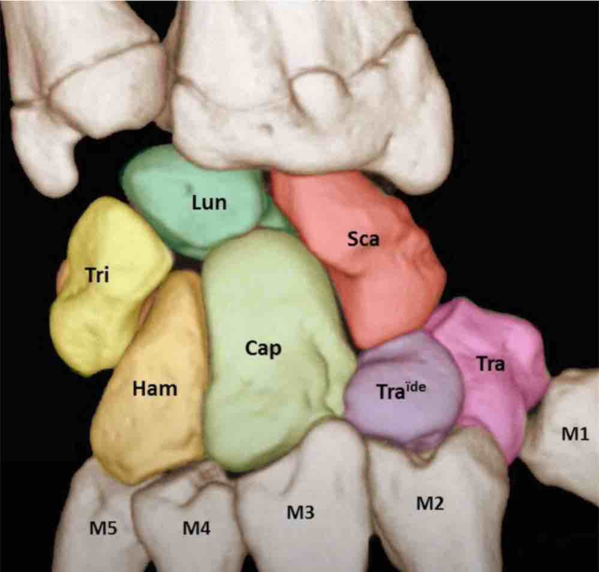
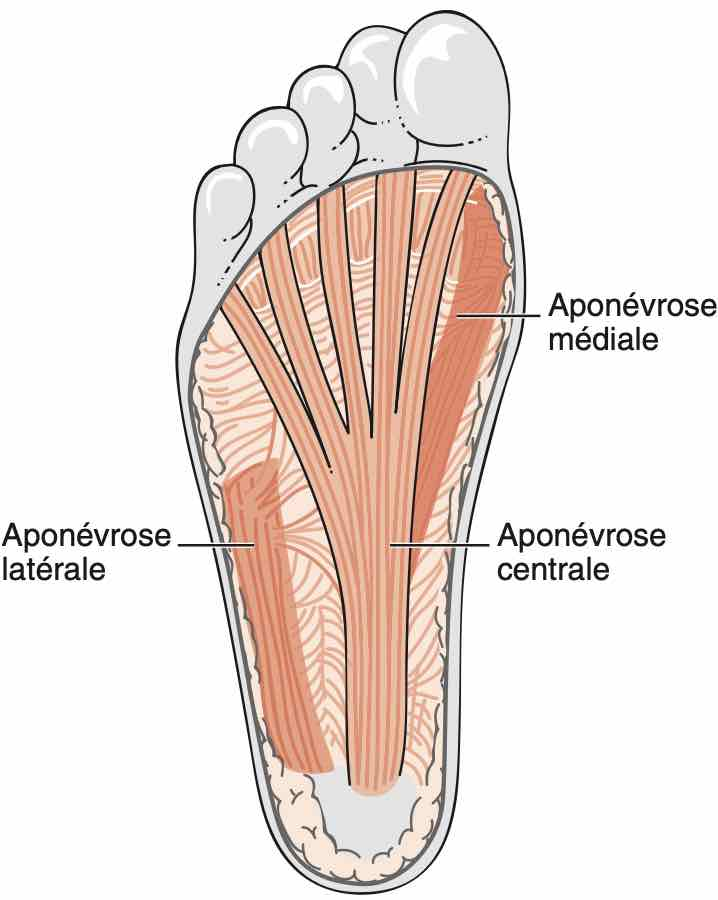

# Echo MSK

=== "EPAULE"
    ```
    Tendon du long biceps en place, fibrillaire, sans épanchement significatif.
    Respect des tendons des muscles subscapulaire et infraépineux.
    Pas d'anomalie tendineuse décelable du muscle supra-épineux.
    Pas d'épaississement de la bourse sous-acromio-deltoïdienne.
    Trophicité conservée des muscles de la coiffe des rotateurs.
    Liberté de l'échancrure spino-glénoïdienne.
    Arthrose acromio-claviculaire modérée.
    Pas d'épanchement gléno-huméral.
    ```
    <figure markdown="span">
        {width="540"}  
        [{width="650"}](https://www.youtube.com/watch?v=CDN2kX3YkZQ&t=51s){:target="_blank"} 
    </figure>  
 
=== "COUDE"
    ```
    Pas d'épanchement articulaire.
    Intégrité des tendons communs des épicondyliens latéraux et médiaux.
    Pas d'anomalie des tendon distaux des muscles biceps et triceps.
    Aspect normal du nerf ulnaire dans son tunnel.
    ```
    <figure markdown="span">
        {width="600"}  
        [{width="800"}](https://www.youtube.com/watch?v=CDN2kX3YkZQ&t=51s){:target="_blank"} 
    </figure> 
    
=== "MAIN"
    ```
    Pas d'épanchement dans les articulations radiocarpienne, radioulnaire distale et médiocarpienne.
    Pas d'épanchement dans les articulations métacarpophalangiennes et interphalangiennes.
    Remaniements dégénératifs des articulations trapézométarcarpiennes.
    Pas d'anomalie décelable des tendons extenseurs et fléchisseurs.
    Pas d'anomalie des nerfs médian et ulnaire au poignet.
    ```
    <figure markdown="span">
        {width="620"}
        {width="300"}  
        {width="400"}  
        {width="500"}
        **sd canal carpien** = nerf > 12-15 mm², index d'aplatissement > 3,  
        nerf hypo +/- signal Doppler, bombement rétinaculum > 4 mm, 
        {width="300"}
        {width="400"}  
        {width="500"}  
    </figure> 

=== "HANCHE"
    ```
    Pas d'épanchement articulaire coxo-fémoral.
    Pas d'argument pour une fissure de l'enthèse du muscle long adducteur.
    Pas de lésion traumatique de la jonction myotendineuse du muscle iliopsoas.
    Intégrité du muscle droit fémoral et de ses insertions tendineuses.
    Intégrité des tendons glutéaux et de l'insertion proximale des ischio-jambiers.
    ```
    <figure markdown="span">
        [{width="900"}](https://www.youtube.com/watch?v=CvP7ZwW3trk&list=PLGV2jHWN573djULLdIjMos1uZ1iMdevnT&index=4){:target="_blank"}  
        [{width="900"}](https://www.youtube.com/watch?v=ivN3cYggy_w&list=PLGV2jHWN573djULLdIjMos1uZ1iMdevnT&index=4){:target="_blank"}  
        [{width="700"}](https://www.youtube.com/watch?v=JJLKE5kArb0&list=PLGV2jHWN573djULLdIjMos1uZ1iMdevnT&index=5){:target="_blank"}  
        [{width="900"}](https://www.youtube.com/watch?v=8AxHjBnEDPQ&list=PLGV2jHWN573djULLdIjMos1uZ1iMdevnT&index=6){:target="_blank"}  
    </figure>  

=== "PIED"
    ```
    Pas d'épanchement dans l'articulation tabio-talienne.
    Pas d'anomalie décelable du ligament talofibulaire antérieur.
    Respect des ligaments talonaviculaire dorsale, tibiofibulaire antéro-inférieur, calcanéocuboïdien latéral et calcanéo-fibulaire.
    Comblement graisseux hyperéchogène sans particularité du sinus du tarse.
    Tendons court et long fibulaires en place, sans épanchement.
    ```
    <figure markdown="span">
        {width="600"}  
    </figure> 
    ```
    Pas d'épaississement des corps ni des enthèses des tendons calcanéens.
    Pas d'hyperhémie Doppler en regard des douleurs.
    Pas d'anomalies des aponévroses plantaires.
    ```
    <figure markdown="span">
        {width="350"}
    </figure> 