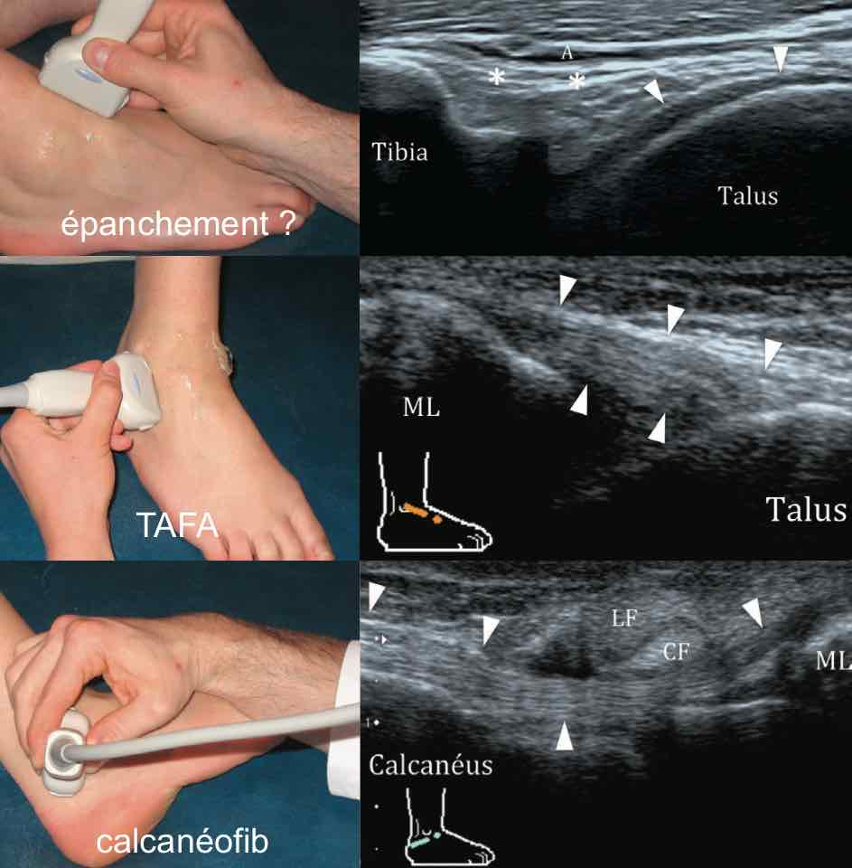

# Echo-Rx

<figure markdown="span">
    [Rx urg](https://univers-medecine.com/livres/fr/Lecture%20radiologique%20aux%20urgences.pdf){:target="_blank"} &nbsp;&nbsp;&nbsp;&nbsp;&nbsp; [os accessoires](https://fr.wikipedia.org/wiki/Os_accessoire){:target="_blank"}
</figure> 

=== "EPAULE"
    ```
    Radiographies de face avec 3 rotations de profil :
    Pas de lésion osseuse post-traumatique.
    Pas de diminution de l'espace sous-acromial.
    Respect de l'articulation acromio-claviculaire.
    Intégrité de l'interligne articulaire gléno-huméral.
    Pas de calcification en projection des tendons de la coiffe des rotateurs.
    Pas de lésion suspecte dans les structures osseuses et les parties molles.

    Echographie :
    Tendon du long biceps en place, fibrillaire, sans épanchement significatif.
    Respect de l'échostructure des tendons des muscles subscapulaire et infraépineux.
    Pas d'argument pour un conflit antérieur lors des manœuvres dynamiques.
    Pas d'anomalie tendineuse décelable du muscle supra-épineux.
    Pas d'épaississement de la bourse sous-acromio-deltoïdienne.
    Trophicité conservée des muscles de la coiffe des rotateurs.
    Liberté de l'échancrure spino-glénoïdienne.
    Arthrose acromio-claviculaire modérée.
    Pas d'épanchement gléno-huméral.
    ```
    <figure markdown="span">
        {width="540"}
        espace sous-acromial > 7 mm  
        </br>
        [{width="650"}](https://www.youtube.com/watch?v=CDN2kX3YkZQ&t=51s){:target="_blank"}
    </figure>  
 
=== "COUDE"
    ```title="Epicondylite"
    Pas d'épanchement articulaire.
    Intégrité des tendons communs des épicondyliens latéraux et médiaux.
    Pas d'anomalie des tendon distaux des muscles biceps et triceps.
    Aspect normal du nerf ulnaire dans son tunnel.
    ```
    <figure markdown="span">
        {width="600"}  
        [{width="800"}](https://www.youtube.com/watch?v=CDN2kX3YkZQ&t=51s){:target="_blank"} 
    </figure> 
    ```title="Nerf ulnaire"
    Nerf ulnaire en place au sein de la gouttière épitrochléo-olécrânienne.
    Aspect fasciculaire sans disparité de calibre ni augmentation de sa surface de section.
    Absence de luxation lors des manœuvres dynamiques.
    Pas de lésion compressive extrinsèque.
    ```
    ```title="Hygroma"
    Collection anéchogène compressible sous-cutanée rétro-olécrânienne mesurant  mm.
    En son sein flottent des lobules graisseux hyperéchogènes, sans lésion suspecte.
    Infiltration et discrète hyperhémie des tissus mous adjacents.
    Pas d'épanchement articulaire huméro-radial ni huméro-ulnaire.
    ```
    
=== "MAIN"
    ```
    Pas d'épanchement dans les articulations radiocarpienne, radioulnaire distale et médiocarpienne.
    Pas d'épanchement dans les articulations métacarpophalangiennes et interphalangiennes.
    Remaniements dégénératifs des articulations trapézométarcarpiennes.
    Pas d'anomalie décelable des tendons extenseurs et fléchisseurs.
    Pas d'anomalie des nerfs médian et ulnaire au poignet.
    ```
    <figure markdown="span">
        {width="620"}
        {width="300"}  
        {width="400"}  
        {width="500"}
        **sd canal carpien** = nerf > 12-15 mm², index d'aplatissement > 3,  
        nerf hypo +/- signal Doppler, bombement rétinaculum > 4 mm, 
        {width="300"}
        {width="400"}  
        {width="500"}  
        {width="480"}
    </figure> 

=== "HANCHE"
    ```
    Pas d'épanchement articulaire coxo-fémoral.
    Pas d'argument pour une fissure de l'enthèse du muscle long adducteur.
    Pas de lésion traumatique de la jonction myotendineuse du muscle iliopsoas.
    Intégrité du muscle droit fémoral et de ses insertions tendineuses.
    Intégrité des tendons glutéaux et de l'insertion proximale des ischio-jambiers.
    ```
    <figure markdown="span">
        [{width="900"}](https://www.youtube.com/watch?v=CvP7ZwW3trk&list=PLGV2jHWN573djULLdIjMos1uZ1iMdevnT&index=4){:target="_blank"}  
        [{width="900"}](https://www.youtube.com/watch?v=ivN3cYggy_w&list=PLGV2jHWN573djULLdIjMos1uZ1iMdevnT&index=4){:target="_blank"}  
        [{width="700"}](https://www.youtube.com/watch?v=JJLKE5kArb0&list=PLGV2jHWN573djULLdIjMos1uZ1iMdevnT&index=5){:target="_blank"}  
        [{width="900"}](https://www.youtube.com/watch?v=8AxHjBnEDPQ&list=PLGV2jHWN573djULLdIjMos1uZ1iMdevnT&index=6){:target="_blank"}  
    </figure>  

=== "GENOU"
    ```title="Entorse"
    Pas d'épanchement dans l'articulation tibio-talienne.
    Aspect normal des ligaments talofibulaire antérieur et calcanéofibulaire.
    Respect des ligaments talonaviculaire dorsale, tibiofibulaire antéro-inférieur et calcanéocuboïdien latéral.
    Comblement graisseux hyperéchogène sans particularité du sinus du tarse.
    Tendons court et long fibulaires en place, sans épanchement.
    ```

=== "PIED"
    ```title="Rx"
    Respect des interlignes articulaires du tarse, métacarpophallangiennes et interphallangiennes.
    Pas d'érosion osseuse ni de lésion suspecte.
    Pas de lésion post-traumatique récente.
    Parties molles sans particularité.
    ```
    <figure markdown="span">
        {width="500"}  
    </figure> 
    ```title="Entorse"
    Pas d'épanchement dans l'articulation tibio-talienne.
    Aspect normal des ligaments talofibulaire antérieur et calcanéofibulaire.
    Respect des ligaments talonaviculaire dorsale, tibiofibulaire antéro-inférieur et calcanéocuboïdien latéral.
    Comblement graisseux hyperéchogène sans particularité du sinus du tarse.
    Tendons court et long fibulaires en place, sans épanchement.
    ```
    <figure markdown="span">
        {width="650"}  
        {width="490"}  
    </figure> 
    ```title="Talalgies"
    Respect de l'échostructure des aponévroses plantaires, sans épaississement.
    Pas d'épaississement des corps ni des enthèses des tendons calcanéens.
    Pas d'hyperhémie Doppler en regard des douleurs.
    ```
    <figure markdown="span">
        {width="380"}
    </figure> 
    ```title="Névrome de Morton"
    Pas d'épaississement hypoéchogène dans les espaces intercapitométatarsiens, y compris lors de la manœuvre de Mulder.
    Absence également de collection anéchogène intercapitométatarsienne qui traduirait une bursite.
    Respect des plaques plantaires des 2ème et 3ème rayons.
    Pas d'épanchement dans les articulations métatarso-phalangiennes.
    ```

=== "INFILTR"
    ```
    Sous mesures d'asepsie rigoureuses et avec un contrôle échographique permanent :
    Abord via une aiguille 25G avec anesthésie locale à la Xylocaïne.
    Injection de 2 ml de Diprostène dans .
    Pas de complication au cours ni au décours du geste.

    Consignes de surveillance données au patient :
    Pansement à conserver quelques heures.
    Mise au repos relatif de l'articulation pendant 48 heures.
    Attendre plusieurs semaines pour évaluer l'efficacité du geste.

    En cas de signes d'infection (rougeur, douleur, tuméfaction, fièvre) : 
    Nous recontacter, consulter le médecin traitant, ou aller aux urgences.
    ```