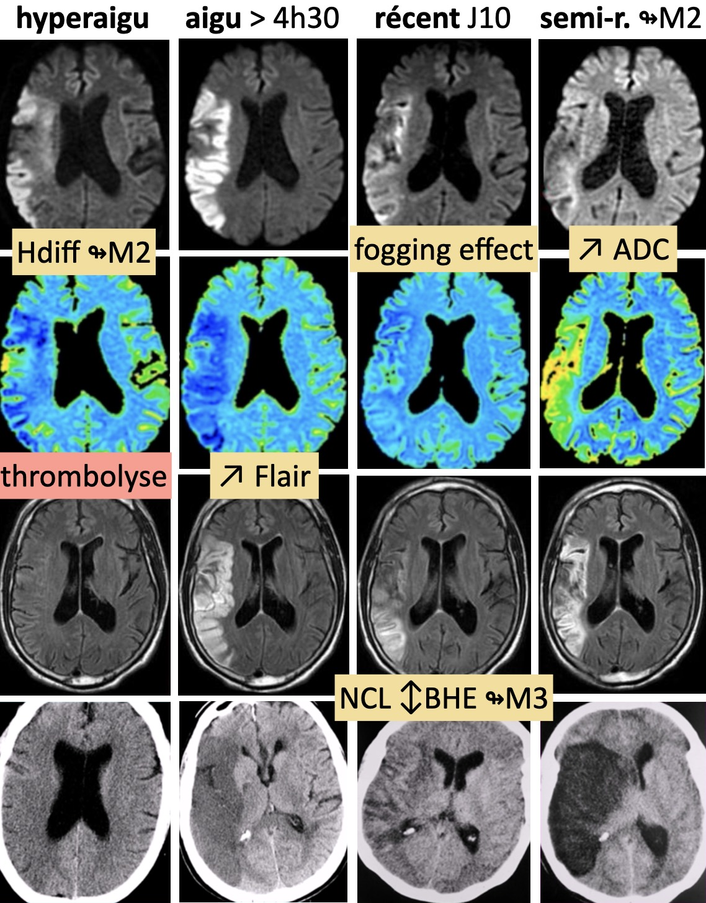
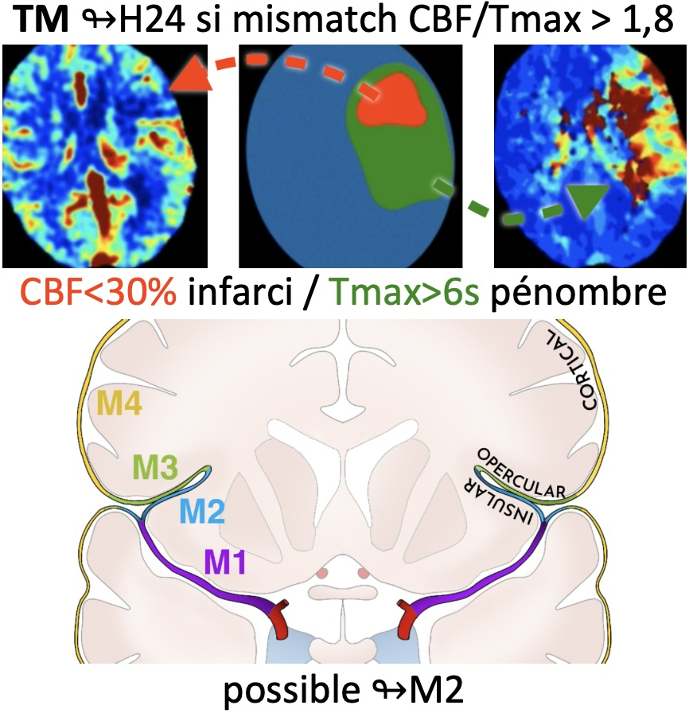
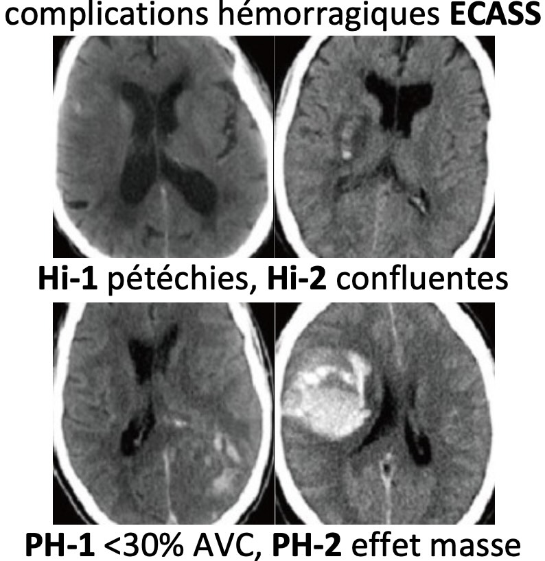
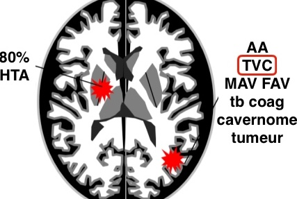
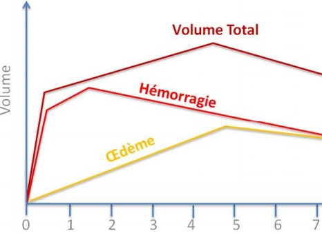
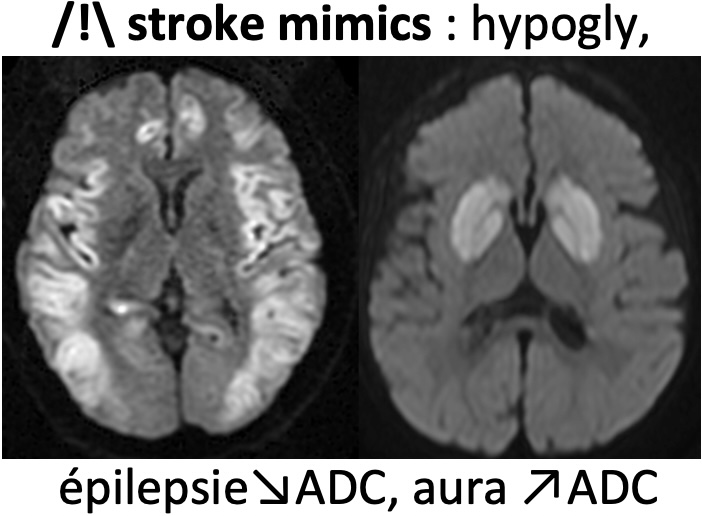

# [AVC](https://onclepaul.fr/wp-content/uploads/2011/07/AVC-ischemiques-.-RD-2021.pdf){:target="_blank"}

=== "ischémique"
    ```
    Séquences axiales diffusion, FLAIR, T2* et TOF.

    Absence de lésion ischémique ou hémorragique récente.
    Absence de flux de lent ou de thrombus décelable.
    Perméabilité des artères du polygone de Willis.
    Absence de processus expansif intracrânien.
    Respect des espaces liquidiens intra et péri-cérébraux.
    ```

    <figure markdown="span">
        [lobes cérébraux](https://radiopaedia.org/cases/61691/studies/69700?lang=gb){:target="_blank"} &nbsp;&nbsp;&nbsp;&nbsp;&nbsp;[territoires artériels](https://radiopaedia.org/cases/10814/studies/11258?lang=gb){:target="_blank"} &nbsp;&nbsp;&nbsp;&nbsp;&nbsp; [stroke mimics](assets/mimics.pdf){:target="_blank"}  
        </br>
        {width="250"}  
        </br>
        {width="410"}  
        </br>
        {width="330"}  
        </br>
        {width="300"}  
    </figure>


=== "TSA"
    ```
    Séquences axiale diffusion, 3D FLAIR, SWI, axiale T1 SE.
    Après injection de gadolinium, ARM des TSA et axiale T1 spin écho.

    
    Structures médianes en place. Pas d'hydrocéphalie.
    Pas de prise de contraste pathologique.
    
    Étude vasculaire :
    
    Perméabilité des TSA et des artères du polygone de Willis par ailleurs sans disparité de calibre.
    ```
    ```
    Acquisition 3D T1 SE FS sur l'étage cervical.
    ```
    
    <figure markdown="span">
        supsi [dissection](https://radiopaedia.org/articles/internal-carotid-artery-dissection-1){:target="_blank"}   = 3D T1 FS + ARM  
        </br>
        {width="320"} 
        80% sous-pétreux  
        </br>
        {width="320"}
        60% V3
    </figure>


=== "hémorragique"

    | grade  | [échelle de Fisher modifiée](https://radiopaedia.org/articles/modified-fisher-scale-of-subarachnoid-haemorrhage){:target="_blank"}  | vasospasme J7  | 
    | :----------: | :-------: |:-------: |
    | `1` | HSA minime | 24% |
    | `2` | HSA minime + HV | 33% |
    | `3` | HSA importante | 33% |
    | `4` | HSA importante + HV | 40% |

    <figure markdown="span">
        {width="340"}
        TDM sans/art/vx sauf hématome profond >65a avec HTA  
        /!\ [spot sign](https://radiopaedia.org/articles/ct-angiographic-spot-sign-intracerebral-haemorrhage){:target="_blank"} = extravasation PDC = mauvais Pc  
        </br>
        {width="300"}  
        </br>
        {width="370"}
    </figure>


=== "mimics"

    <figure markdown="span">
        [{width="900"}](https://insightsimaging.springeropen.com/articles/10.1007/s13244-018-0637-y){:target="_blank"}  
        [Oncle Paul diapo 633](https://onclepaul.fr/wp-content/uploads/2011/07/AVC-ischemiques-.-RD-2021.pdf){:target="_blank"} 
    </figure>