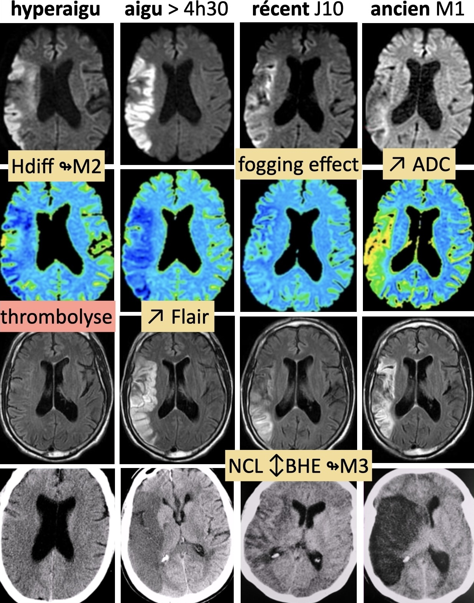

# [AVC](https://onclepaul.fr/wp-content/uploads/2011/07/AVC-ischemiques-.-RD-2021.pdf){:target="_blank"}

=== "ischémique"
    ```
    Séquences axiales diffusion, FLAIR, T2* et 3D TOF.

    Absence de lésion ischémique ou hémorragique récente.
    Absence de flux de lent ou de thrombus décelable.
    Perméabilité proximale des artères du polygone de Willis.
    Respect des espaces liquidiens intra et péri-cérébraux.
    Absence de processus expansif intracrânien.
    ```

    <figure markdown="span">
        [stroke mimics](assets/mimics.pdf){:target="_blank"}  
        [lobes cérébraux](https://radiopaedia.org/cases/61691/studies/69700?lang=gb){:target="_blank"} &nbsp;&nbsp;&nbsp;&nbsp;&nbsp;[territoires artériels](https://radiopaedia.org/cases/10814/studies/11258?lang=gb){:target="_blank"}  
        <br> 
        {width="250"}  
        {width="410"}  
        {width="330"}  
        {width="300"}  
        {width="500"}          
    </figure>


=== "TVC"

    ```
    Séquences axiales diffusion, FLAIR, T2* et T1 SE.
    Après injection de gadolinium, ARM veineuse et 3D T1 EG.

    Perméabilité des sinus veineux intracrâniens.
    Pas d'argument pour une thrombose des veines corticales et internes.
    Absence de remaniement œdémato-hémorragique dans le parenchyme.
    Respect des espaces liquidiens intra et péri-cérébraux.
    Absence de processus expansif intracrânien.
    Pas de comblement des sinus de la face.
    ```

    <figure markdown="span"> 
        <br>
        {width="800"}  
        [territoires vasculaires veineux](https://radiopaedia.org/cases/brain-venous-vascular-territories-diagram){:target="_blank"} 
    </figure>


=== "TSA"
    ```
    Séquences axiales diffusion, FLAIR, T2* et T1 SE.
    Après injection de gadolinium, ARM des TSA et axiale T1 SE.

    
    Structures médianes en place. Pas d'hydrocéphalie.
    Pas de prise de contraste pathologique.
    
    Étude vasculaire :
    
    Perméabilité des TSA et des artères du polygone de Willis par ailleurs sans disparité de calibre.
    ```
    ```
    Acquisition 3D T1 SE FS sur l'étage cervical.
    ```
    
    <figure markdown="span">
        supsi [dissection](https://radiopaedia.org/articles/internal-carotid-artery-dissection-1){:target="_blank"}   = 3D T1 FS + ARM  
        </br>
        {width="320"} 
        80% sous-pétreux  
        </br>
        {width="320"}
        60% V3
    </figure>


=== "hémorragique"

    | grade  | [échelle de Fisher modifiée](https://radiopaedia.org/articles/modified-fisher-scale-of-subarachnoid-haemorrhage){:target="_blank"}  | vasospasme J7  | 
    | :----------: | :-------: |:-------: |
    | `1` | HSA minime | 24% |
    | `2` | HSA minime + HV | 33% |
    | `3` | HSA importante | 33% |
    | `4` | HSA importante + HV | 40% |

    <figure markdown="span">
        {width="340"}
        TDM sans/art/vx sauf hématome profond >65a avec HTA  
        /!\ [spot sign](https://radiopaedia.org/articles/ct-angiographic-spot-sign-intracerebral-haemorrhage){:target="_blank"} = extravasation PDC = mauvais Pc  
        <br>
        {width="300"}  
        <br>
        {width="370"}
    </figure>